R4ndom’s Tutorial #10: The Levels Of Patching
=============================================

Link: http://thelegendofrandom.com/blog/archives/833

### Introduction

In this tutorial we will be discussing the different levels to patching a binary. This tutorial is
a little on the long and detailed side, but we will be covering a lot of ground, some of which is
not that easy. I wanted to give you an example of deep analysis on a binary, and what it entails.
You may not understand a great deal of it, but it will give you a good overall view of reverse
engineering. This way, in future tutorials, you will have a frame of reference. We will be studying
the same crackme as last tutorial, Crackme6 by “TDC”, included in the download.

You can download the files and PDF version of this tutorial on the
[tutorials](http://thelegendofrandom.com/blog/sample-page) page.

Overall, it’s not a tough crackme as we saw in the last tut, but we will be doing some advanced
analysis on it, preparing for future tutorials. So sit back, grab a coffee/cigarette/candy
bar/hypodermic needle, whatever gets you going, and let’s get started…

### Levels Of Cracking

There is a sort of an unwritten rule of reverse engineering (and especially cracking) about the
different levels of patching a binary. There are basically four levels of patching a binary (and
I’m sure at least half of every reverse engineer out there will argue with me on that number
) Of course, because everything sounds better as an acronym, I have come up
with one for all four levels. So, without further ado, here is your guide to the levels of
patching, and what they mean:

**Level 1 – LAME**

The LAME method, or **Localized Assembly Manipulation and Enhancing** method, is what we have gone
over so far. It means find the first place in the code that you can find the magic compare/jump
decision and either NOP it out or force it to jump. This method has worked magically for us so far.
Of course, we have been working on simple crackmes (half of which I coded specifically for the
tutorial). Unfortunately, most apps out there aren’t quite this easy. There are many things that
can go wrong with the LAME method, including:

1. Many, many apps do more than one check for if the program is registered, always from different
parts of the app, so just because you patch one does not mean there won’t be several more (I think
19 separate checks is the most I’ve seen). And sometimes these other checks aren’t done until some
other event happens, so you will find yourself going back to the same app searching for alternative
checks to patch.

2. Many programs also do many special tricks to avoid the compare/jump combo being obvious. Whether
it’s performed in a DLL, performed in another thread, modified polymorphically, there are many ways
around making this obvious.

3. Sometimes you end up patching an awful lot of code. Maybe you patch 7 checks for if we’re
registered, NOPping out other checks and so forth. This can get confusing and, let’s face it, it’s
not very elegant.

4. You don’t learn a heck of a lot only using this method, and if you’re reading these tutorials,
it’s probably because you’re interested in the topic and want to learn.

All that being said, sometimes the most elegant solution, which is often also the simplest, is a
single patch on the compare/jump combo, so don’t take me the wrong way and think you should never
use it. In fact, of the many programs I have reverse engineered, I would guess 25-40% were solved
using a simple patch like this. So it can be a powerful method 

**Level 2 – NOOB**

This method, the ***Not Only Obvious Breakpoints*** method usually involves going one step deeper
than the LAME method. It generally involves stepping into the call right before the compare/jump
combo to see what is causing the compare/jump combo to come out the way it does. The benefit of
this technique is that you have a lot more chance of catching other parts of the code that will
call this same routine to check for registration, so patching in one place can really patch in
several- every location that the binary calls the check registration routine. Of course this method
also has some shortcomings, some of which are:

1. Sometimes this routine is used for more than just a registration check. For example, it may be a
generic function that compares two strings, returning true or false whether they match. In the case
of our serial matching, this is the place to patch, but what happens if this same method is then
called with two different strings and we’ve patched it to always return true (or false, as the case
may be)?

2. This method requires more time and experimentation to determine what the best options are for
returning the correct values. This takes time and skill.

This is the first method we will use in this tutorial.

**Level 3 – SKILLED**

The SKILLED method, or ***Some Knowledge In Lower Level Engineered Data*** , is similar to the
**NOOB** method except it means you actually go through the routine and completely reverse engineer
it to see exactly what’s happening. This gives many benefits such as understanding any tricks being
used (like storing variables in memory for later retrieval), offering many more places to patch
that are easier and less intrusive, and giving an insight into how the program works. It also gives
you as a reverse engineer a lot of knowledge that can be used in the future, not to mention your
assembly language skills.

The main shortcomings of this method are that it’s more difficult and takes more time. My
suggestion to you is to try this method on at least a couple programs, because nothing will make
you a better reverse engineer than spending time digging through code, the stack, registers and
memory, trying to get a feel for what the author was trying to do. This is the method we will be
using in the last part of this tutorial.

**Level 4 – SK1LL$**

Thought of as the holy grail of cracking, ***Serial Keygenning In Low-level Languages, Stupid***
means that you not only have gone through and figured out exactly how the registration process is
performed, but you are also able to re-create it. This allows a new user to type in whatever
username they want, and the keygenner’s code will spit out a proper serial that will work with this
binary. The general way a keygen is made is to try to use the programs own code against it, meaning
copying the code the author used to decrypt serials and use it to encrypt them. This code is
usually put in some sort of wrapper program made specifically to accept ripped code (it provides
the GUI and such.)

The ultimate in skill$ is if the code cannot be ripped from the app and must be custom coded to
provide a viable serial. This means you must completely understand how the app decrypts the serial
and compares it to what you have entered. You then must code your own program that performs this
same routine, only in reverse, many times written in assembly language.

Obviously, the major shortcomings with this method are the sk1ll$ involved.

So, in light of our new understanding of the levels in reverse engineering…

### Looking At The App In Level 2

Let’s re-start the app and run it again. Set the breakpoint on GetDlgItemTextA (see last tut),
enter a password (I entered “12121212″) and click “Check” so Olly breaks at our GetDlgItemTextA:

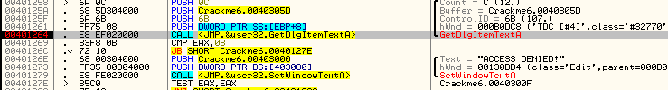

Now let’s get some info on GetDlgItemTextA:

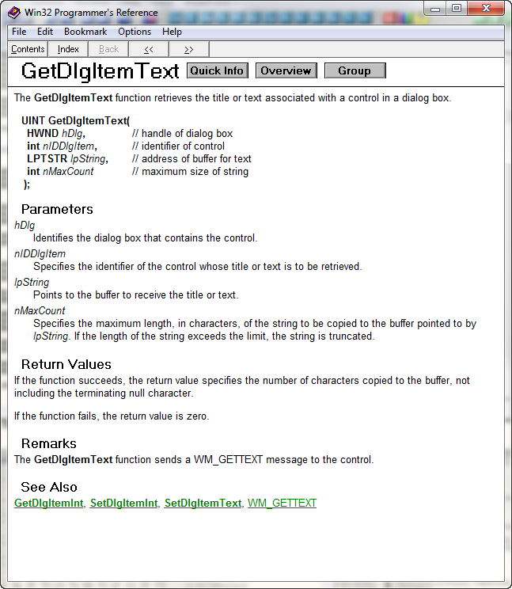

Here’s the important parts for us: One of the arguments is a pointer to a buffer where the password
will be stored (lpString), and the return value in EAX is the string’s length:

The pointer to the string buffer, as you can see above at address 40125a, is 40205D (Olly puts a
comment of ‘Buffer=’ because he can guess the arguments). That means that this function will copy
our dialog text into a buffer starting at 40205D, and will return the length of this string in EAX.
So, in our case, the password entered, “12121212″ will be retrieved and returned with the length of
the password in EAX, in this case 8. Now, if you look at the next two lines you’ll notice that this
value is compared to 0x0B (11 decimal) and the program will jump if EAX is less than this amount.
This really means that if the length of our password (EAX) is less than 0x0B (11 digits) then jump.
You’ll notice that if we don’t jump, we will fall through to the bad boy, so in effect, this means
our password must be less than 11 digits:

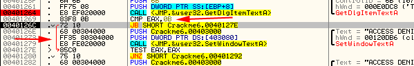

See!! We have learned something already- our password must be at most 11 digits
. Now since our password was less than 11 digits we will go ahead and take
the jump. (If you happened to put in a password longer than 11 digits, restart the app and put a
new one in less than 11 digits, then step to where we are here.)

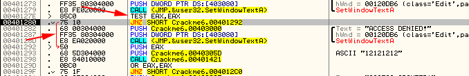

Next you will notice that EAX, which still contains the length of our password, is tested if it’s
zero, and if it’s not, it jumps past the second bad boy. So now we know that the first bad boy is
for situations where our password is longer than 11 digits, and the second bad boy is if it’s zero
digits.

Now notice that, after we take the jump, the next two lines, starting at address 401282, PUSH EAX
(the password length), and the address 40305D (the buffer that our password was stored in) on to
the stack. Looking at the stack we can see this in action:

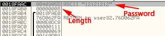

Notice first (at address 18FAB0) the length (8) was pushed and then at address 18FAAC the address
40305D was pushed, which Olly has helpfully shown you is “12121212″, or our password. Now we know
that our password is stored in memory at address 40305D. This will be important later
. Later, Olly will refer to these two values as ARG.1 and ARG.2, as they
are arguments passed to this function. Now after these two values are pushed, we will call the main
registration routine (we know this because it’s the call right before the all important
compare/jump combo, so it’s outcome will determine whether we jump to the good boy or bad boy), at
address 401298.

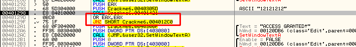

Keep Olly paused at the CALL line but notice after the call, EAX is OR’d with itself (will set the
zero flag depending on whether EAX is zero or not) at address 40129D and will jump over the good
message if EAX is not zero. This means that the registration routine called at address 401298 will,
at some point, put a value into EAX and RETN this value, which will then be checked if it is zero
or not, and if it is not, we will show the bad boy message. So we must make sure that in this call,
EAX equals 0 when it returns! If we can accomplish this, it would be the only patch that would be
needed (as well as the password being between 0 and 11 digits restriction, but that’s an easy
patch). Let’s go ahead and step into the registration routine at address 401298 and get an
overview:

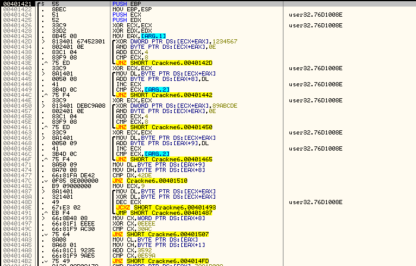

Wow, that’s a lot to take in, especially as you’re probably only half way through your assembly
book . But it is not impossible. The technique I usually use is to go to
the end of the routine, knowing that EAX must equal zero when it returns, and see what will
accomplish this and what will keep this from happening, and work my way backward. Scroll down till
you see the RETN of the function:

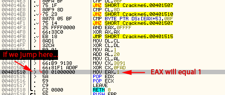

Here, we can see that we definitely want to avoid the instruction at 401510 as it sets EAX to 1
right before returning. You can also see that there is a red arrow pointing to this line, so that
jump will want to be avoided as well. Now if we look up a little we can see where EAX is set to
zero, and the way through the end of this routine to return it as such:

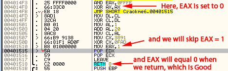

If we get to line 4014FB, EAX will be set to zero (XOR’d with itself), the JMP instruction will
jump over the bad instruction at 401510, and the routine will return with EAX equal to zero
. Now let’s follow the first jump we saw up (the jump that came to the MOV
EAX, 1 bad instruction at address 401510) and see where it is coming from:

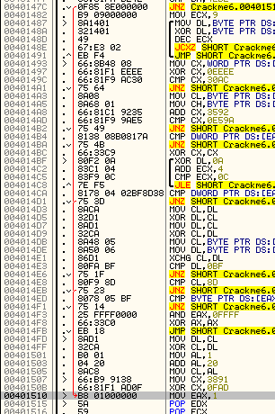

40147C is our bad jump. We want to avoid this jump or we are definitely getting the bad message.
OK, we now have some general knowledge of this routine, and for a level 2 crack we would stop here
and patch to make sure EAX always returns a zero. How would you do that? Well, I am going to leave
that up to you (it will be at the end for homework ) Though rest assured
that I will give you the answers… But do understand that patching at this level is already better
than our initial patch as 1) we only need one patch and 2) if this routine were to be called from
anywhere else in the program, we would still get the good message .

Now, take a break and think about how you would patch this. Remember, EAX must return as zero. The
reason I am letting you attempt this is because there are many, many NOOB patches to accomplish
this, and I want you to start thinking like a reverse engineer! If you need a hint, look in the
homework section at the end. And if you can solve it, you are a true NOOB!!!

When you are done, and ready to move on to even more detailed analysis, read on…

### Stepping It Up To Level 3

I understand that you are still a beginner, but I wanted to give a taste of what patching on a
deeper level looks like. If you don’t feel prepared for this, or get completely lost, don’t fret.
This is just to give you an idea. We will be going back over everything in this section in future
tutorials. You may ask yourself, what is the purpose of going deeper into this code if, everywhere
in the app that calls this routine, it will be patched? Well, for starters, what if there are
varying degrees of registration, for example “Private”, “Corporate”, “Enterprise”… This routine may
make this decision based on logic inside this routine. Another reason you may want to investigate
further is to eventually make a keygen for it. You would need to understand this code to do that.
Now, let’s start on patching on a SKILLED level and go back up to the beginning of this routine and
examine it:

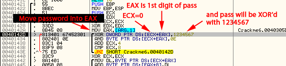

First, there is some typical pushing of registers and creating some space on the stack for some
local variables. The values in ECX and EDX are pushed on to the stack so we may use these registers
without overwriting what was in them (they will be popped off the stack at the end of the routine
to return them to normal). We then get to address 40142A, which moves the local argument on the
stack (which is the address of our password) into EAX. If you look at the regsters window you’ll
see that EAX holds the address 40305D, which is the address of our password. Next comes a menacing
looking line:

**XOR DWORD PTR DS:[ECX+EAX], 1234567**

what this line means is add ECX (which is zero) to the address of the beginning of our password
(which is stored at 40305D – remember that address?), then take the DWORD (4 bytes) at this
location and XOR it with the hex value 1234567. Since ECX is zero, adding this to the address of
our password doesn’t do anything to that address, so we are dealing with the address starting with
the first digit of our password. In simpler language, what this line means is “get the first 4
bytes of the password and XOR it with 1234567, storing this new value back into the same memory
address which is the beginning of our password.”

We can watch this happen; first, making sure we are still paused on this line of code at address
40142D, look right above the dump window and it will tell you what address ECX+EAX is (40305D) as
well as what values are there (32313231) which in ASCII is “2121″ (remember the endians
):

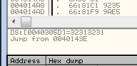

Now highlight the first line that says “DS:[0040305D]=32313231″, right-click and select “Follow in
dump” so we can see the actual memory where our password is currently stored:

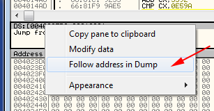

Now the dump window is showing memory, starting at address 40305D. Here, the first 8 bytes is our
password. Now remember, the line of code we are on is going to take the first 4 bytes at this
address (31,32,31,32) and XOR them with 0×1234567, storing the result back into this memory
location:

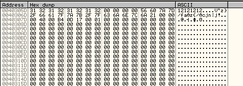

Go ahead and hit step over once and you will see the first 4 bytes of our password changed, XOR’d
with 0×1234567.

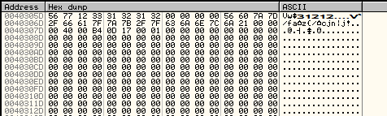

Now, let’s continue down the code to the next line:

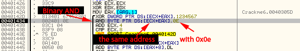

This line, **AND BYTE PTR DS:[ECX+EAX]**, 0E, is another menacing looking line. We know what ECX +
EAX is address 40305D, which is the address of our former password. Now we’re going to AND 0x0E
with the BYTE at this address and store the result back into this address. This means that the
first digit of our former password that is stored at 40305D is going to be ANDed with oE and stored
back in that first position. Looking at that helper area above the dump helps point this out:

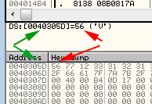

It is telling us that the address that will be affected is 40305D, and the value at that address
(currently) is 56. Now go ahead and step once and you will see that first digit change again:

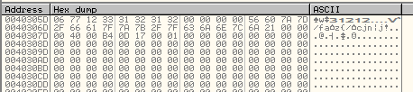

So now we know that ox56 ANDed with 0x0E is 0×06  Now let’s continue
trudging through this code:

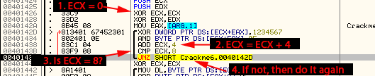

ECX is increased by 4 (to point at the next set of 4 bytes) and compared to 8. This means that this
loop will run two times- the first time ECX will equal 4, the second time 8, then we will jump out
of it. This means that we are dealing with 8 bytes of code total. So the second time through the
loop, we will affect the second set of 4 bytes, ANDing them with 1234567. As you step it, keep an
eye on the second set of 4 bytes:

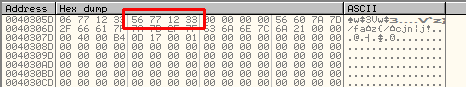

and they will change as well. That fifth byte will also change again as it’s ANDed with 0x0E. After
this loop, we hit the next instruction at address 401440 that just resets ECX to zero:

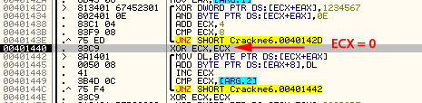

Now let’s look at the next set of instructions:

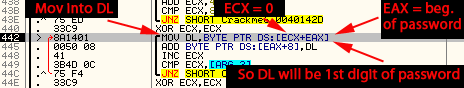

First we move the first (new) byte of our (former) password into DL (since ECX is zero again, we
know we are dealing with the first digit again, or where EAX is pointing). If you look at the
registers window, you’ll see that first byte (0×06) in the EDX register:

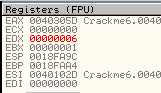

We then add this digit in DL with whatever is at EAX + 8, or the eighth byte after the beginning of
EAX, and store it back into the eighth position:

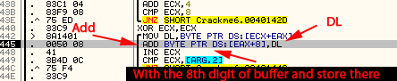

Here, we ca see that that byte has changed:

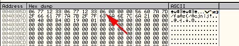

This has added the first byte in this buffer (6) with the 8th byte in the buffer (zero) and given
us 6. If our password was longer than 8 digits, this would have added the first byte in our buffer
to the next digit of our password, but since our password is only 8 digits, this memory is set to
zero. Next we increase ECX by one (thereby moving to the next byte) and compare it to the length of
the password. This just basically figures out if we’ve reached the end. If we haven’t, we then jump
to the beginning of this loop and do it again. This basically means we will cycle through all the
digits of the password, adding the value of each digit and storing this value in the 8th memory
position. Now we realize why the password can only be 11 digits; there’s only space to hold 11
characters plus the terminating zero.

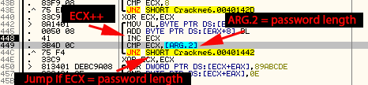

As you step through this loop, you can watch the memory change:

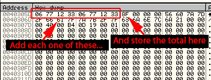

After this loop is done, we once again set ECX to zero and enter a similar loop to the first one,
this time XORing each set of 4 bytes with 0x89ABCDE.

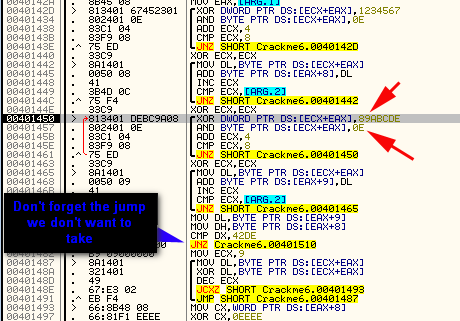

It also then adds up all the bytes and keeps this total in the ninth byte. This process will be
implemented until ARG.2 equals zero. ARG.2 is the length of our password (remember it was the
second item pushed on to the stack right before calling this function?) So, this set of
instructions will be run 8 times, once for each digit of our password. And after stepping through
this code, you will see the final result::

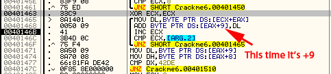

It is vitally important that you run this and watch it all happen as it will make it a lot clearer.
Take time understanding each line, what it’s going to do and where it’s going to store the result.
You will find that it is not as difficult as it sounds:) And don’t forget that we are making our
way to that first jump at address 40147C. Here, in summation, is what we have done:

1. We XORed each set of 4 bytes of our password with the hex value 12345678 and stored them back
over top of our password.
2. The first digit was ANDed with 0x0E, as well as the 5th byte.
3. We then added up the values of all of these bytes and stored this value in the 8th byte.
4. Then, we XORed each set of 4 bytes of this buffer with 0x9ABCDEF, and stored the result back
into this buffer.
5. Again, we added up the values of all of the buffer memory contents and stored this into the 9th
memory location.

We have performed most of the magic of the protection scheme on this crackme (*phew*). Now we will
load these two values (the summation of the buffer memory contents), one at EAX+8 and one at EAX+9
into DL and DH, making EDX in our example equal to 842C. We then compare these values with the
value 42DE:

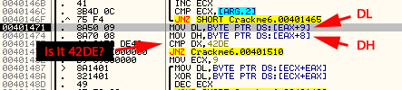

Why 42DE? Well, this is probably a hard coded password. If you think about it, if you had a
specific password, ran it through this whole operation of XOR-ing and AND-ing, it will come up with
this magic number of 42DE. In our case, seeing as EDX equals 842C:

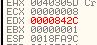

We have not entered this magic password so we will take this jump which will lead us to the bad
code:

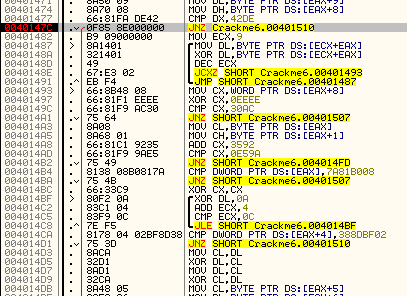

Unless, of course, we help Olly out a little:

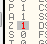

And instead fall through so EAX will not be set to one and this function immediately stopped. Next
we load ECX with 9 so that we may access the 9th digit of our buffer, move the contents of this
ninth memory location into DL (0x2C in this case), XOR it with itself (making it equal zero), lower
ECX by one to go to the previous location, and do this nine times:

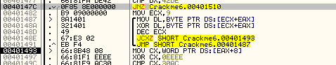

You may wonder, as this doesn’t actually change anything in the buffer, what the point of this
function is? Well, that makes two of us. Seeing as all it’s doing is zeroing out DL over and over,
this almost seems like a decoy (or a mistake ) in the code. All in all, if
this code runs or does not run, it makes no difference, so it is dead code. We now enter short
group of code that basically compares EAX with 30AC:

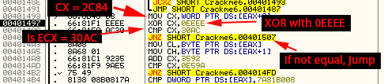

First, it load ECX with the summation we did earlier (0x2C in the 9th memory location and 0×84 in
the 8th memory location), XORs it with 0xEEEE and compares it with 30AC. And since ECX is not equal
to 30AC, we will jump:

To where ECX is set to one again:

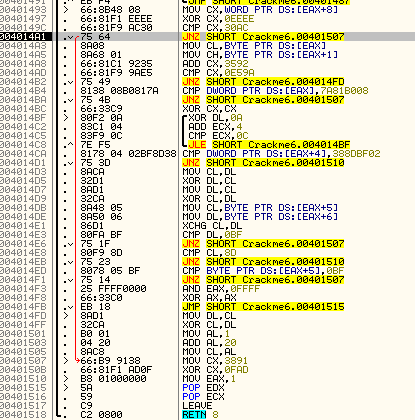

This is basically a second check of the password. The reason for this is probably that a reverse
engineer with not a lot of experience (or just enough to get him/herself in trouble) would
immediately patch the first JNZ when our converted password was compared with 0x42DE above. They
may not have taken the time to go through the rest of the code, thinking this patch is all it
takes. Unfortunately, this patch is obviously not enough as the app now takes the computed value of
our password, performs some more manipulation on it, and jumps if it does not match this new value.
A lot of times this method is used as a technique to discover if someone is trying to patch the
app: if we get through the first JNZ with our password checking out without patching anything, we
should get through the second as well. If we don’t, we know someone has patched the first check, so
we know someone has altered the code. Many times this second jump will go to some completely
different section of code, something that looks incredibly complicated but doesn’t actually do
anything, and then eventually terminate. This is an attempt to send the reverse engineer on a
wild-goose-chase and make it harder to overcome the protection. We don’t want that, so set the zero
flag so we keep going and we hit the next two lines:

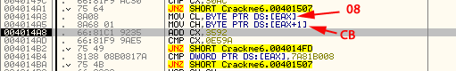

This loads the first and second memory location’s contents of our password buffer into CL and CH,
which in our example makes ECX equal to CB08. It adds 3592 (hex) to this value and compares it with
E59A. If it does not equal this value, we jump:

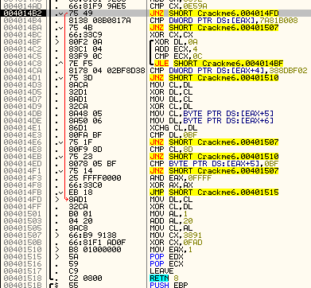

This is doing the same thing as above; performing another check to make sure we got here
legitimately. Obviously, we don’t want to take this jump either, so we help Olly by changing the
zero flag again. We then go through yet another check, this one from memory location 4014A3 to
4014AD. We skip this JNZ as well, setting the zero flag, and we end up here:

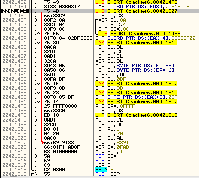

The first line, **CMP DWORD PTR DS:[EAX], 7A81B008**, does another check. After all of the
manipulation done on this password, eventually the first 4 bytes will equal 7A81B008. If it does
not, we will jump to our bad code:

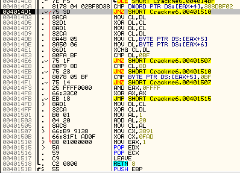

So helping Olly with the zero bit, we then enter another collection of checks (why not?), first
performing some manipulation on the next set of bytes and comparing them with 388DBF02, and
comparing various memory contents with hard coded numbers. This is obviously overkill on the
checks, but I think the author thought the more checks, the more protected this crackme would be
. Bypassing all of these jumps we finally get to what we want, the JMP
instructi0n at address 4014FB:

If we then step through the return, we will end up in familiar territory, but this time with a
difference:

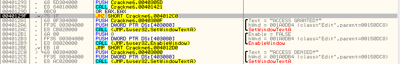

Notice that this time we fall through to the good boy message . This is
because we kept the app from setting EAX equal to 1.

Now, you may think, “great, we’ve traded a single patch in our level 2 for 9 patches (all of the
JNZ zero flag resets) in this new deeper analysis”, but this is not true. Not only do we understand
how this works (and have gained a lot of experience for future reversing challenges) but we can now
make very solid patches that we KNOW will work no matter what. Not to mention that it would not be
very hard to find the REAL password for this app, bypassing any need to patch anything! This is
true reverse engineering, and it only comes with A LOT of practice. And the harder the app is to
crack, the more you can expect needing to get this detailed in the code.

Again, don’t worry if you got lost; this was more to give an overview of the methods used. We will
be going over this stuff again. in the mean time, here’s some…

### Homework

As stated earlier in the tutorial, see if you can come up with a way to patch this app using the
NOOB technique. This means finding a way to step into the call that performs all of the
manipulation on the password, and find a way to bypass all of it. You don’t need to understand all
of the manipulations being done on the password, just find a way to make the app skip it and still
come out to the good boy.

If you need a hint, click [here.](http://thelegendofrandom.com/files/tuts/hints/hint10.html)

Super Insane Extra Credit: Can you find the hard coded password?

-Till next time

R4ndom
