R4ndom’s Tutorial #11: Breaking In Our Noob Skills
==================================================

Link: http://thelegendofrandom.com/blog/archives/884

### Introduction

In this tutorial we will be discussing patching programs again, but diving a little deeper than a
typical single “first patch we come to”. We will start with a console program and find the correct
password that has been hidden in it. It is included in the tutorial download. Other than this, all
you will need is OllyDBG.

You can download the files and PDF version of this tutorial on the
[tutorials](http://thelegendofrandom.com/blog/sample-page) page.

So let’s get started…

Console programs are 32bit windows just like any other 32-bit program running under windows. The
only difference is they don’t use a graphical interface. Other than that, they are identical. This
crackme is called CrackmeConsole.exe. Let’s run it and see what we got:

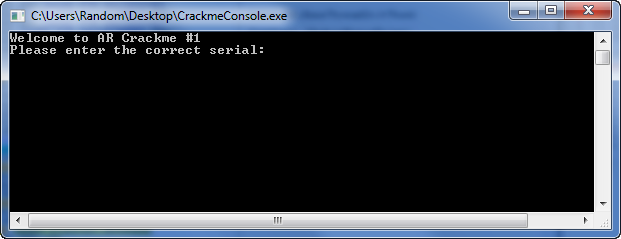

Well, looks easy enough. Let’s try a password:

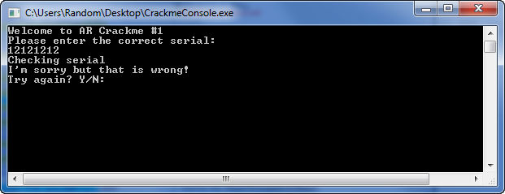

Bummer. Pressing ‘N’ ends the app:

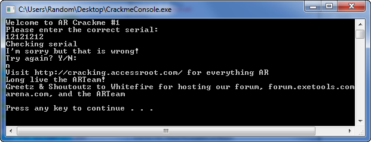

Well, I think we have enough to at least start investigating. Go ahead and load it in Olly. Let’s
then start by searching for strings:

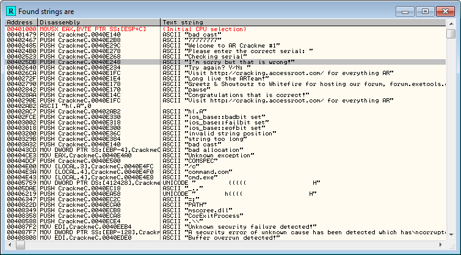

That wasn’t so hard. Let’s dbl-click on the bad boy message, “I’m sorry, but that is wrong” to at
least get into the right area:

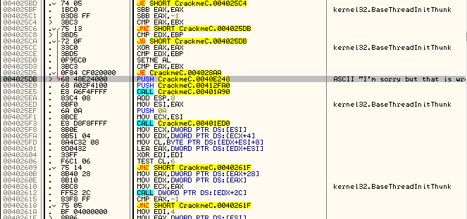

Ok, let’s study this a little. We see a jump leads to this message from 4025C6, denoted by the red
arrow. We also notice that we could get to it by not jumping at the JE instruction at address
4025D5. Let’s see what happens if we do take this jump. Click on it:

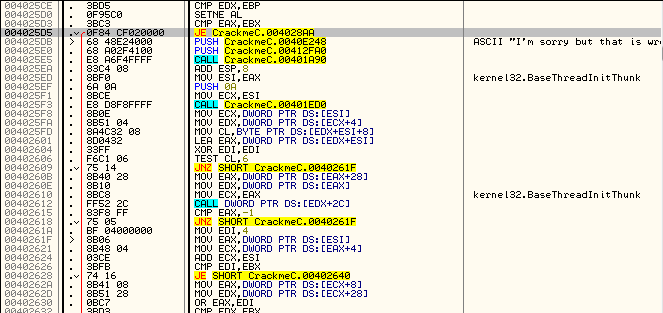

And scroll to where it points (a couple pages down):

That looks like the way we want to go . Let’s go back up and look around a
little more:

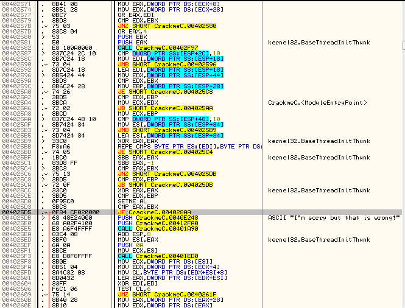

So address 4025D5 jumps to the good boy message, so that’s the jump we’d like to take. Let’s try
clicking on the other jumps to see where they lead us…maybe there’s an earlier jump that takes us
to the good boy message:

This one goes to the bad boy:

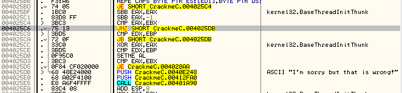

as does this one, and if you keep clicking on the jump instructions, you’ll notice the jump at
address 4025D5 is the only one that jumps to the good boy. So basically, we want to keep all jumps
that jump to the bad boy from jumping, and force the jump to the goodboy into jumping. If we keep
scrolling up, we reach our first call/compare instructions at address 402582:

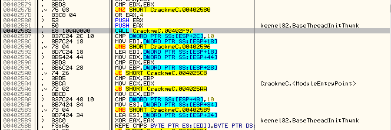

Scrolling further, we can see that there is a jump that skips the call but still performs the
compare:

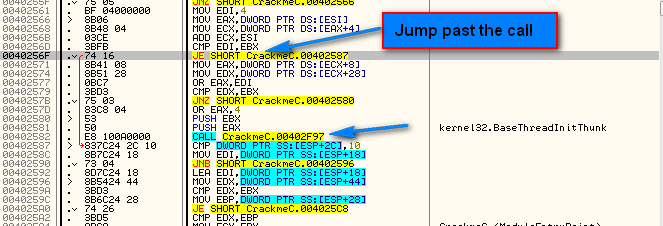

That’s not exactly normal behavior, but when we scroll up a little more we see another call compare
group. I have placed a BP on both of these calls:

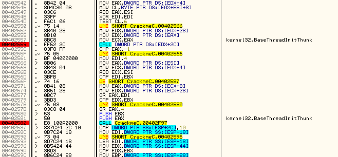

OK, let’s go ahead and run the app in Olly and see what happens. I’l enter the password ’12121212′:

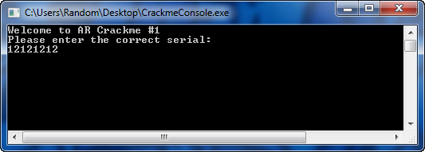

and Olly breaks at the first call:

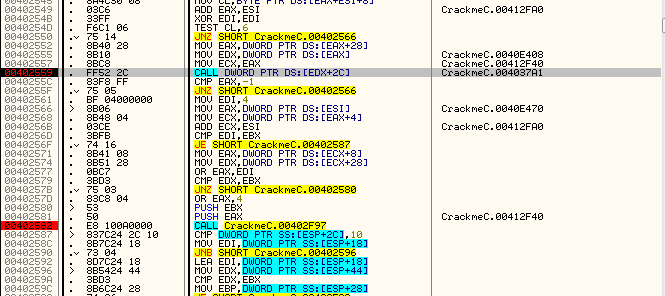

Start single stepping and you will notice that the jump at 40256F jumps the second call. Hmmm, this
gives us an indication that this second jump may not be the password checker after all, but maybe
some sort of routine if our password does not meet certain specs, like too short or too long?
Whatever, let’s keep single stepping:

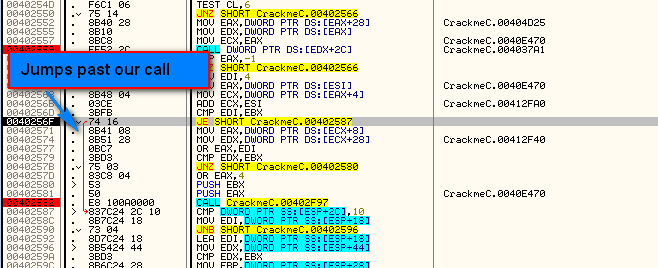

Here, at address 4025C6, we see our main culprit that jumps to our bad boy message:

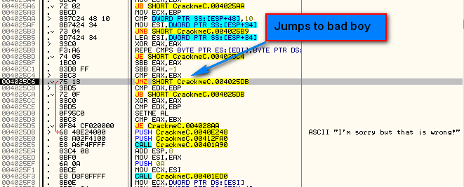

Let’s set the zero flag and see what happens:

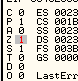

and as we continue to single step, we hit our jump to the good boy and notice that it is taken:

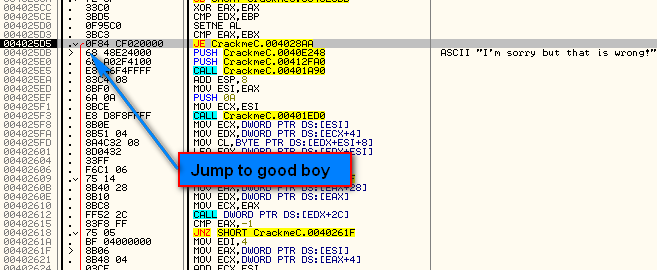

Go ahead and run the app and we notice that we have found our first potential patch:

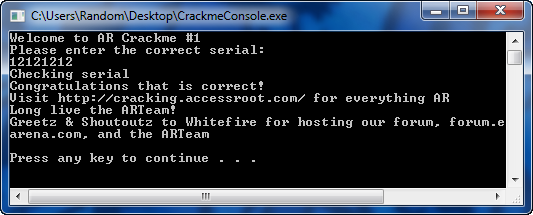

Now, patching the jump where we set the zero flag may work, or may not work. It’s hard to tell.
What if our password is too short? Too long? A different password than the one entered. This patch
is not a very good patch as we don’t really know what we’ve done, we just know it happened to work
in this case.

### Digging Deeper

Let’s look at this code a little closer, using the levels we learned in the last tutorial, and try
something not so LAME. Scroll back up to the jump to the bad boy that we patched and let’s try to
figure out why we would have jumped had we not patched it. Notice that I have also placed a comment
on the jump so I can remember it later (if you recall, highlight the line and hit ‘;’ to add a
comment).

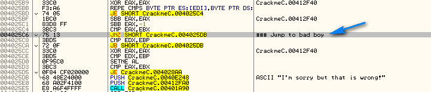

I usually preclude all of my comments with a ‘###’, this way, later, when using other tools that
fill in the comments column for us, it’s easier to find my own comments- they stand out more. You
can do whatever you like though.

Now, let’s look just above this jump and see if we can figure out what caused it. Here I have
marked the first section above the jump:

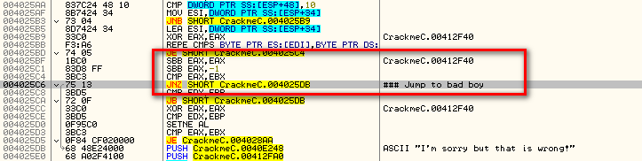

Here we can see some SBB instructions with a compare. This code doesn’t really mean a lot here to
us as we have no idea what any of it pertains to, so let’s go up to the next section and see if we
can start making some sense of it:

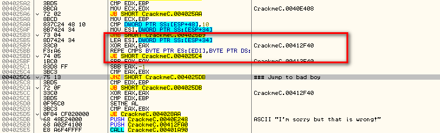

Alright, here we’re getting somewhere. The first thing you may notice is the REPE CMPS instruction.
This is a red flag in reverse engineering! Let’s look up REPE and see what it says:

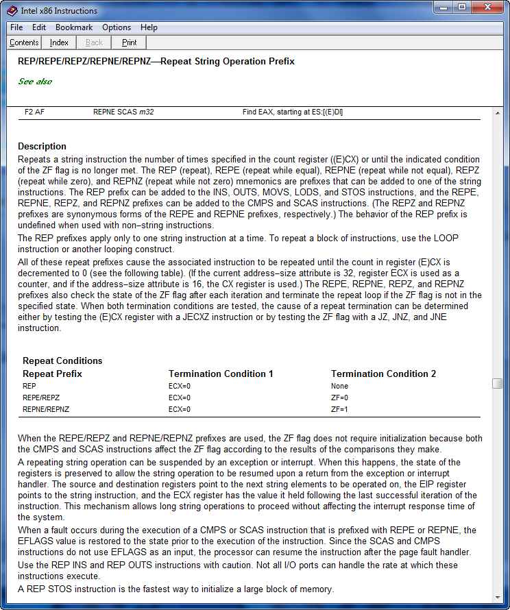

It’s not horribly clear, but if you have any experience with assembly you know that the REPXX
statement repeats like a loop until ECX = 0. The instruction after the REPXX, in this case CMPS, is
what is repeated. Taken together, this statement means “Repeat comparing two memory addresses,
incrementing this address each time through the loop, while the zero flag remains equal.” In basic
terms, it means “compare these two strings.” In reverse engineering, anytime we compare two
strings, red flags should go off. It is not done very often in an app, and checking a serial
number/password/registration key is one of the few times it is. Let’s place a BP on the first line
of this section at address 4025B5 and re-start the app. Enter our password and Olly will break at
this breakpoint:

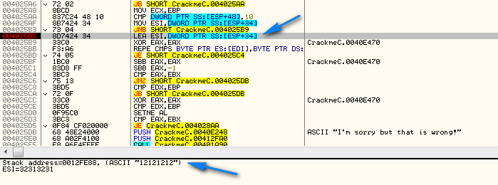

Now notice that the first instruction, **LEA ESI, DWORD PTR SS:[ESP+34]**, is **L**oading an
**E**ffective **A**ddress into ESI from the stack. The SS: denotes the stack, the [ESP+34] denotes
the position on the stack, in this case the 34th byte past whatever the ESP register is pointing
to, and the LEA instruction means basically load the address of something, as opposed to the
contents of the something. If we look at the middle bar (where the blue arrow is pointing) we can
see that SS:[ESP+34] equals address 0012FE88, and at this address is stored our ASCII password.
Single stepping once over this line shows ESI being set equal to our password (that is currently on
the stack):

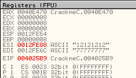

The next instruction sets EAX to zero, and then we hit the REPE instruction. In this case, the
contents of memory at the address stored in ESI is compared with the contents of the memory address
stored in EDI:

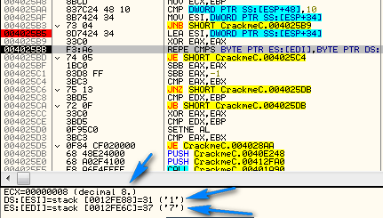

The ECX register is then lowered by one, the compare goes to the next memory location in both EDI
and ESI, and the loop will end when ECX = 0. In this case, if you look above you can see that ECX
is set to 8 (which happens to be the length of our password) so this loop will go through all 8
digits of our password, each time comparing a digit with a digit from the corresponding location
after EDI. But wait…what are we comparing to? If we look at the registers window again we see that
EDI points to an address on the stack that has some ASCII 7s in it. Let’s see this on the stack.
Click on the adddress next to EDI, right click on it and choose “Follow in stack”:

The stack window then jumps to the referenced address, in this case 0012FE6C. At this address (and
we can’t help noticing at the next as well) we see a string of “37″s. Looking at our ASCII chart we
can see that 37 is equal to “7″ which we saw in the registers window is in the EDI register:

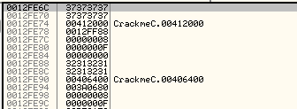

Well, it doesn’t take a rocket surgeon to see that our inputted password is being compared with a
hardcoded ASCII string of all “7″s. There are exactly 8 of them on the stack (we got lucky that we
happened to enter a password that was the same length as the hard-coded password
 ). These eight “7″s are compared, one by one, with what we entered as a
password. If we get through all 8 of them being equal (equal to 7 that is) then we will take the
next jump. Hmmmmmm. Our entered password is compared with eights “7″s. This sounds to me like the
password could be eights “7″s. Let’s restart the app and try it:

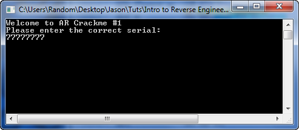

drumroll please….

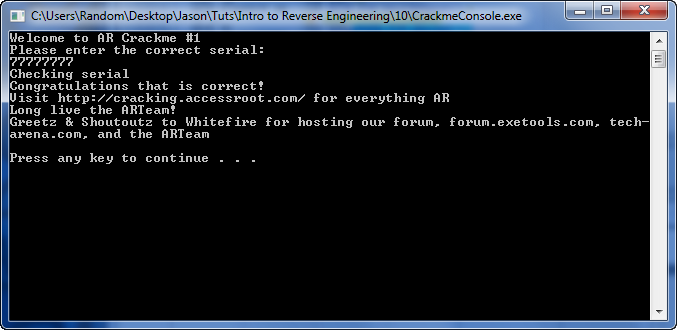

And we got it . So, looking a little farther than we would normally
patch has revealed the password, which is frankly far better than patching an app not knowing if it
will actually truly patch it or not. This is the benefit of patching at a NOOB level as opposed to
a LAME level.

### One Last Thing

I just wanted to show you an example of going through code and making comments. Unfortunately, when
writing tutorials, you have to understand the app at a pretty deep level. Here is a picture of the
core section we were discussing with my comments in it:

As you can see, a lot goes into understanding the way an app works 

-Till next time.

R4ndom
