R4ndom’s Tutorial #12: A Tougher NOOBy Example
==============================================

Link: http://thelegendofrandom.com/blog/archives/1042

### Introduction

In this tutorial we will be going over a program that’s a little more challenging. It is called
ReverseM1, written by R4ndom. I will also be discussing the plugin “Ascii Table” for Olly. It is
downloadable on the [tools](http://thelegendofrandom.com/blog/tools) page. This ReverseMe is a
perfect example of why the LAME way of patching is often just that- lame.

You can download the files and PDF version of this tutorial on the
[tutorials](http://thelegendofrandom.com/blog/sample-page) page.

### Getting Started

Go ahead and run the program:

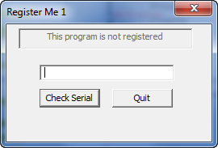

We can see that it says it is not registered and is asking for a serial number. Let’s give it one:

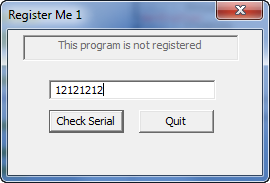

and click “Check Serial”:

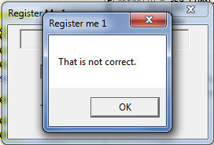

and we can see we are not correct (again!). Let’s open the app in Olly and do our trusty “search
for strings”:

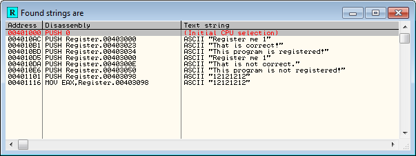

Well, that looks promising. Let’s check out the “That is not correct” string:

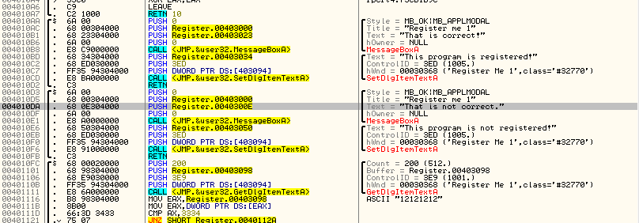

and we come to the heart of the matter. Because each of these are separate methods, we will need to
see where they are called from, so let’s do that:

and Olly opens the References window:

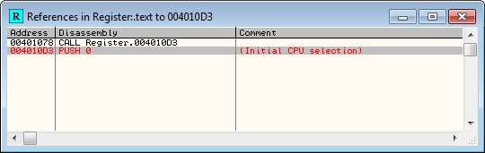

and we see that there is one call to this function. Let’s double-click that and see what it looks
like:

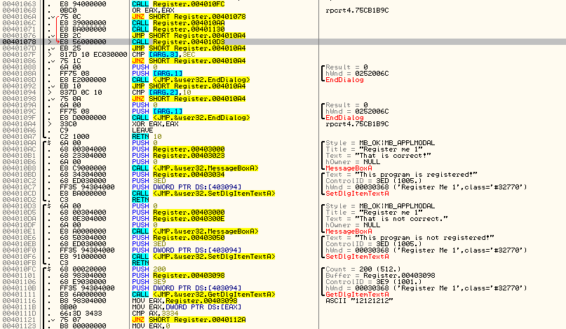

Here, we can see that the bad boy is called from address 401078, and we can also immediately see
that there is a jump instruction that jumps to this call at address 40106A:

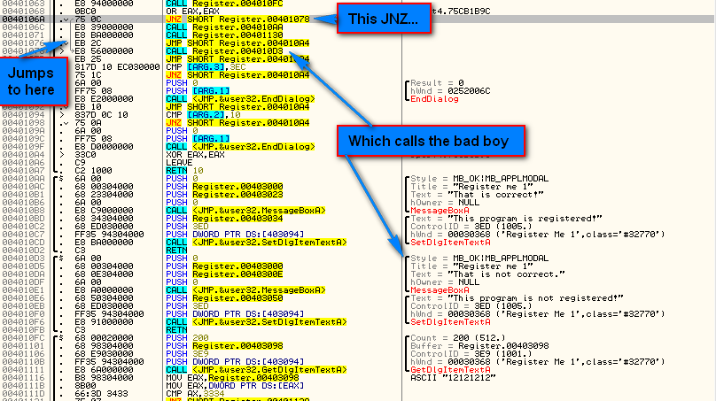

Scrolling up a couple lines we can see the proverbial call to check routine/compare/jump that we’ve
seen before. From this we can guess that the main checking routine is at 4010FC, called from
address 401063. After returning, the EAX register is checked if it contains zero or not, and if it
doesn’t, we jump to the bad boy.

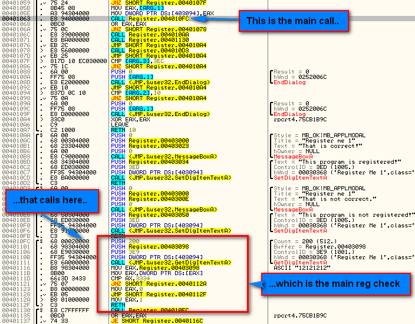

Let’s test out our hypothesis and set a breakpoint at address 40106A and re-start the app. After
entering a serial number (I entered the same ’12121212′) we break at the jump after the call to the
serial check:

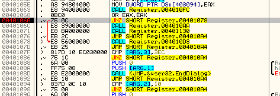

Now let’s help Olly in the right direction so he won’t take the jump (and fall through to the call
to the good boy):

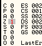

and hit run:

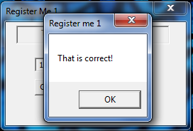

Yeah, that was easy!! Click OK and:

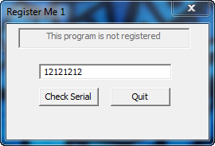

Oh F%$@ that S&%@, what the F$^& is going on here, you A$$$%^#!!!!! Obviously it didn’t register
our program. This means that there must be something we missed.

### Looking a Little Closer

Let’s re-start the app, enter a serial and let Olly break again at 40106A:

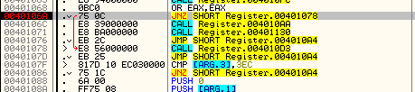

We see that if we keep Olly from making the jump to the bad boy, execution falls through to the
call at line 40106C, which will call address 4010AA. Looking down at that routine, we can see that
it is pretty standard; it opens a message box with “That is correct” and then changes the label on
the main screen to “This program is registered!”.

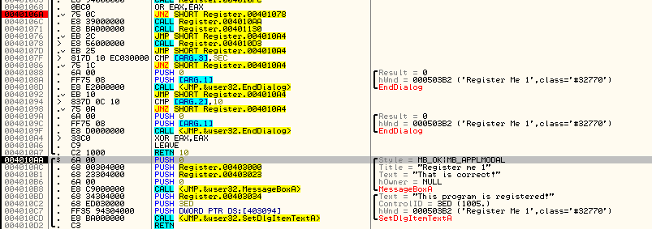

But wait! Once we return from that call, there is another call at 401071:

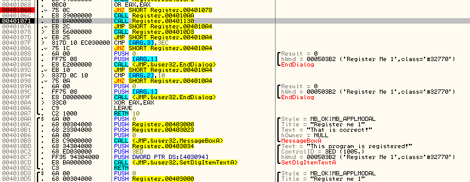

That call calls 401130, so let’s have a look-see at that routine. First of all, we notice that it
calls SetDlgItemTextA, but with a strange looking string. Let’s step through this line by line. At
401130 a call is made to address 4010FC. Looking above at this we can see that this is the serial
check routine. It then OR’s EAX with itself to see if it’s zero, and if it is not, it performs a
lot of weird looking stuff:

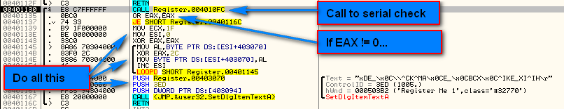

So what we can gather from this so far is that, after we patch the app to display the good boy
message, another call is made, and within this call, a call is made to the check serial routine
again, performing the same analysis on the results. This is a backup check! Now let’s see what
happens if we fail this second backup check (which we will since we only patched the jump):

First, ECX is loaded with 1F (31 decimal) --Sorry, it’s a little cut off--. ESI is then loaded with
zero and EAX is zeroed out. We then enter a loop. We’ll go through the loop step-by-step. The first
line moves a byte from an address, ESI + 403070, and since we know ESI equals zero, the address is
actually just 403070, into the AL register. Let’s see what’s at this address in the dump. Either
right click and select Follow in dump -> constant or just click in the dump window and select goto
and type in the address 403070:

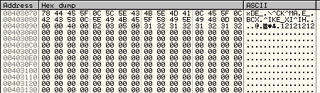

If we look carefully, we can see that this is the string that appeared above in the argument to
SetDlgTextItemA. So it is loading the first character of this weird looking string into AL.

*One thing you should know is that in a lot of assembly language instructions, certain registers
are used in default ways, for example ECX is used as a counter, ESI is used as a source address,
and EDI is used as a destination. This is the case in this example.*

Next, we XOR this character with 2C, then save it back into the same memory address:

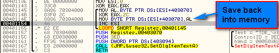

Lastly, we increment ESI (the source register) and do a LOOPD. LOOPD means lower the ECX register
by one and loop until ECX equals zero. This tells us that the value that was loaded into ECX
originally, 31 decimal, is the length of this loop.

From a big picture, this loop is basically cycling through each character of this weird string,
XOR-ing it with 2C, and saving it back into memory. This will go on until ECX equals zero, or 31
times. Single step once past the LOOPD instruction to go back up to the top and look in the dump
window:

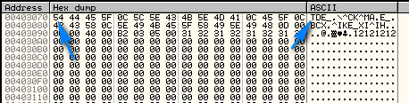

You will notice that the first digit of this string has been replaced. The original character was
XOR’ed and now it is a “T”. If you step through this loop several times, you will see the dump
window’s string change. You will also see the argument for the SetDlgItemTextA change as well:

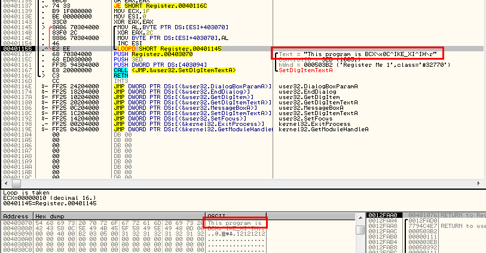

Stepping completely through the loop, we can see the final message, which looks surprisingly
familiar; “This program is not registered!”. This is the same message displayed on the main screen
showing that the app is in fact not registered yet:

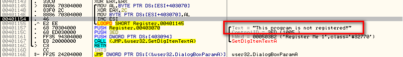

You can see that this string then becomes a value passed to the SetDlgItemTextA routine, in effect
replacing the registered message that was put up at the end of the good boy with a copy of the
unregistered message that was there before:

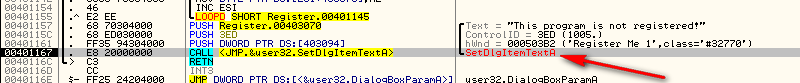

And here we see it in the main app:

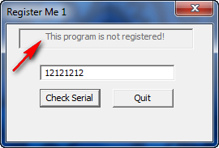

So now we know that the smarter way to patch this app is to go into the serial check and make sure
it always returns the right value, as it’s called not only as the first check, but also after the
success screen is displayed. Just to remind you, the call to the serial check is called, then eax
is tested for zero. If it’s not a zero, we jump to the bad boy- so we want that routine to return a
zero! Then, the second time the serial check routine is called, it will return a zero again, and
our second check will be passed:

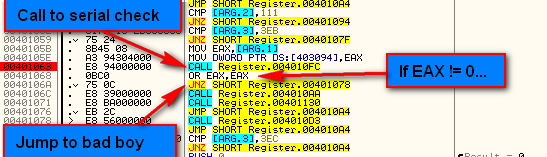

So let’s go to the serial checking routine and see what we can do about it. At the beginning of the
routine is a call to GetDlgItemTextA, as we could guess just get’s our entered serial. You can see
this by right clikcing on the argument at address 401101 (that points to the buffer that the text
will be placed in) and following it in the dump:

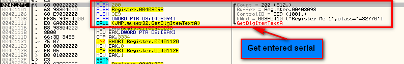

After we step over the GetDlgItemTextA instruction, we can see our serial in the buffer:

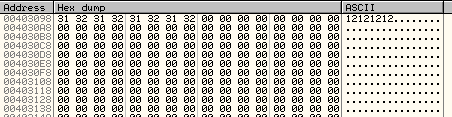

After it is stored in the buffer, the address of the beginning of the buffer is moved into EAX, and
then the contents of this address are moved into EAX. This basically moves the first four bytes of
our password into EAX. These bytes are then compared with 3334, and if they don’t match, EAX is
filled with a 1 (bad), otherwise, if they do match, EAX is stored with a zero (good):

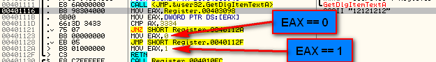

We can see that the main decission maker is the JNZ instruction at address 401121:

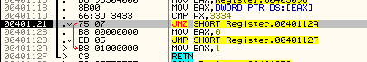

This line determines whether EAX will equal zero or 1 right before the return. So what we want to
do is guarantee that EAX will always equal zero:

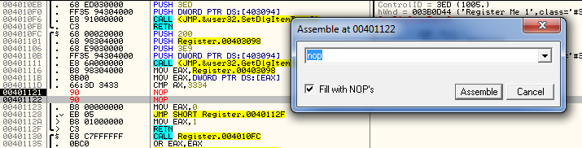

So now, the code will always fall through to moving zero into EAX and then jumping directly to the
return. Now running the app:

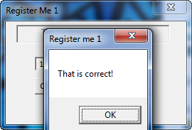

and noticing that after the call to the serial check, we naturally jump to the goodboy:

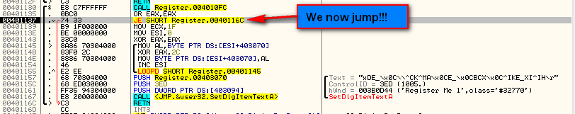

and on the second check we will jump to the good boy as well:

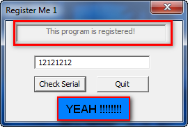

So we have now found one patch that will register this program, no matter what the serial entered
is. . Congratulations.

### ASCII Table Plugin

One thing you should do is try to find out what the password is (or what the requirements are for
it). To help you, download and install the “Ascii Table” plugin and copy it into your plugin
directory. After restarting, choose “Plugins” -> “Ascii table” and show the table. Even though it
leaves a lot to be desired, it does give you a quick table of all ASCII values:

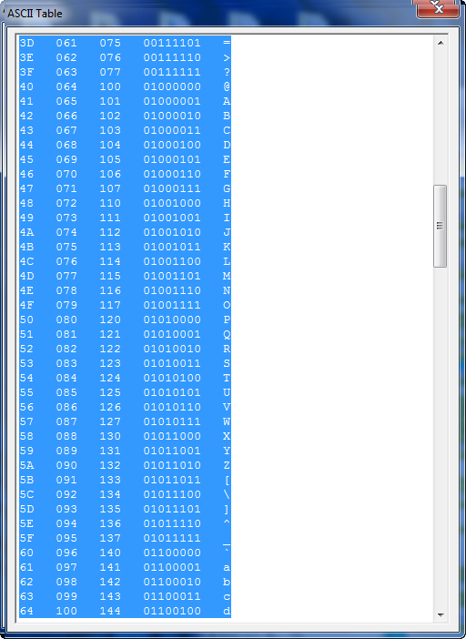

*If anyone would like to take it upon themselves to update or re-do this plugin, I would be
eternally grateful. For one, the text should not be highlighted nor editable (why would I want to
edit the ASCII chart?). Secondly, making the window sizable would be really great. If anyone does
it, please tell me and I will forever be in your debt*

-Till next time

R4ndom
