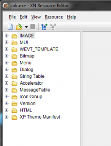
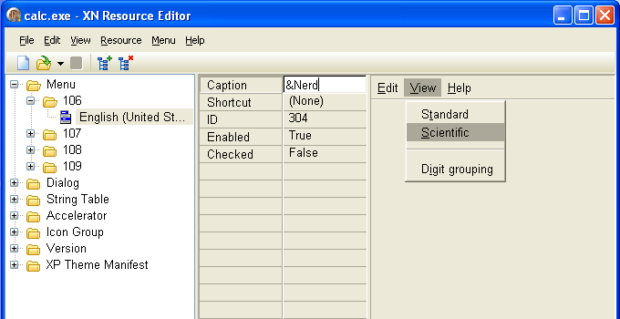
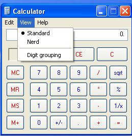
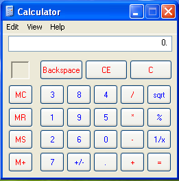

Tutorial #1 : What is Reverse Engineering
=========================================

Link: http://thelegendofrandom.com/blog/archives/7

### What is reverse engineering?

Reverse engineering is the process of taking a compiled binary and attempting to recreate (or
simply understand) the original way the program works. A programmer initially writes a program,
usually in a high-level language such as C++ or Visual Basic (or God forbid, Delphi). Because the
computer does not inherently speak these languages, the code that the programmer wrote is assembled
into a more machine specific format, one to which a computer does speak. This code is called,
originally enough, machine language. This code is not very human friendly, and often times requires
a great deal of brain power to figure out exactly what the programmer had in mind.

### What is reverse engineering used for?

Reverse engineering can be applied to many areas of computer science, but here are a couple of
generic categories;

- Making it possible to interface to legacy code (where you do not have the original code source).
- Breaking copy protection (ie. Impress your friends and save some $$).
- Studying virii and malware.
- Evaluating software quality and robustness.
- Adding functionality to existing software.

The first category is reverse engineering code to interface with existing binaries when the source
code is not available. I will not be discussing this much, as it is boring.

The second category (and the biggest) is breaking copy protection. This means disabling time
trials, defeating registration, and basically everything else to get commercial software for free.
This we will be discussing at great length.

The third category is studying virus and malware code. Reverse engineering is required because not
a lot of virus coders out there don’t send instructions on how they wrote the code, what it is
supposed to accomplish, and how it will accomplish this (unless they are really dumb). This is a
pretty exciting field, but requires a great deal of knowledge. We will not discuss this much until
later on.

The fourth category is evaluating software security and vulnerabilities. When creating large (think
Windows Operating Systems), reverse engineering is used to make sure that the system does not
contain any major vulnerabilities, security flaws, and frankly, to make it as hard as possible to
allow crackers to crack the software.

The final category is adding functionality to existing software. Personally, I think this is one of
the most fun. Don’t like the graphics used in your web design software? Change them. Want to add a
menu item to encrypt your documents in your favorite word processor? Add it. Want to annoy your
co-workers to no end by adding derogatory message boxes to Windows calculator? Let’s do it. This we
will be getting into later in the series.

### What knowledge is required?

As you can probably guess, a great deal of knowledge is necessary to be an effective reverse
engineer. Fortunately, a great deal of knowledge is not necessary to ‘begin’ reverse engineering,
and that’s where I hope to come in. That being said, to have fun with reversing and to get
something out of these tutorials you should at least have a basic understanding of how program flow
works (for example, you should know what a basic if…then statement does, what an array is, and have
at least seen a hello world program). Secondly, becoming familiar with Assembly Language is highly
suggested; You can get thru the tutorials without it, but at some point you will want to become a
guru at ASM to really know what you are doing. In addition, a lot of your time will be devoted to
learning how to use tools. These tools are invaluable to a reverse engineer, but also require
learning each tool’s shortcuts, flaws and idiosyncrasies. Finally, reverse engineering requires a
significant amount of experimentation; playing with different packers/protectors/encryption
schemes, learning about programs originally written in different programming languages (even
Delphi), deciphering anti-reverse engineering tricks…the list goes on and on. At the end of this
tutorial I have added a ‘further reading’ section with some suggested sources. If you really want
to get good at reversing, I highly suggest you do some further reading.

### What kinds of tools are used?

There are many different kinds of tools used in reversing. Many are specific to the types of
protection that must be overcome to reverse a binary. There are also several that just make the
reverser’s life easier. And then some are what I consider the ‘staple’ items- the ones you use
regularly. For the most part, the tools fit into a couple categories:

##### 1. Disassemblers

Disassemblers attempt to take the machine language codes in the binary and display them in a
friendlier format. They also extrapolate data such as function calls, passed variables and text
strings. This makes the executable look more like human-readable code as opposed to a bunch of
numbers strung together. There are many disassemblers out there, some of them specializing in
certain things (such as binaries written in Delphi). Mostly it comes down to the one your most
comfortable with. I invariably find myself working with IDA (there is a free version available
http://www.hex-rays.com/), as well as a couple of lesser known ones that help in specific cases.

##### 2. Debuggers

Debuggers are the bread and butter for reverse engineers. They first analyze the binary, much like
a disassembler Debuggers then allow the reverser to step through the code, running one line at a
time and investigating the results. This is invaluable to discover how a program works. Finally,
some debuggers allow certain instructions in the code to be changed and then run again with these
changes in place. Examples of debuggers are Windbg and Ollydbg. I almost solely use Ollydbg
(http://www.ollydbg.de/), unless debugging kernel mode binaries, but we’ll get to that later.

##### 3. Hex editors

Hex editors allow you to view the actual bytes in a binary, and change them. They also provide
searching for specific bytes, saving sections of a binary to disk, and much more. There are many
free hex editors out there, and most of them are fine. We won’t be using them a great deal in these
tutorials, but sometimes they are invaluable.

##### 4. PE and resource viewers/editors

Every binary designed to run on a windows machine (and Linux for that matter) has a very specific
section of data at the beginning of it that tells the operating system how to set up and initialize
the program. It tells the OS how much memory it will require, what support DLLs the program needs
to borrow code from, information about dialog boxes and such. This is called the Portable
Executable, and all programs designed to run on windows needs to have one.

In the world of reverse engineering, this structure of bytes becomes very important, as it gives
the reverser needed information about the binary. Eventually, you will want to (or need to) change
this information, either to make the program do something different than what it was initially for,
or to change the program BACK into something it originally was (like before a protector made the
code really hard to understand). There are a plethora of PE viewers and editors out there. I use
CFF Explorer (http://www.ntcore.com/exsuite.php) and LordPE
(http://www.woodmann.com/collaborative/tools/index.php/LordPE), but you can feel free to use
whichever you’re comfortable with.

Most files also have resource sections. These include graphics, dialog items, menu items, icons and
text strings. Sometimes you can have fun just by looking at (and altering) the resource sections. I
will show you an example at the end of this tutorial.

##### 5. System Monitoring tools

When reversing programs, it is sometimes important (and when studying virii and malware, of the
utmost importance) to see what changes an application makes to the system; are there registry keys
created or queried? are there .ini files created? are separate processes created, perhaps to thwart
reverse engineering of the application? Examples of system monitoring tools are
[procmon](http://technet.microsoft.com/en-us/sysinternals/bb896645.aspx),
[regshot](http://sourceforge.net/projects/regshot/), and process hacker. We will discuss these
later in the tutorial.

##### 6. Miscellaneous tools and information

There are tools we will pick up along the way, such as scripts, unpackers, packer identifiers etc.
Also in this category is some sort of reference to the Windows API. This API is huge, and at times,
complicated. It is extremely helpful in reverse engineering to know exactly what called functions
are doing.

##### 7. Beer.

### So Let’s Get On With It, Already!

Even though we are starting with very little knowledge, I did want to give you at least a little
taste of reversing in this first tutorial. I have included a resource viewer/edit in this tutorial
(see the Files folder) called [XN Resource Editor](http://www.wilsonc.demon.co.uk/d10resourceeditor.htm).
It is freeware. Basically, this program allows you to see the resource section in an exe file, as
well as modify these resources. I have found that you can have an awful lot of fun with these- they
allow you to change the menus, icons, graphics, dialogs, you name it, in programs. Let’s try one
ourselves…

First, run XN. Click on the load icon on top, and click over to *Windows\System32\ and load
calc.exe* (you’re default windows location may vary.) You should see a bunch of folders available:

You can see that there are folders for Bitmaps (any graphics the program displays), Menu (the top
menu items), Dialog (dialog boxes, along with text and buttons), String Table, IconGroup etc. You
should feel free to mess around with these things. Just make sure to save it as a different file
(you would hate to have to re-install windows just for the dumb calculator). In particular, try
this:

Click on the plus next to Menu. You will then see a folder with a number as a name. This is the ID
that windows will use to access this resource in the program. Open this folder as well. You should
now see an icon for “English (United States)” or something like this. If you click on this you will
see a diagram of what the menu will look like (you can even click around- it works just like a real
menu).

Now, click on the menu option “Scientific”. The Caption field should change to “&Scientific”. The
ampersand is there to tell you what the ‘Hot-Key’ is, in this case ‘S’. If instead we wanted the
‘e’ to be the hot-key, it would look like this “Sci&entific”. So already, don’t like the built in
hot-key’s for calc? Just change them!! But let’s do something different.In the Caption field,
replace the &Scientific with “&Nerd”. This will now change the menu option to “Nerd” and use the
hot-key ‘N’ (I looked through the other options in the menu to make user no other menu option used
‘N’ as a hot-key). You should do this for all of the menu entries. Now, go up to File (in XN
Resource) and choose “Save As…” Save your new version of calc to a different name (and preferably a
different location) and then run it.

Of course, you don’t have to stop there. In order to drive my coworkers nuts, I changed all of the
numbers in their calcs.

As you can see, the sky’s the limit.

Till next time…

-R4ndom

ps. Thanks go out to Lena151, for showing me the way, A.S.L., snaker, Qwerton and Jibz for showing
me the secrets, and Olly, Yoda-mmi, uCF and Colin Wilson for giving me the tools.

### Further Reading

1. **Assembly Language.**
[Assembly Language For Intel Based Computers](http://www.amazon.com/Assembly-Language-x86-Processors-Edition/dp/013602212X/ref=sr_1_4?s=books&ie=UTF8&qid=1337355497&sr=1-4)
is the de-facto book on it . You can also check out some web sites that offer a tremendous amount
of [downloads](http://homepage.mac.com/randyhyde/webster.cs.ucr.edu/index.html),
[instruction](http://assembly.co.nr/),
[sample code](http://www.codeproject.com/Articles/89460/Why-Learn-Assembly-Language), and
[help](http://www.asmcommunity.net/board/). Another good resource is *“The Art of Assembly”*. I
will be including this in one of the next tutorials, but you can also download it
[here](http://homepage.mac.com/randyhyde/webster.cs.ucr.edu/index.html)

2. **The PE file structure.** One of the best resources is from Microsoft themselves:
“[An in-depth look into the Win32 Portable Executable File Format](http://msdn.microsoft.com/en-us/magazine/cc301805.aspx)“.
Another good document (with lots of pretty pictures) is
“[PE File Structure](http://www.curlybrace.com/archive/PE%20File%20Structure.pdf)“. It is a downloadable PDF.

3. **Windows Operating System Internals.** The de-facto book is
“[Microsoft Windows Internals](http://www.amazon.com/Windows-Internals-Book-Online-Cour/dp/1906795177/ref=sr_1_2?ie=UTF8&qid=1337355472&sr=8-2)”
by Mark Russinovich. It’s about as exciting as women’s baseball, but it is THE resource.

4. **Cracking tutorials.** www.Tuts4You.com is the place to be.
