Tutorial #3: Using OllyDBG, Part 1
==================================

Link: http://thelegendofrandom.com/blog/archives/115

In this tutorial, I will attempt to introduce you to using OllyDBG. Olly has many functions and the
only way to truly learn them all is to experiment and practice. That being said, this tutorial will
give you a brief overview. Additional topics not covered in this tutorial will be discussed in
later tutorials, so that by the end, you should have a pretty good grasp of Olly.

I am including some files in this tutorial. You can download the files and PDF version of this
tutorial on the [tutorials](http://thelegendofrandom.com/blog/sample-page) page.They include a
simple binary that we will be using in olly, an Olly cheat sheet, my version of Olly with some
cosmetic changes, and a new ini file that you can replace Olly’s default init file with that will
help with new users (thanks go out to the immortal Lena151 for this). They can be downloaded
directly [here](http://thelegendofrandom.com/files/tuts/R4ndom_tutorial_3.zip) or from the
tutorials page. If you would rather use the original Olly, you can download it
[here](http://www.ollydbg.de/).


### Loading the app

The first step is to load the intended binary into Olly. You can either drag and drop the file onto
Olly’s disassmebly window, or click the load icon on the top far left and choose the file. In this
case, load “FirstProgram.exe”, downloaded from this site. Olly will do analysis (if you can read it
fast enough in the bottom bar of Olly’s display) and will stop at the programs Entry Point (EP):


The first thing to notice is that the EP is at address 401000, as we can see in the first column.
This is a pretty standard starting point for an executable (at least an executable that has not
been packed or obfuscated anyway). If your screen looks different and Olly has not stopped at
401000, try going into Appearance and selecting debugging options, click on the “Events” tab, and
make sure “WinMain (if location is known)” is checked. Then restart the app).

Let’s get a snapshot of the memory space taken up by “FirstProgram.exe”. Click on the “Me” icon (or
“M” if using a different version of Olly):

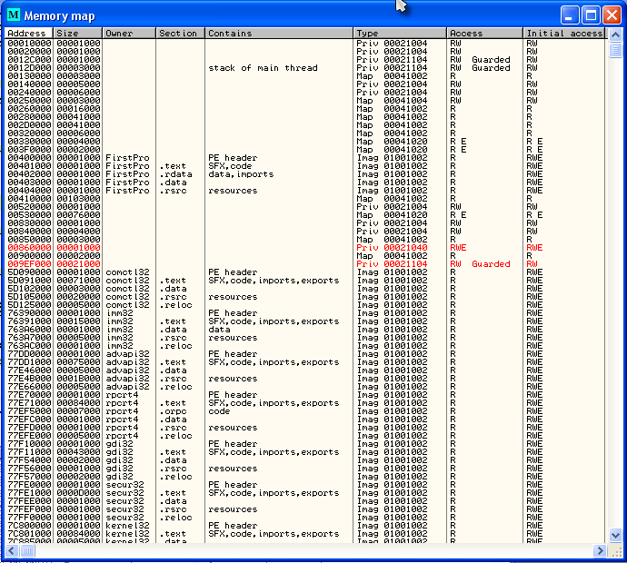

If you look in the address column, you will see that at location 401000, the row contains the size
1000, the name “FirstPro” (short for FirstProgram), the section name “.text, and that it contains
“SFX, code”. As we will learn later in this series, exe files have different sections in them that
contain different types of data. In this section is the “code” for the program. It is 1000h bytes
long and it starts at address 401000 in memory.

Below this you will see the other sections of our FirstProgram; there is an .rdata section that
contains data and imports at address 402000, a section called “.data” that contains nothing at
address 403000, and finally, a section called “.rsrc” that contains resources (such as dialog
boxes, images, text etc. Keep in mind that these sections can be called anything- it is completely
up to the programmer.

You may wonder why the .data section has nothing in it. Well, in actuality, it does. It has things
like global variables and random data. Olly just chooses not to list this as he doesn’t know
exactly what kind of data is stored in there.

At the top of the sections is a section called “PE Header”. This is a very important section, one
we will get very much into in a future article. For now, just know that it is like an instruction
manual for Windows with steps for loading this file into memory, how much space it needs to run,
where certain things are etc. It is at the head of just about any exe (and DLL for that matter).

If you now look down the list, you will see other files other than our First Program app. We see
comctl32, imm32, gdi32, kernel32 etc. These are DLL files that our app needs in order to run. A Dll
file is a collection of functions that our program can call that have been provided by windows (or
another programmer). These are things such as opening dialog boxes, comparing strings, creating
windows and the like. Collectively, these are the Windows API. The reason programs use these is
because if we had to program every function, just displaying a message box could take thousands of
lines of code. Instead, Windows has provided a function like CreateWindow that does this for us.
This makes programming much, much easier for the programmer.

You may wonder how these DLL’s got into the address space of our program and how windows knew which
ones were needed. Well, this information is stored in the PE Header listed above. When Windows
loads our exe into memory, it checks this header and finds the names of the DLL’s, as well as what
functions in each DLL our program needs, and then loads these into our program’s memory space so
that our program can call them. Every program loaded into memory will also have the required DLL’s
that the program need loaded into it’s memory space. This means that, conceivably, some DLL’s may
be loaded several times in memory if several programs are currently loaded and all use that
particular DLL. If you would like to see exactly which functions our program calls, you can
right-click in Olly’s disassembly window and select “Search For” -> “All Intermodular Calls. This
shows something like the following:


This may be surprising, but this list is VERY small, Usually, there are hundred’s or thousands of
functions needed for a commercial product, but because our sample program is so simple, it doesn’t
need very many. Although, when you think about what our program does, it seem like quite a lot of
functions just to perform such a basic role! Welcome to Windows . This
window shows the name of the DLL first, followed by the name of the function. For instance,
*User32.LoadIconA* is in the DLL User32 and the function name is *LoadIconA*. This function
usually loads the icon on the top left corner of the window.

Next, let’s do a search for all strings in the app. Right-click the disassembly window and choose
“Search For” -> “All Referenced Text Strings:

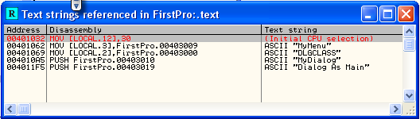

This window shows all text strings it could find in our app. Since this app is very simple, there
are only a couple. Most apps will have MANY more (sometimes in the 100′s of thousands) unless they
have been packed or obfuscated. In this case, you may see none at all! The reason packers do this
is because reverse engineers (at least new ones) rely heavily on text strings to find important
functions in a binary, and removing the text strings makes it much harder. Imagine if you did a
search for text strings and saw “Congratulations! You entered the correct serial”? Well, this would
be a huge help to a reverser (and we will see this time and again). By the way, double-clicking on
one of the strings will take you to the instruction that uses it in the disassembly window. This is
a nice feature so you can jump right to the code that uses the string.


### Running the program

If you look in the top left corner of Olly you should see a yellow window that says “Paused”. This
is telling you that the app is paused (at the beginning in this case) and ready for you to do
something. So let’s do something!. Try hitting F9 (or choose “Run” from the “Debug” menu option).
After a second, our program will pop up a dialog box (it may open behind Olly, so minimize Olly’s
window to make sure.)

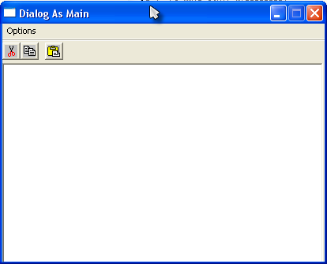

That same box that said Paused should now say Running. This means that the app is running, but
running inside Olly. You may interact with our program, in fact do  See
how it works and what it does. If you accidentally close it, click back over to Olly and hit
ctrl-F2 (or choose Debug->Restart) to re-load the program, and you can hit F9 to run it again.

Now try this: as the program is running, click over to Olly and click the pause icon (or click F12,
or choose Debug->Pause). This will pause our program wherever in memory it happened to be running.
If you now try to view the program, it will look funny (or won’t show up at all). This is because
Windows is not updating the view as it is paused. Now hit F9 again and you should be able to play
with the program again. If anything goes wrong, just click the double left facing arrow icon or
choose Debug-restart (or ctrl-F2) and the app will re=load and pause at the beginning. You can now
run it again if you wish.


### Stepping the program

Running an app is fine and dandy, but doesn’t give you a heck of a lot of information about what’s
going on. Let’s try single-stepping. Reload the application (reload icon, ctrl-F2, or
debug->restart) and we will be paused at the start of the application. now press F8. You will
notice that the current line selector has gone down one line. What Olly has done is run one line of
instructions and then paused again. If you were really observant, you would have noticed the stack
window scrolled down one and has a new entry at the top:

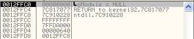

This is because the instruction that we performed, PUSH 0″ ‘pushed’ a zero onto the stack. This
shows up on the stack as “pModule = NULL”. NULL is another name for zero. You also may have noticed
that in the registers window, the ESP and EIP registers have turned red:

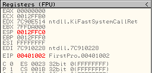

When a register turns red, it means that the last instruction run changed that register. In this
case, the ESP register (which points to the address of the top of the stack) was incremented by one
since we pushed a new value onto the stack. The EIP register, which points to the current
instruction that is being run has also increased by two. This is because we are no longer on
address 401000, but 401002- running that last instruction was two bytes long and we are now paused
on the next instruction. This instruction is at 401002, which is the current value of EIP.

The instruction that Olly is now paused on is a CALL. A call instruction means that we want to
temporarily pause in the current function we are in and run another function. This is analogous to
calling a method inside a high level language, for instance:

```
int main()
{
    int x = 1;
    call doSomething();
    x = x + 1;
}
```

In this code, we first make x equal to 1, then we want to pause this line of logic and instead call
doSomething(). When doSomething is done, we will resume with our original logic and increase x by
1.

Well, the same is true in assembly language. We first PUSHed a zero onto the stack and now we want
to call a function, in this case the one in Kernel32.dll called GetModuleHandleA():

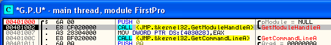

Now press F8 once more. The current line indicator will move down one, the EIP register will stay
red and increase by 5 (as the instruction that ran was 5 bytes long) and the stack was brought back
to what it originally showed. What happened here is that since we pressed F8, which mean
“Step-Over”, the code inside the call was performed and Olly paused on the next line after the
call. Now, inside of this call the program could have done anything, but we ‘stepped over’ it.

Now, to see the other option, re-start the program (ctrl-F2), press F8 to step over the first
instruction, but this time hit F7 on the call instruction. You will notice that the entire window
looks different now:

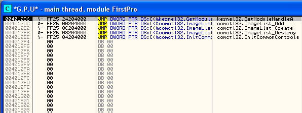

This is because F7 is “Step-In”, meaning Olly made the call and paused at the first line of this
new function. In this case, the call jumped to a new area of memory (EIP = 4012d6). Theoretically,
if we kept stepping through this new functions lines of code, we would eventually get back to the
statement after the call that got us here, back at the beginning. Of course, there are shortcuts to
this, but for now, let’s just re-start the program and start over, as we don’t want to get too
lost.

Now that we are paused at the beginning of the program, hit F8 (Step-Over) 4 times and we will land
on this statement:

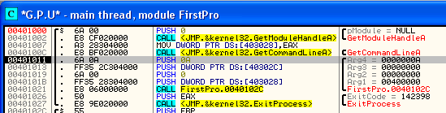

You will notice that there are 4 PUSH statements in a row. This time, watch the stack window as you
hit F8 4 times and watch the stack grow (it actually grows down – remember the plate example?). I
think we’re starting to get the feel for PUSHing on the stack…

Now you may ask WHY we pushed these arbitrary numbers onto the stack. In this case it is because
these 4 numbers are being passed as parameters to a function (the function we are about to call at
address 401021). If we take our previous high-level program and modify it a bit, it will become
clearer:

```
int main()
{
    int x = 1;
    int y = 0;
    call doSomething( x, y );
    x = x + 1;
}
```

Here, we declare two variables, x and y, and pass them into the doSomething Function. The
doSomething function will (probably) do something with these variables and then return control back
to the calling program. The stack is one of the main ways that variables can be passed to a
function: each variable is PUSHed onto the stack, the function is called, and the in the function,
these variables are accessed, usually using the inverse of the PUSH instruction which is POP.

The stack is not the only way to do this, it is just the most often used. These variables could
also have been put into registers and accessed through these registers inside the called function,
but in this case, the compiler of our program chose to put them on the stack. All of this will
become clearer after you study assembly language (you are studying assembly language, aren’t you?).
We will also go over this several times in the future.

Now, if we press F8 one more time, you will notice that it will say “Running” in the active bar in
Olly and our program’s dialog box will show up. This is because we stepped-over the call that
actually has most of the program in it. Inside this call is code that enters a loop waiting for us
to do something, so we never get control back to the line after the call. Well, let’s fix that…
Click over to our program and hit the ‘close’ button to end the app. Olly will immediately pause on
the next line after the call:

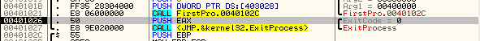

You will also notice that our program has disappeared. This is because, somewhere in that call, the
dialog window was closed. Also, if you look down one line you will see that we are just about to
call kernel32.dll -> ExitProcess. This is the Windows API that stops an application, so basically
Olly has paused our program after it has closed the window but before it has actually been
terminated! If you now press F9, the program will terminate, the active bar in Olly will say
“Terminated” and we are no longer debugging anything.


### Breakpoints

Let’s try something else, re-load the app (ctrl-F2) and double-click on the line at address 401011
in the second column (you will be clicking on the opcodes “6A 0A”. Address 401011 will now turn
red:

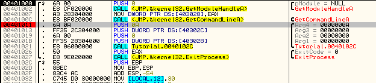

What you have done is set a breakpoint on address 401011. Breakpoints force Olly to pause execution
when it reaches it. There are different types of breakpoints in order to stop execution on
different events:

##### Software Breakpoints

A software breakpoint replaces the byte at your breakpoint address with a 0xCC opcode, which is an
int 3. This is a special interrupt that tells the operating system that a debugger wishes to pause
here and to give control over to the debugger before executing the instruction. You won’t see the
instruction change to 0xCC, Olly does this behind the scenes, but when Olly hits it an exception
occurs and Olly will trap the exception and allow the user to do what he/she wishes. If you select
to allow the program to continue (either by running it or stepping), the 0xCC opcode is replaced
back with it’s original.

In order to set a software breakpoint, you can either double-click on the opcode column, or you can
highlight the row you want the breakpoint on, right-click on it, and choose Breakpoints->Toggle (or
hit F2). To remove the breakpoint, you can double-click on the same line or right-click and select
Breakpoint->Remove Software Breakpoint (or hit F2 again).

Now that we have a BP (breakpoint) set at address 401011 and our program is paused at the first
instruction, hit F9 (run). Our program will run but will pause at the line with our BP on it.

I also want to point out something very helpful. Click on the “Br” toolbar icon or select
View->Breakpoints. You will see an entry in the breakpoint window that shows our currently set BP:

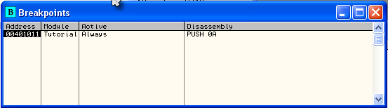

This gives you a quick overview of all of your breakpoints set. You can double-click on one of them
and the disassembly window will jump to that breakpoint (though the EIP will stay the same as you
are not actually changing the flow of control of the program. double click the EIP register to go
back to the current line set to execute next).

If you highlight a breakpoint and click the space bar, the breakpoint will toggle between enabled
and disabled. You can also highlight a breakpoint row and hit “DEL” key which will remove the
breakpoint.

Lastly, restart the program, go into the breakpoints window, highlight the breakpoint we set at
address 401011, and hit the space bar. The “Active” column will change to “Disabled”. Now run the
program (F9). You will notice that Olly did not stop at our BP because it was disabled.

##### Hardware Breakpoints

A hardware breakpoint uses the CPU’s debug registers. There are 8 of these registers built into the
CPU, R0-R7. Even though there are 8 built into the chip, we can only use four of them. These can be
used for breaking on reading, writing or executing a memory section. The difference between
hardware and software breakpoints is hardware BP’s don’t change the process’s memory, so they can
be more reliable, especially in programs that are packed or protected. You set a hardware
breakpoint by right-clicking on the desired line, selecting Breakpoint, and then choosing Hardware,
on Execution:

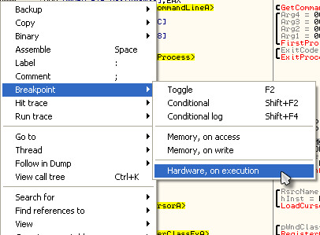

The only way to see what memory BP’s you have set is to select “Debug” and “Hardware Breakpoints”.
There is a plugin that will make this a lot easier, but we’ll discuss that later


##### Memory Breakpoints

Sometimes you may find a string or a constant in the program’s memory, but you don’t know where in
the program it is accessed. Using a memory breakpoint tells Olly that you want to pause whenever
ANY instruction in the program reads or writes to that memory address (or groups of addresses.)
There are three ways to select a memory breakpoint:

- For an instruction, right-click on the desired line and select Breakpoint->Memory, On Access or Memory, On Write.
- To set a BP on an address in the memory dump, highlight one or more bytes in the dump window, right-click on them and choose the same option as above.
- You can also set a BP for an entire section of memory. Open the Memory window (“Me” icon or View->Memory), right click the section of memory you desire, and right-click and choose “Set Break On Access for either Access or Write.

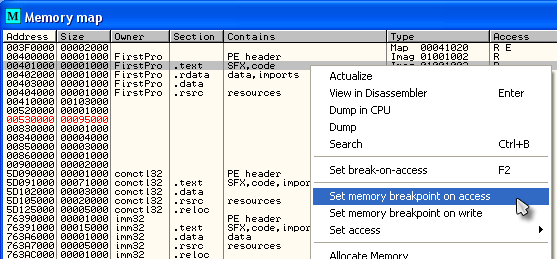


### Using The Dump Pane

You can use the dump pane to inspect the contents of any memory location in the debugged process’s
memory space. If an instruction in the disassembly window, a register, or any item in the stack
contains a reference to a memory location, you can right click that reference and select “Follow in
Dump” and the dump pane will show you the address section. You can also right-click anywhere in the
dump pane and select “Go To” to enter an address to view. Let’s try it.

Make sure the FirstProgram is loaded and paused at the beginning. Now, press F8 eight time and we
will be on the instruction at address 401021 that says CALL FirstPro.40102c. If you look at this
line, you will notice that this call is going to jump us down to address 40102c, which happens to
be 3 lines down from where we currently are. Hit F7 to step in to the jump and we will then be at
that address at 40102c. Remember that this is a CALL instruction, so we will eventually come back
to 401021 (or at least the instruction after this).

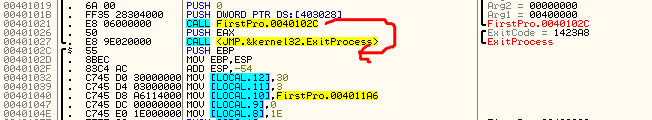

Now, step the code (F8) until we get to address 401062. You can also just set a breakpoint on this
line and hit F9 to run to it. Remember how to set a breakpoint? double-click on the opcode column
on the line you want to set the BP. You can also just highlight the line and hit F2 to toggle the
BP on and off). Now we are paused at address 401062:

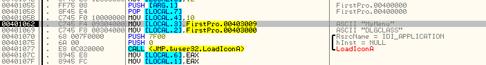

Now, let’s look at the line we are paused at. The instruction is MOV [LOCAL.3], FirstPro.00403009.
As I’m sure you know (because you have been studying assembly language :p ) this instruction moves
whatever is at address 00403009 onto the stack (which Olly references as LOCAL.3). You can see in
the comments column that Olly has discovered that at this address is the ASCII string “MyMenu”.
Well, let’s have a look. Right-click on the instruction and select “Follow in Dump”. You will
notice that we have a couple options here:

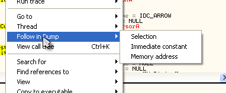

In this case, select “Immediate Constant”. This loads whatever address is being affected in the
instruction. If you had chosen “Selection”, the dump window would have shown the address of the
highlighted line, in this case 401062 (the line we were paused at). We would basically just be
looking at a dump of what we were looking at in the disassembly window. Lastly, if we had chosen
“Memory address”, the dump screen would show the memory for LOCAL.3. This would in effect show the
memory for the local variables we were working with (on the stack). Here;s what the dump looks like
after selecting Immediate Constant”:

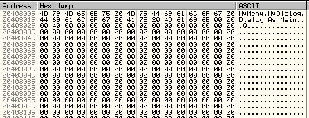

As you can see, the dump now shows memory starting at address 403009, which is the address the
instruction Olly was loading the ASCII string from. On the right, you can see the string, “MyMenu”.
On the left, you can see the actual hex for each character. you may notice that after “MyMenu” are
some additional strings. These strings will be used in other parts of the program.


### Finally, Something Fun!

To end this part of the tutorial, let’s do something fun. Let’s edit the binary to display our own
message! We will change the “Dialog As Main” string to something of our own and then see what
happens.

First, click on the “D” of “Dialog As Main” in the ASCII section of the dump window:

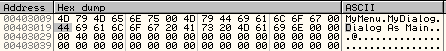

You will notice that the first hex digit is also highlighted on the left. This digit corresponds to
the letter “D”. If you look it up on an ASCII chart you will see that the hex for the letter “D” is
0×44. Now, click and drag to select the entire string “Dialog As Main”:

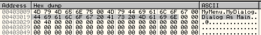

Now, right-click anywhere on the selection and choose “Binary” -> “Edit”. This allows us to change
the memory contents of our program:

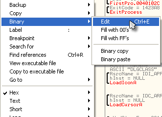

We should then have a screen that looks like this:

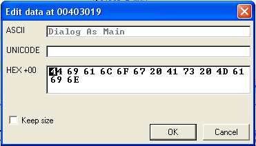

The first field shows us our string in ASCII. The second field is for Unicode (which this program
doesn’t use, so the field is blank) and the last field is the raw data relating to this string.
Now, let’s change it. Click on the first letter of the string (the “D”) and type anything you want
over top of the “Dialog As Main” string. Just make sure you don’t add more letters than in the
original string! You may overwrite other strings the program need, or worse, code that the program
needs!!! In my case, I typed “Program R4ndom”:

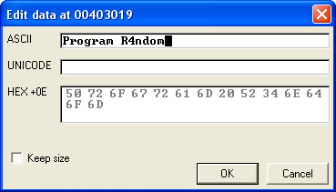

Now click OK and run the app (click inside Olly and hit F9). Switch over to our program, type
something in and select “Options” -> “Get Text”. Now look at our dialog box!!!

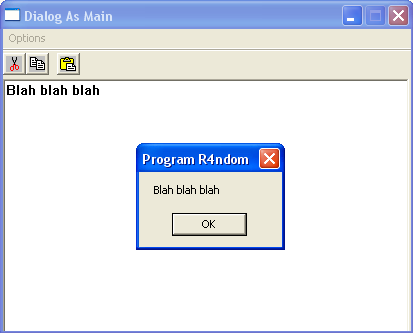

Notice anything different about the title of the dialog box 

-till next time

R4ndom
