Tutorial #4: Using Olly, Part 2
===============================

Link: http://thelegendofrandom.com/blog/archives/258

### Introduction

In this tutorial we are going to continue with learning to use Olly. We will use the same program
used in the last tutorial (I will also include it in the downloads of this one again).

You can download the files and PDF version of this tutorial on the
[tutorials](http://thelegendofrandom.com/blog/sample-page) page.


### DLLs

As I told you in an earlier tutorial, DLLs are loaded by the system loader when you start your app.
Let me be more specific this time. DLL (Dynamic Link Libraries) are collections of functions,
usually provided by Windows (though they can be provided by anyone) that are used a lot in windows
programs. They are also functions that make it easier for programmers to perform what would
otherwise be tedious, repetitive tasks. These functions are stored in libraries that are
dynamically linked in when needed.

For example, converting a string to all uppercase is something that needs to be done in a lot of
applications. You have three choices if your app uses this functionality multiple times in your
app; 1) you can code it yourself and put it in your app. The problem is, what if you know that your
next app is also going to use this same function many times? You would need to cut and paste it
into every app you make that uses it! 2) You can create your own library that any app you make can
call. In this case, you would create a DLL that you would include with every app, and this DLL
would have convertToUpper, as well as other common functions, that your apps can call, thereby only
having to code it once. Another good thing about this is, say you come up with a nice optimization
for converting a string to all uppercase. In the first example, you would need to copy this new
code to every app that uses it, but in the the case of a common DLL, you would just change the code
in the DLL and every app that used that DLL would get the benefit of the faster code. Sweet. This
was really the reason DLLs came in to being.

The last option is to use one of the thousands of functions that Windows has included in it’s own
set of DLLs. There are many benefits to this. The first is that the coders at Microsoft have been
spending years optimizing their functions, so chances are they’re better than yours. Secondly, you
do not have to include any of your own DLLs with your app as all windows systems have these DLLs
built in. And lastly, if Windows decides to change their operating system, your custom DLLs may not
be compatible with the new operating system, while if you use Windows DLLs, they are guaranteed to
be compatible.


### How DLLs Are Used

Now that you know what a DLL is, let’s talk about how they’re used. A DLL is basically just a
library of functions that your app can call. When you first load your app, the Windows Loader
checks a special section of the PE Header (remember the PE Header?) and checks to see what
functions your app calls and from what DLL’s these functions reside in. After loading your app into
memory, it then iterates through these DLLs and loads each one into your app’s memory space. It
then goes through all of your app’s code and injects the correct address of where it put these DLL
functions into your program everywhere your program calls that function. For example, if one of
your first calls is to convert a buffer of letters to uppercase by calling StrToUpper in the
kernel32 DLL (just an example), the loader will find the place it loaded the kernel32 DLL, find the
address of the StrToUpper function, and inject that address into the lines of code in your app that
call that function. Your app will then call into the kernel32′s DLL space in memory, perform the
StrToUpper function, and then return back to your program.

Let’s see this in action. Load the FirstProgram.exe program included with this tutorial into Olly.
Olly will break at the first line of code (from now on called the Entry Point – this is important
as this is what the PE Header calls it for when we start discussing that in detail.)

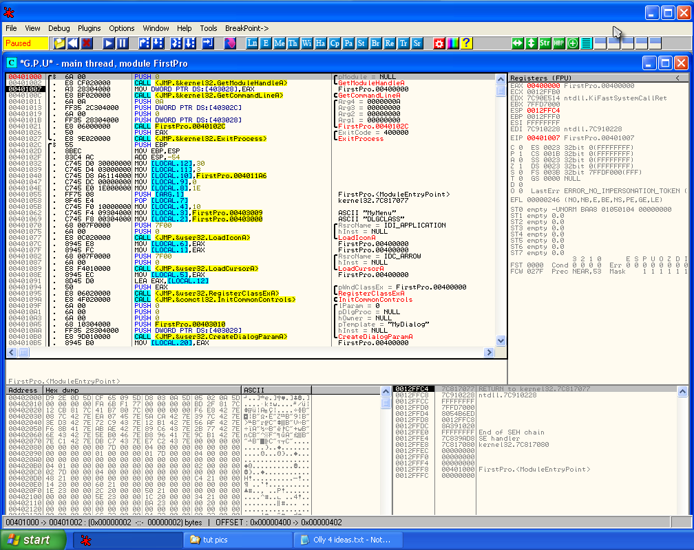

If you look at the second line of the code, you will see a call to a function called
kernel32.GetModuleHandleA. First off, let’s see what this function does. In case you did not get it
in the last tutorial, I have included in the downloads for this tutorial a file called WIN32.HLP as
well as a text document explaining how to install it into Olly. This file allows you to right-click
on a Windows API you are unfamiliar with and it will show you what the API does. You may need to
restart Olly after you copy it over. Right click on GetModuleHandleA and select “Help on Symbolic
Name”. Olly will bring up a cheat sheet of this API:

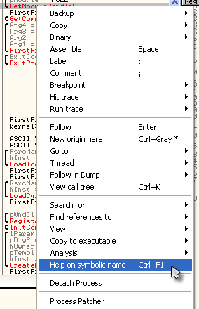

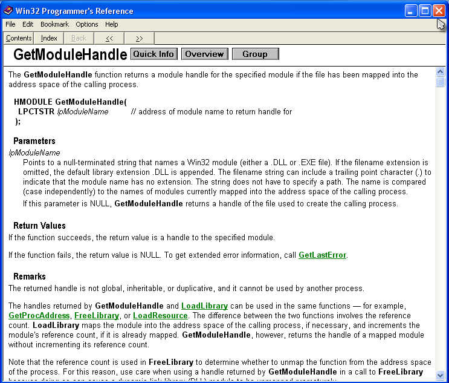

So, basically, this functions gets a handle to our program’s memory space. In Windows, if you want
to do ANYTHING to a window (or pretty much any other object for that matter) you must get a handle
to it. This is basically just a unique identifier so Windows knows which object you’re referring
to. GetModuleHandle is actually a little more complicated than this, but let’s return when we have
more knowledge under our belt.

Close the help window and let’s see exactly where this call is going. As Olly has tried to help and
replaced the actual address of the GetModuleHandleA with the name of the function, let’s see what
address it resides at. Click once on the GetModuleHandleA call line and hit the space bar. That
will open up the assembly window:


This window serves two purposes; it first shows you the exact assembly language instructions that
are being computed (in case Olly has helpfully replaced the address) and secondly it allows us to
edit the assembly language. We will not be doing any editing until next tutorial, so for this time
lets just look at the address: 4012D6.There are two ways to jump to this address (without actually
running the code) to see what’s there. You can highlight the “CALL GetModuleHandleA” line and hit
“Enter”. You can also hit Ctrl-G and enter the address manually. Let’s try the first way- select
the line at address 401002 (in the third column with the actual instruction in it) and click enter,
and you will be taken to the code that that call has called into:

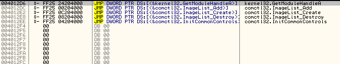

Now this is interesting: it sure doesn’t look like code that would perform GetModuleHandleA. It
look more like a series of jumps. There is a very good reason for this, but unfortunately, one that
requires a little explanation.


### The Address Jump Table

The first thing to know is that DLLs do not always get loaded into memory at the same spot. The
Windows loader, which is responsible for loading your app and all of the support DLLs that your
program needs, is allowed to change where in memory these DLLs can be loaded (and frankly, can even
change where your app can be loaded, but we’ll get to that later). The reason for this is let’s say
a Windows DLL, one of the first ones loaded, is mapped into address 80000000. Well let’s say you
have also included a DLL in your app that wants to be loaded at that same address. Since both DLLs
can’t be loaded at the same address, the loader must move one of these DLLs to another address.
This happens all the time, and is called relocation.

Here’s the problem: When you first coded your application and wrote an instruction that called
GetModuleHandleA, the compiler knew exactly where the proper DLL was, so it put an address into
that instruction, something like “CALL 800000000″. Now, when your program is loaded into memory, it
still has this call to 800000000 (I’m being overly simple here  , but what
if the loader has decided to move this DLL to 80000E300? Your call will call the wrong function!

The way the PE file, and hence the Windows file, got around this problem was by creating a jump
table. What this means is that when your code was first compiled, every call to GetModuleHandleA
pointed to a single location in your app, and this single location immediately jumps to an
arbitrary address (which will eventually become the proper address). In fact, all function calls
into DLLs use this same technique; they each call a specific address that then immediately jumps to
an arbitrary address. When the loader loads in all the DLLs, it goes through this ‘jump table’ and
replaces all of the arbitrary address with the real address of the functions in the memory. This is
what a jump table looks like after all of the real addresses have been populated:

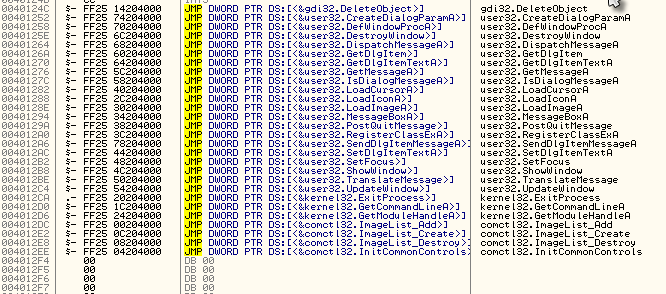

Just as this is sort of a complicated idea, let me give you an example. We will write a short
program, using completely arbitrary information (just to prove our point) that calls a function in
kernel32.dll called ShowMarioBrosPicture. Here is our program (in no specific language):

```
main()
{
      call ShowMarioBrosPicture();
      call ShowDoYouLikeDialog()
      exit();
}
ShowDoYouLikeDialog()
{
      If ( user clicks yes )
      {
          call ShowMarioBrosPicture();
          Call ShowMessage( "Yes, it's our favorite too!")
      }
      else
      {
          call showMessage( "You obviously never played Super Mario Bros.");
      }
}
```

After compiling this, the calls to functions will be replaced by actual address and will look
something like this (again, not in any specific language):

```
401000 call 402000 // Call ChowMarioBrosPicture
401002 call 401006 // Call showDoYouLikeDialog
401004 call ExitProcess
401006 Code for "Do You like It" dialog
.
.
.
40109A if (user clicks yes)
40109C call 402000 // call showMarioBrosPicture
40109E call 4010FE // call show message
4010a1 call ExitProcess
4010a3 if (user clicks no)
4010a5 call 4010FE // call show message
4010a7 call ExitProcess

4010FE code for show message
...
40110A  retn
```

and down below would be our jump table (in this case, only showMarioBrosPicture is in it) **402000
JMP XXXXXXXX**

Now, since out program has no idea where showMarioBrosPicture is going to be ( or where the
kernel32 DLL file is going to be for that matter), the compiler of our program is just going to
fill in X’s for the actual address call (not really but you get the idea).

Now, when the Windows loader loads our app, it first loads our binary into memory, complete with
the jump table, but the jump table doesn’t have any real addresses in it yet. It then starts
loading DLLs into our memory space, and finally starts figuring out where all the functions reside.
Once it finds the address for showMarioBrosPicture, it is going to go into our jump table and
replace the X’s with the actual address of that function. Let’s say the showMarioBrosPicture
address was at 77CE550A. Our jump table code would then be replaced with:

**402000 JMP 77CE550A** .

Now, since Olly can figure out that this is pointing to showMarioBrosPicture, it will helpfully go
into our jump table and actually show it as :

**402000 JMP DWORD PTR DS:[<&kernel32.showMarioBrosPicture>]**

Now, let’s go back and look at the jump table in our FirstProgram app:


When this program was first coded, all of these functions were called in various DLLs, but the
compiler did not know where these functions were going to be placed in memory when our program was
run, so it would have created something that looked (though not exactly) like this:

**40124C  JMP XXXXX** // gdi32.DeleteObject
**401252  JMP XXXXX** // user32.CreateDialogParamA
**401258  JMP XXXXX** // user32.DefWindowProcA
**40125E  JMP XXXXX** // user32.DestroyWindow
**…**

After the loader loaded our app and then loaded all the DLLs and found the address of these
functions, it would have then gone through each one of these and replaced them with the actual
address these functions now reside at, namely what you saw in the previous picture. If you think
about this, this is a pretty smart way to handle this. If not done this way, the loader would be
forced to go through our entire app and replace EVERY call to EVERY function in EVERY DLL and
replace that address with the true address. That would be a lot of work. This way, the loader only
has to replace the address in one place per function call, namely that functions line in the jump
table.

Let’s See For Ourselves. Reload the app in Olly and hit F7. Click on the instruction in line 401002
(like we did before) and hit the space bar (like we did before):


I just wanted you to notice the address again, 4012D6. Now click F7 to step into the call and you
will notice that we will land at address 4012D6, which if you scroll up a little, you will also
notice that we have called into the middle of the jump table:


Now, click F7 again and we will be taken to the REAL address of GetModuleHandleA at 7780B741. You
can tell we are now in module kernel32 in two ways, both of which you will use at different times.
The first is the title of Olly’s CPU window:

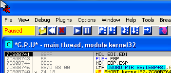

You can see that it says “module kernel32″. And the second way you can tell is by going into the
memory window and looking up the address:

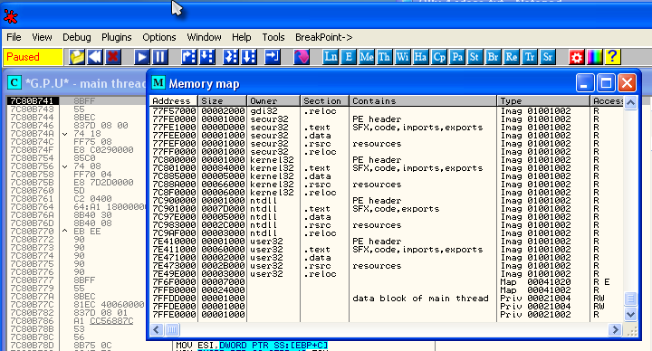

You can see that the address we are on (7780B741) falls in the address space of kernel32′s code
section.

Now let’s go back and view a couple of the other function calls. Re-start the app and F8 down to
address 40100C, the line that has the call to GetCommandLineA on it. Click on the instruction and
hit the space bar so we can see what address it is pointing to, in this case 4012D0:

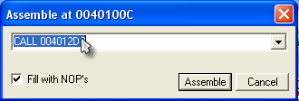

(Sorry for the mouse right over the address  It is 4012D0) Now,
let’s try manually going to this address, as this is something you will use often. Either click
Ctrl-G or click on the GOTO icon and type in the address we want to go to:

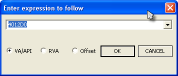

Notice your “GOTO” window may look a little different, but that will be fixed soon. Now click OK
and we will jump to the jump table for the GetCommandLineA function:

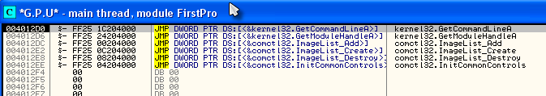

Now click F7 to make the jump and we will land at the beginning of the GetCommandLineA function in
kernel32.dll. This function starts at 7C812FBD:

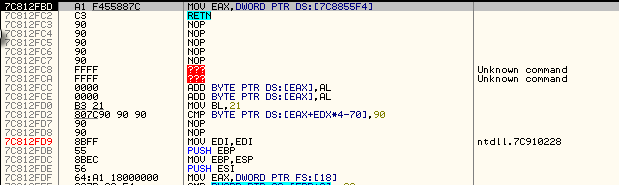


### Jumping in and out of DLLs

As we step around a program, at various times you will end up in DLLs. This is not generally where
you want to be if you are trying to overcome some sort of protection scheme as Windows DLLs do not
really contain any. The one caveat to this is if the program you are attempting to reverse engineer
comes with it’s own DLLs and you want to reverse those as well (or the protection scheme is
actually in a DLL). There are a couple ways to get back to our programs code from a DLL. One way is
to simply step through all of the DLL’s function code until you finally return to your program,
though this can take quite a while (and in some cases like Visual Basic, forever). The second
option is to go into the “Debug” menu option in Olly and choose “Execute till user code” or press
Alt-F9. This means run the code in this DLL until we return to our own programs code. Keep in mind
that sometimes this doesn’t work because if the DLL accesses a buffer or variable that is in our
programs workspace, Olly will stop there, so you could end up calling Alt-F9 several times before
you finally get back.

Let’s try this option now. We should be currently paused at address 7C812FBD, the beginning of
GetCommandLineA. Now press Alt-F9. This will take us back to the instruction in our program after
the call we made to kernel32 (if you scroll up one line you’ll see the call).

Now let’s try another option of getting back to our code. Re-start the program, step over (F8)
until the call to GetCommandLineA (40100C), step in to that call (F7) and step in to the jump in
the jump table (F7). We are now back at the beginning of GetCommandLineA:


Now open up the memory window and scroll until you can see the sections with our programs code in
it (starting at address 400000 with the PE Header):

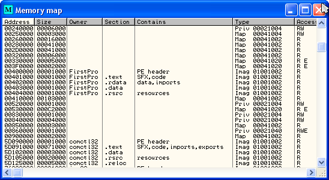

now, click on the line at address 401000, the line that has our .text section on it. Now hit F2 to
toggle a breakpoint on access for this memory section (or right click and select Breakpoint on
access):


Now, run the app. Olly will break on the same line as above at address 401011, the line one after
our call to the DLL!!! Now remove the memory breakpoint or you’ll wonder why every time you run the
app it breaks on the next line 


### More On The Stack

The stack is a very important part of reverse engineering, and without a very clear understanding
of it, you will never be a great reverse engineer. Let’s experiment with it a little…

First, take a look at the registers window (after re-starting the app) and look at the ESP
register. This register points to the address of the ‘top’ of the stack. In this case the value of
ESP is 12FFC4. Now look down at the stack window and you’ll notice the top address in the list
matches this address:

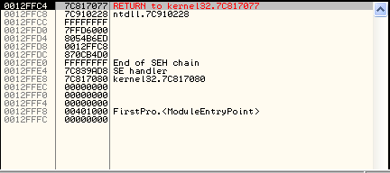

Now push F8 (or F7) one time to push the value zero onto the stack and look at the stack window:

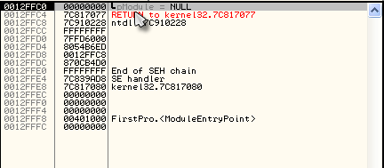

As we went over in out last tutorial, this pushes zero (null) onto the stack. Now look at our ESP
register:

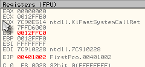

It has changed to 12FFc0, because, after pushing a byte onto the stack, this is the new top of the
stack. Now press F8 one time, stepping over the call to GetModuleHandleA, and look at the stack
window:

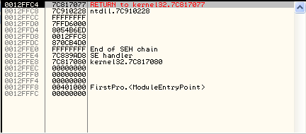

You will notice that our stack has gone back down by one (and our ESP register is back to what it
was). This is because the GetModuleHandleA function used this zero that was pushed on to the stack
as an argument and then ‘pop’ed it off the stack as it was no longer needed. As was touched on in
the last tutorial, this is one way our program passes arguments to functions: they push them on the
stack, the called function pops them off the stack, uses them, and then returns, usually with any
information we need in registers (as we’ll see shortly).

Let’s watch a couple more…If you press F8 twice to step over the call to GetCommandLineA you will
notice that the stack didn’t change. That’s because we didn’t push anything onto the stack for that
function to use. Next, we reach a PUSH 0A instruction. This is the first argument that we are going
to pass to the next called function. Stepping over this you will notice that 0A will be at the top
of the stack and the ESP register has gone down by 4 (when you push a value onto the stack, the ESP
register goes down as the stack ‘grows’ down in memory). Now push F8 again, and the ESP register
will go DOWN again by 4. This is because we have pushed a 4 byte value onto the stack. If you look
at the top of the stack you will notice that we pushed 00000000 onto the stack. Why?

Let’s look at the line that actually made the push at 401013: **PUSH DWORD PTR DS:[40302c]**

What this line means (as I’m sure you know because you have been studying assembly language :p ) is
take the contents of the four bytes at address 40302C and PUSH them onto the stack. What’s at
40302C? Well, 00000000 of course! (just kidding. Let’s look for ourselves 
Right click on the instruction at address 401013 and select “Follow in Dump” -> “Memory Address”.
This will load the dump window with the contents of memory starting at 40302C:

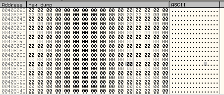

Obviously, there’s not much there! But at least you now know where the zero is coming from. If you
would like to know more detail as to what’s going on here, this memory space is being set up for
variables and will eventually be populated with those variables, but for now, all the variables
have been initialized to 0′s.

Now press F8 once and we will be on another PUSH but this time from address 403028. If you scroll
up on the dump window you can see that at this address is yet more zeros (right after the string we
changed in the last tutorial  ). So what this section is doing is pushing
pointers to memory addresses, currently set at zero, that our code will use as variables. Step over
the last PUSH and step into the call to address 40101C. The first thing you should notice is that
something new has been pushed onto the stack: the return address for our call, 401026.

When any code uses a CALL instruction, the address of the next instruction that would have been run
had we not made the call is automatically pushed onto the stack. The reason for this is that, after
the function we called has done everything it needs to do, it needs to know where to return to.
This address that was automatically pushed onto the stack is that return address. Look at the top
of the stack window:

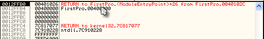

You will see that Olly has figured out that it is a return address and it points back to our
program (FirstPro) and that the address that needs to be returned to is 40102C (one instruction
past the call).

Now, at the end of this function, a RETN instruction will be used (and of course you know this
stands for “return” because it was at the beginning of your assembly language book). This return
instruction really means “POP the address of the top of the stack and point our running code to
this address” (it basically replaces the EIP register- the register of the current line of code we
are running- with this pop-ed value). So now, the called function knows exactly where it needs to
return to when it’s done! In fact, if you scroll down a little you will see the RETN statement at
address 4011A3 that will pop this address off the stack and begin running code at that address:

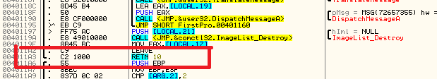

(The 10 after the RETN statement just means give me the return address and also delete 10h bytes
off the stack as I don’t need them anymore. Just look on the next page of your assembly language
book )

---

Let me just take a moment here to start what I am sure will become a famous mantra in the reverse
engineering community. I like to call it **“Random’s Essential Truths About Reversing Data”** , or
**R.E.T.A.R.D** (since everything sounds better as an acronym). I am officially starting this
soon-to-become-legend list with the following commandment:

**#1.  You MUST learn assembly language.**

If you don’t, you will not succeed at reverse engineering. It’s that simple.

---

The last thing I am going to talk about in this tutorial is how Olly handles the displaying of
arguments and local variables. If you double click on the EIP register so we can jump back to our
current line of code (at address 40101C) and look down a couple lines you will see several blue
labels that say Local in them (and one that says Arg):

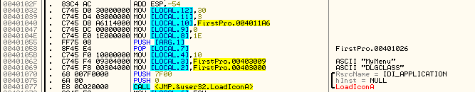

If you do not have any programming experience, you may not know what the difference between a local
variable and an argument is. An argument, as we discussed earlier, are variables passed to a
function that that function needs, usually passed on the stack. A local variable is a variable that
the called function ‘creates’ to hold something temporary. Here is an example of a small program
that has the two different concepts:

```
main()
{
    sayHello( "R4ndom");
}

sayHello( String name)
{
    int numTimes = 3;
    String hello = "Hello, ";

    for( int x = 0; x < numTimes; x++)
        print( hello + name );
}
```

In this program, the string “R4ndom” is an argument passed into the sayHello function. In normal
assembly language, this string (or at least the address of this string) would be pushed on to the
stack so that the sayHello function could reference it. Once control transfers to the sayHello
function, sayHello needs to set up a couple LOCAL VARIABLES, that is, variables that this function
will use but will not be needed once this function is complete.The examples of local variables are
the integer numTimes, the string hello, and the integer x. Unfortunately, just in case the stack
was not complicated enough, both arguments and local variables are stored on the stack. The way the
stack accomplishes this is by using the ESP register, though this register does not have psychic
powers. It normally points to the top of the stack, but it can be modified. So let’s say we enter
the sayHello function and the stack has the following data on it:

**1. Address of the string “R4ndom”**
**2. The return address from the call that got us here.**

Well, if we want t0 create a local variable, all we have to do is subtract an amount from the ESP
register and this will create space on the stack! Let’s say we subtract 4 from ESP (which would be
4 bytes, or one 32-bit number). The stack would then look like this:

**1. Empty 32-bit number**
**2. Address of the string “R4ndom”**
**3. The return address from the call that got us here.**

Now we could put anything we wanted into this address, for instance, we could make it stand for the
variable numTimes in our sayHello function. Since our function uses three variables (all 32-bits
long) it would really subtract 12 bytes (or 0xC in hex) from ESP and then we would have three local
variables that we could use. Here is what the stack may look like then:

**1. Empty 32-bit address that points to the string ‘hello’**
**2. Empty 32-bit number for variable ‘x’**
**3. Empty 32-bit number for  variable ‘numTimes’**
**4. Address of the string “R4ndom”**
**5. The return address from the call that got us here.**

Now, sayHello can populate, change, and re-use these addresses to play with our variables, and it
still has the argument passed in to this function in the first place (the string “R4ndom”). When
sayHello is done, it has two ways that it can delete these local variables and arguments (as they
will no longer be needed after this function is done) and return the stack back to the way it was:
1) it can change the ESP register back to what it was before we changed it or 2) use a special RETN
instruction with a number after it. In the former case, so that the program can remember what the
original value of ESP was, it uses another register, EBP, that’s purpose is to keep track of the
original location that the stack pointed to when we first entered the sayHello function. When it’s
ready to return, it simply copies the original value of ESP (stored in EBP at the beginning) out of
EBP back into ESP and BAM, the variables are gone. The return address is now at the top of the
stack, and when the RETN instruction runs, it will use this tpo get back to our main program.

In the second case, you can tell the CPU how many bytes you don’t need on the stack anymore, and it
will delete these from the top of the stack. In our case, we would use RETN 16 (0xF in hex) and
that would get rid of the first 16 bytes (or 4 32-bit numbers) off the top of the stack, leaving
the new top of the stack with the return address to get back to our main program. The type of
return mechanism used is usually dependent on the compiler, but you will see both.

Now, let’s look back at our FirstProgram.exe:


You can see that Olly has deciphered one argument and 12 local variables. These local variables are
used in our program to keep track of things like the address of our icon, the address of the buffer
for our input text, the length of the text input etc. And when it is done, it will either pop these
values off, change the ESP register back to EBP or RETN with a number (in this case, it uses all
three!!!).

I know that the stack is a very complicated design, but I guarantee that you will start to get the
hang of it after messing with it for a while. That book on assembly language will also help a lot


-till next time

R4ndom
