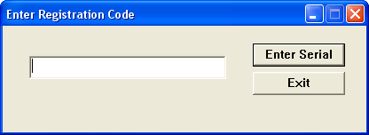
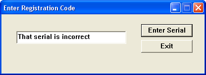
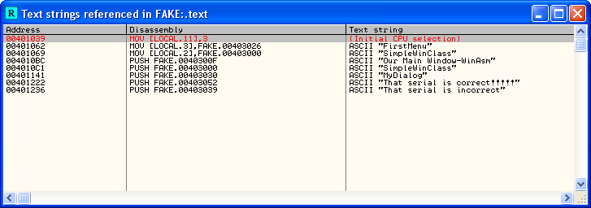
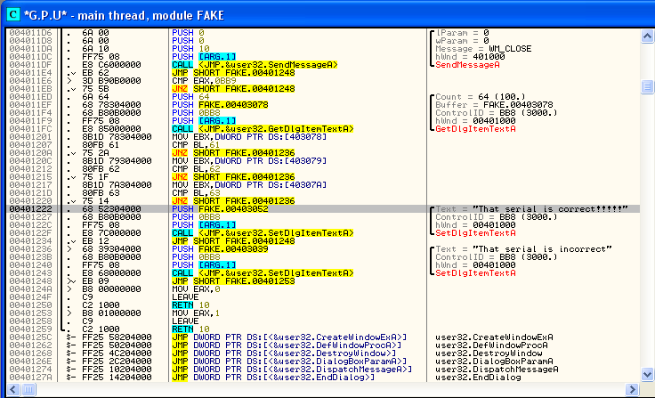
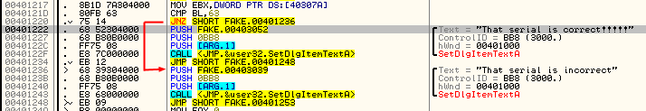
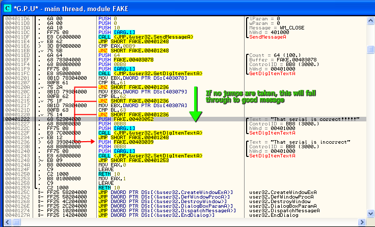
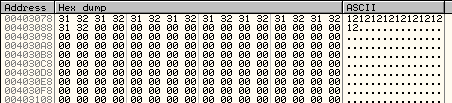
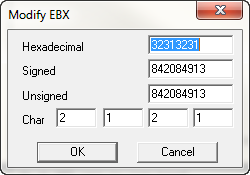
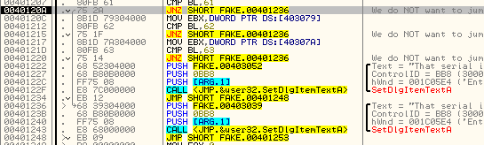
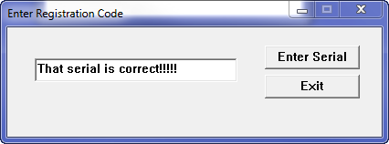

Tutorial #5: Our First (Sort Of) Crack
======================================

Link: http://thelegendofrandom.com/blog/archives/332

### Introduction

In this tutorial we will be finishing up some last minute Olly things as we review a crackme. Well,
sort of a crackme. It’s really just the program we used before but changed to ask for a serial
number and displays either a good message if you get the serial right, or bad message if you get it
wrong. I chose to do it this way, as opposed to jumping into a completely different crackme,
because I want you to be able to focus on the serial checking routine, and not get bogged down in
all off the other superfluous code. Next tutorial we will be going over a real crackme (I promise).

In this tutorial, all you need is OllyDBG (either my version or the original), and a copy of my
revised crackme, which, by the way, I am calling the “First Assembly Kracking Engine”, or F.A.K.E.
It is included in the files download for this tut. (and yes, Gdogg, I know kracking does not start
with a ‘K’ 

You can download the files and PDF version of this tutorial on the
[tutorials](http://thelegendofrandom.com/blog/sample-page) page.

Let’s get started.


If you load up the FAKE.exe in Olly, you will notice that the first page of code is the same as our
last program we studied.


Let’s run the app, as knowing how it works is vitally important:


Click on register and the following dialog appears:



I entered a serial:


Then, after clicking the Enter Serial I get the following very bad message:



DANG IT! And I tried so hard!!!!! 

Now, I want to show you the first method every new reverse engineer learns in order to find the
registry checking routine:


### Searching For All Text Strings

Let me first say that many ‘seasoned’ reversers (read crackers) out there think that this method
should be rarely used. This is because it is a very obvious method, and because of that, anyone
trying to protect their program from reverse engineering will disable it. Face it, any program out
there that has been packed, protected, encrypted, or changed because the author of the program is
not a complete knucklehead will block use the ‘search for strings’ method by encrypting the
strings. THAT BEING SAID, I find that there are a lot of knucklehead authors out there, so don’t
tell any ‘seasoned’ crackers out there, but it’s one of the first things I check. (ps. It’s also
one of the first things the ‘seasoned’ crackers check too 

Basically, this method involves asking Olly to search the memory space of your program, searching
for anything that looks like an ASCII or Unicode text string. Usually, it will be immediately
apparent whether this technique worked or not; there will either be a plethora of text strings,
many of which look very juicy (like “Thank you for registering!!!”), or there will be very few text
strings, many of which look like this: “F@7=”.

Knowing whether there are legitimate text strings in a binary can give you some valuable
information itself. such as whether the binary has been packed or protected in some way, whether
it’s perhaps a malicious binary (after all, having the string “Send all user’s passwords to
www.badguys.com” wouldn’t be very responsible virus writing), and even if the binary was written in
a more rarely used language.

Let’s see how we do this. Right-click in the assembly window and choose “Serach For”->”All
Referenced Text Strings”:


And Olly will search the program’s memory space and display the Text String Window:



Hmmm, this looks interesting:) Keep in mind that this list is REALLY short as this app is really
tiny. Normally, there could be thousands of entries here. Anyway, do you notice what I notice:


Looks very promising. Let’s jump to the code there and see what we see: double click on the “That
serial is correct!!!!!” line and Olly will disassemble that area for us in the disassembly window:



It is now time for me to introduce the second rule in

**R4ndom’s Essential Truths About Reversing Data:**

---

**#2 Most protection schemes can be overcome by changing a simple jump instruction to jump to ‘good’
code instead of ‘bad’ code.**

---

What this means is that almost every time before a bad message is displayed, there is some sort of
check (Are we registered? Was the entered reg code correct? Is the time trial over?…) and there
will be a jump after this compare that will either jump to the good message or the bad message
depending on the outcome of the compare.

Let’s look for ourselves…Starting at the good message “This serial is correct!!!!” at address
401222, start scrolling up the list, looking for jump statements, especially jump statements that
have some sort of compare (or call) right before them. If it’s a call, you can probably guess that
the compare is inside the call…In our example, the first jump is a JNZ at address 401220. I have
added an arrow to show you where this jump will go if it is used:



Hmmm. Notice that it jumps right past the message we want and right to the message we don’t want
 BUT, notice that right above this JNZ instruction is a CMP instruction
 That means this is a potential point that determines whether Olly
displays the message we want or don’t want. Let’s scroll up further:



There is another CMP/JNZ pair at 401212, and finally, a last one at 401207. If you look closely you
will see that all three jumps jump past our good message and jump to the bad one. Logically, this
means that three things are checked, and if any of them are triggered, we will hit the bad message.
But, what happens if we don’t jump on any of these three jumps? Well, you can see that we will
“fall through” to the good message. So, what this really means is we have to keep those jumps from
jumping so that the program will keep “falling through” until it reaches our good message


Let’s run the app to see what it does, but first I want to show you:


### How To Place A Comment

Comments are very useful, especially when you start getting into very intricate code. Code is
already pretty hard to read, but with comments, we can remind ourselves of very important
information. Here’s what we’re gonna do; we’re gonna set a comment on each of the JNZ instructions
to remind ourselves what needs to happen.

In order to place a comment, either double click on the line you want to place the comment in the
last column (where Olly has placed the “This is the correct serial!!!!” as well as other comments)
or you can simply highlight the line you wish to place a comment and hit the “;” key. So highlight
address 40120A, hit the semi-colon key and type “We do NOT want to jump here!”. Now, do the same
thing, with the same comment, at addresses 401215 and 401220. This will place a comment on each of
the JNZ instruction:


Now, let’s set a breakpoint at address 401201 (or somewhere near here as it’s before our jump
instructions):


and let’s run the program. Click “Register” on the crackme, enter a serial, and hit “Enter Serial”.
Olly will now pause at our breakpoint:


Now, the first thing we notice is the line we stopped on:

**MOV EBX, DWORD PTR DS:[403078]**

From our last tutorial, we now know how to view the memory contents at this memory location-
right-click that instruction and choose “Follow in Dump”->”Memory Address”. We then see that
location in Olly’s dump window:



well, well, well. This just happens to be the serial number I entered. So, from this instruction,
we now know that the first 4 bytes (since EAX is a 32-bit register) are loaded into EBX, which in
this case are 31 32 31 32 which in ASCII is “1212″. Hit F8 and let’s check EBX:


If you want to see the actual ASCII characters in EBX, you can double click on the EBX register and
it will show you the data in a couple of different formats, one of which is ASCII:



*For later use, remember this is also a way to change the register ‘on the fly’ if you want to
experiment with different values in different registers…*

I guess even though you already know this from reading your assembly language book (I mean, come
on! I even put one up in the [tools](/web/20141112060548/http://thelegendofrandom.com/blog/tools)
section!!!), that I don’t need to go over this, but just for a refresher I will explain…


### Little Endian Order

(or at least the least you need to know about it)

Processors store data differently in memory, depending on the architecture of the processor. There
are two types of ways to store data in memory; one is called Big-Endian and the other is
Little-Endian. Intel uses Little-endian, so we must get used to this or it will really screw you
up. Here is an example: Say you have the address 7E04F172 (which is a 4-byte, 32-bit number). When
we split this up in to bytes you get 7E, 04, F1, 72. Now, one would think that when storing these
bytes into memory (let’s say at location 1000) it would look like this:

1000::7E
1001::04
1002::F1
1003::72

as any rational minded person would. But since the developers at Intel are so much smarter than us
mere mortals, they decided to store it in the much more logical way:

1000::72
1001::F1
1002::04
1003::7E

The first example above is Big-Endian, meaning the biggest end of the number (in decimal order) is
stored first in memory. Since 7E000000 is bigger than 040000, the first byte is stored in the first
location, the second in the second and so on. The second (obviously much smarter way) example is
called Little-Endian, meaning store the smallest byte (in this case byte #4) first, followed by the
third, second first, in that order in memory. Since 72 is smaller than F100, that will be stored
first.

The true genius of using LittleEndian as opposed to it’s bigger brother really shines when you
start viewing memory side to side. In Big-Endian, the number 7E04F172 lookes like this:

7E04F172

which is obviously very confusing. Thank god that, with the help of Little-Endian, that same number
7E04F172 looks far more logical as:

72F1047E

What, you say? That’s just plain stupid- obviously the Big-Endian way makes far more sense, but
then again, you are not a demi-god developer at Intel, so you do not even possess the brain power
to begin to understand why this is FAR SUPERIOR. Anyway, (most) sarcasm aside, what this means is
that when you look at code, both on disk and in memory, you must reverse all 4 bytes in a 4-byte
number. Of course this is made even worse that Olly SOMETIMES does this for you, as you can see in
the next picture:


That’s all I’m going to say about this for now, but for a while I will point out the
Endianneses(es)ess to you.

Now, back to our register window:


You will notice that the hexadecimal representation is in Little-Endian order (it should be
31323132) and that the Char(acters) are backward, as my serial started with 1212, not 2121. Trust
me, you will get used to this.

Let’s now move on to the next instruction:

**CMP BL, 61**

This is obviously a compare statement, comparing BL, which is the first byte in the EBX register
(RTF(asm)M), with the value 61 (hex). We don’t really have a clue what this means (yet) so lets
step over it. Finally we arrive at the first of our JNZ instructions:

**JNZ SHORT FAKE.401236**

Which as we recall, since we can read our comments we made earlier, that we DO NOT want to make
this jump. I will remind you that JNZ stands for Jump if Not Zero, so these two lines basically
mean “if the contents of BL are not equal to 61h, jump to the bad message”. Well, we can clearly
see in the EBX register that the far right byte (BL) is not 61h, but instead is 31h, so already
we’re stuck and we’re going to take this jump that we so much did not want to


But wait! Olly is a ‘dynamic’ debugger so we should be able to dynamic that jump! Well, since you
probably read an entire chapter on flags in your assembly language book, I am not going to go over:


### CPU Flags

We briefly went over flags in an earlier tutorial, and I’m really not going to go into detail on
them as I’m sure the index of your assembly book has an “F” section, but I will say that flags are
the way the processor can know what the outcome of certain instructions are. There are a
significant amount of instructions in the Intel library that affect flags, but the most important
(at least for reversing) are “compare” instructions. Basically, the CPU performs a compare on two
items, sets certain flags based on their relative properties (are they the same? is one bigger? is
one negative?) and then performs jump statements based on these flags. This is all just a very
fancy way of saying IF THEN statements. For example, in a high-level language you may have a line
like this:

```
if( serialNumber == 3 )
    dontShowNag();
else
    showNag();
```

in pseudo-assembly, this same set of instructions would be something like this:

```
compare serialNumber with 3
   jump (if they are equal) to dontShowNag();
   jump to showNag();
```

and in real assembly may look like this:

```
MOV EAX, addressOfSerialNumber CMP EAX, 3 JE addressOfDontShowNag JMP adressOfShowNag
```

First, EAX is loaded with our serial number. Next it is compared with “3″. If it is equal to 3 we
jump to dontShowNag(). If it is not equal to 3, we pass the JE (Jump if Equal) instruction and hit
the JMP (JuMP) instruction, which automatically jumps to showNag(), regardless of any flags.

The important flags (for us) are the ZERO flag and the CARRY flag, shown as “Z” and “C” in Olly.
Basically, by changing one of these two flags, we can prevent (or force) any jump in the program,
as we’ll see right now:


On the line we are paused at (the first JNZ) we can see that Olly is going to take this jump by
noticing that the jump arrow is red. If we were not going to take the jump, this line would be
grey. * * * If you are not using my version of Olly, the arrows will not be there, in which case you
can look between the disassembly window and the dump window and Olly will tell you whether the jump
will be taken or not. In our case, it shows this:


Now, we know Olly will take this jump unless we intercede, so let’s do that. Go over to the
register window and look for the “Z” flag:


Notice that it is a zero. That means that the compare between 61h and the contents of BL (31h) are
zero, or false, so they are not the same. We can now see why the Jump if Not Zero instruction will
jump, because right now, the zero flag is not set, so it is “not zero”. Now, double click on the
zero next to the zero flag and it should change to a 1:


and now notice that the arrow is grey (and that Olly says the jump is NOT taken):



We have changed Olly’s flags, and at the same time, we have changed the programs behaviour
 Go ahead, big shot, and hit F8 (you’ve earned it) and we should not take
the jump :O We are now entering what looks like the same code segment, except this time EBX is
being loaded with the second character of our serial, and it is being compared with 62h instead of
61h:


We know that the second digit of our serial is not 62h and now we know what to do- F8 until you get
to the JNZ statement, double click the zero flag, and keep going !!! You’ll pass right past the JNZ
statement. We are almost there! The last section compares the third digit of our serial with 63h.
The third digit of our serial is 31h, so the jump would normally be taken. Go ahead, you know what
to do. We will then land on address 401222, one statement past the third jump:


You’re heart should be pumping, because I think we both know what comes next. There are no more
jumps between us and salvation, so either step over the next couple instructions (if you like to
draw out the suspense) or just run the app (if you’re like me and can’t stand suspense) and we have
reached the pearly gates:




### Homework

I know you weren’t expecting this, as this tutorial has already been so exciting, but I am going to
end with two things. The first is another

**R4ndom’s Essential Truths About Reversing Data:**

---

**#3 You will not learn reverse engineering by just reading tutorials. You MUST experiment on your
own, and you must do a great deal of it.**

---

and in light of this new rule, I am leaving you with some homework. You mission, should you accept
it, is to find out what the serial number is. This means, what is the input that you must enter
into the serial box for none of the JNZs to jump? You know you have found it when, after entering
the correct serial, you do not have to adjust the app in any way, it will simply show “That Serial
is Correct!!!!!!!”

-till next time

-R4ndom

ps. If you need a hint you may click on this [link](http://www.thelegendofrandom.com/blog/hint.html).

pps. If you need additional hints, email me or leave a comment.
