Tutorial #6: Our First (True) Crack
===================================

Link: http://thelegendofrandom.com/blog/archives/397

### Introduction

Welcome to Part 6 of my tutorial. In this tutorial we are going to get a little closer to the real
thing: a real crackme. It is included in the download of this tutorial. Crackme’s are a great way
to take the incremental steps to learning reverse engineering as, instead of jumping into a ‘real’
program (having no idea the difficulty of reversing it) crackmes can be ordered from easy to hard,
so you can learn in a linear fashion. Eventually, we will work out way up to real programs, but
seeing as we’re still just getting started, these crackmes should give us plenty of challenge.

You can download the files and PDF version of this tutorial on the
[tutorials](http://thelegendofrandom.com/blog/sample-page) page.

We will be using OllyDBG 1.10 (either my version or the original, though if you use mine it will
look like the pictures ). I recommend that you download the plugin
“MnemonicHelp” from the tools page under Olly Plugins as I will be referencing it in this tutorial
(it is also included in the download of this tut). Unzip it and put it and the x86eas.hlp file into
your plugins directory in the Olly folder. If there isn’t a plugin folder, create one in the main
Olly folder. You will then need to go to Options->Appearance-> Directories tab in Olly and select
the directory where you placed your plugin. While you’re there, you may as well create a directory
in the main Olly folder called “UDD” and point the other option on this setting page to point to
that folder as well. UDD files are Olly’s ‘notes’ on an app, so every breakpoint you set, comment
you make, and specific setting for that binary will be stored in the UDD file, usually called
“AppName.UDD”. These UDD files are a lifesaver if you want to take a break and come back to
reversing an app, as everything will be saved. Here’s the window where you set the two directories
(along with my settings):

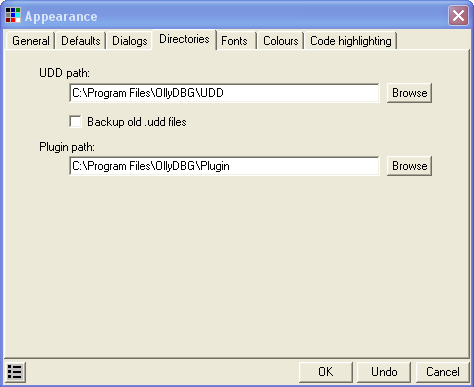

### Investigating the binary

Go ahead and load up Crackme2.exe:

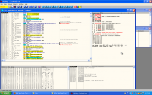

As I have said before, one of the most important things you can do before getting started is
running the app and studying it. It gives you a plethora of information; is there a time trial? Are
certain features disabled? Are there a certain amount of times it can be run? Is there a registry
screen that you can enter a registration code?

These are all really important things to know, and as you get better in reverse engineering, you
will gain more and more experience as to what you should be looking for (how long did it take to
validate the code? Is it forcing you to a web site?…)

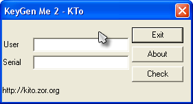

Seems pretty straight forward. Let try it:

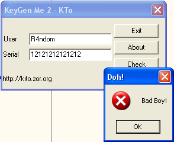

That’s not what we want. Let’s see if we can help Olly do the right thing. Go back to Olly and
let’s try our first (and only) tool we currently know. Let’s search for text strings.
Right-click->”Search For”->”All Referenced Text Strings”:

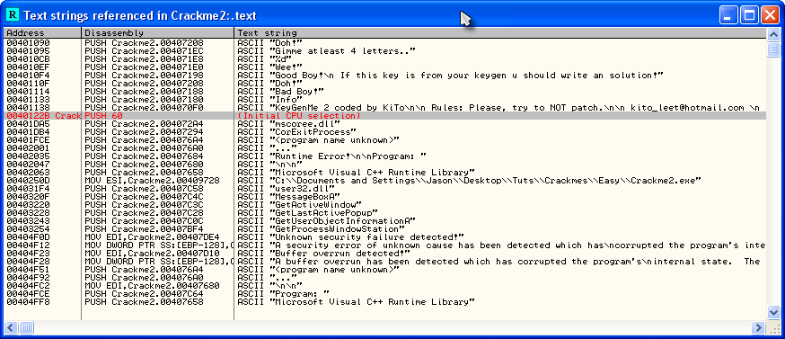

This looks promising. There are several things of note here. The first is that we now know that the
serial requires at least 4 characters:

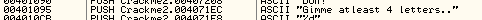

and the second is we now know exactly where the good and bad messages are displayed:

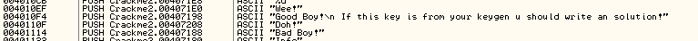

So, let’s click on the good boy at address 4010F4 and see what we got:

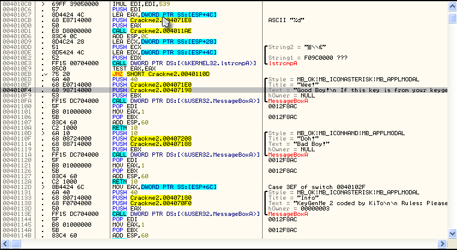

This is a pretty standard process when working with easier crackmes (and easier commercial programs
as well). You do a search for referenced text strings, you find a message that is displayed whether
you got the registration code/password/license number right or wrong, you go to that part of the
code, and you see both the good and bad messages pretty close to each other. And then, according to
R.E.T.A.R.D. rule #2, you search for the compare/jump that calls the one you want. Let’s find that
jump.

The first jump we find is at address 4010EB, a JNZ statement. If we click on this line, Olly will
be so kind as to show us where it will jump:

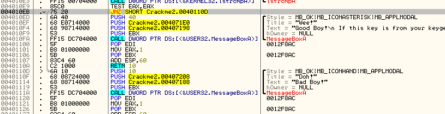

As we can see, this instruction jumps the good boy and goes directly to the bad boy. This seem like
a prime place to start. We also know that prior to a jump there is usually a compare to determine
if the jump is taken or not. Looking above the JNZ instruction we see a TEST EAX, EAX. Seeing as
you may not have gotten to the TEST instruction in your assembly book yet, let’s see if we can find
out what this TEST does. Since, at the beginning of this tutorial you installed the MnemonicHelp
plugin, that’s what we’ll use. Right click on the TEST instruction and you should see a question
mark as one of the entries in the context menu. Choose this:

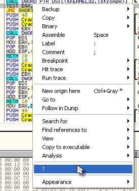

That will open the Mnemonic Help window:

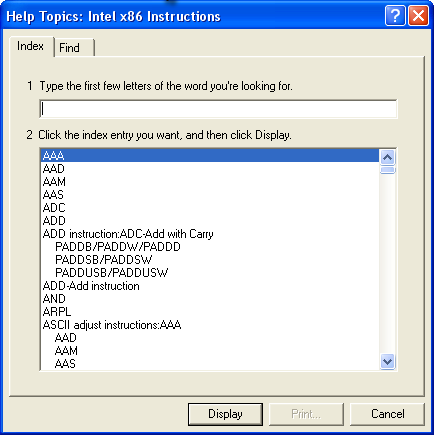

Type “test” into the top bar and choose (double-click) “TEST”. This will bring up help on that
mnemonic:

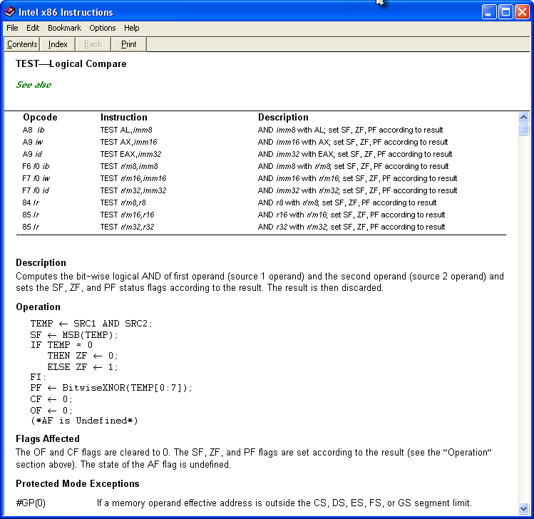

As we can see, the TEST instruction *“Computes the bit-wise logical AND of first operand (source 1
operand) and the second operand (source 2 operand) and sets the SF, ZF, and PF status flags
according to the result. The result is then discarded.”* Most of the time, if the test instruction
is testing two registers that are the same, it means it’s checking whether it’s a zero or not. So
this definitely fills our requirement of a compare before the jump:

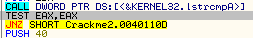

What these two statements mean is “If EAX does not equal zero, jump to 40110D”, which is our bad
boy. Well, we definitely don’t want that, so let’s test our hypothesis. Place a breakpoint on the
JNZ instruction and restart the app. Enter a username and serial number (remember, at least four
characters  ) and click check in the crackme. Olly will then break at our
BP:

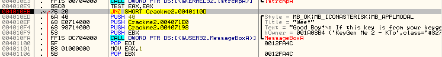

Now, we can see that we are going to jump past the good boy, straight into the arms of the bad boy.
Let’s not let that happen. Help Olly out by flipping the zero flag (see previous tuts):

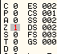

And we see that we are now not taking the jump. Run the app and:

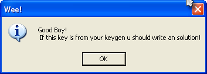

Yep, exactly what we wanted. *ignore the message about the keygen- some of these crackmes are
for other purposes, but I am using them because they highlight things we need to learn as well.
Many of them we will come back to and use as intended, once we get some more knowledge under our
belt* 

### Patching

Restart the crackme, run it, enter the name and serial, and Olly will break at our trusted BPs. You
will notice that, again, we are taking the jump to the bad boy, as changing a flag in Olly is only
temporary. Now this time, instead of temporarily changing a flag, we are going to change the actual
code in the binary to do what we want. This is called a patch.

Click on the line we are paused at (address 4010EB) click on the instruction column of the line
(the part that has JNZ SHORT…) and press the space bar. You will see a window pop up that shows us
the instructions at that line, as well as a dialog to change them:

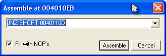

Now, what we want to do is change this from jumping to the bad boy message, to NEVER jumping-
meaning we really don’t even want this instruction performed. So what we are going to do is replace
it with an instruction that does nothing, the NOP instruction. NOP stands for No OPeration. Go into
the dialog window with the instruction in it and change the JNZ SHORT 0040110D to NOP:

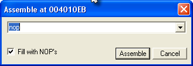

You can leave the “Fill with NOP’s” checked. Now click Assemble, to commit that line, and then
cancel to close the window.

*btw, if you did not click cancel and kept clicking Assemble, you would assemble each line, one
after the other. This is a ‘feature’ of Olly and it is for when you want to replace several lines
of code. It keeps you from having to hit the space bar on every line. I guarantee that when you
first start patching this will drive you nuts :X )*

You will notice that the line we are paused on has been changed- the instruction now shows two NOPs
instead of the JNZ instruction and they are in red (because Olly shows items that have been changed
in red):

The reason for the two NOPs is because the NOP opcode is only one byte long and the the statement
we replaced, the JNZ, is two bytes, so Olly replaced both bytes with NOPs. You will also notice
that the jump arrow has disappeared; this is because there is no longer any jump in this line! Now
single step and you will make your way into the good boy. And the good boy is displayed. And your
smile grows 

### Saving The Patch

One important thing to know is that your patch will not stay in place if you reload or re-start the
app until you save it back to the binary. You can see this in action- click back in Olly and open
the Patch Window (the “Pa” icon or ctrl-P):

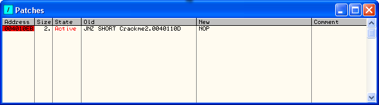

The Patches Window shows all of the patches we have made in our app. Notice that the address is red
and there is the word “Active” in the state column. As our app is still running, this means that
this patch is currently implemented and if the CPU runs this code, it will run the patched version.
Now, re-start the app (ctrl-F2). First of all, Olly may bring up an error, a very long, complicated
error that basically tells us our patch (and our breakpoints) may not “stick” because Olly can’t
keep track of them (it’s a little more complicated than this, but we’ll see later). Close the
window and then go to the breakpoints window:

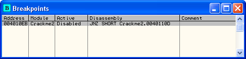

You see that our BP has been disabled  Re-activate the BP (space bar) and
now Olly will break on it again. Run the app, enter the username and password and we will stop on
the line we previously patched (with our breakpoint re-enabled on it):

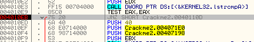

As you can see, our two NOPs are gone and the original code is back in (but grey this time). Our
patch has been reverted back! Now, go back to the Patches Window:

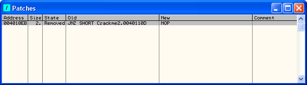

You will notice that the address is no longer red and the State column lists it as “Removed”. Olly
has disabled our patch, and will do this every time we re-start the app. What we want to do is
permanently apply this patch so that we don’t need to activate it every time.

In order to keep our patch permanent, we must save the changed version to the binary on disk. First
of all, re-enable the patch by clicking on it and hitting the space bar. The JNZ instruction should
change back to our NOPs, and the NOPs will re-appear in the disassembly window in red. Now,
right-click anywhere in the disassembly window and select “Copy to executable” and choose “All
modifications”:

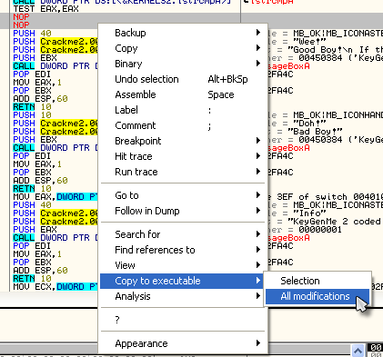

Select “copy all” if it asks you if you want to save all of the modifications:

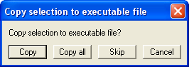

This will be important when you implement multiple patches and want to save them all at once, as
sometimes it’s easy to forget you’ve created multiple patches. In this case, even though we only
have one patch, selecting all patched will still only save our one. Of course, only patches that
are set to active in the Patches Window will be saved.

Later, you may want to choose “Selection” instead of “All modifications”, but you must make sure
your modification is highlighted in the disassembly window (by clicking and dragging all of the
lines with modifications in it). It is OK if you select more than just the lines that have been
modified- Olly will only change the modified lines.

After clicking “Copy all” a new window will open that is basically a dump of the entire process but
with our patch in it:

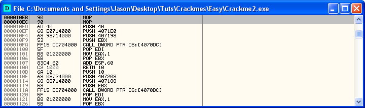

You can see our patch at the top. But realize that this is just a revised version of our executable
*in memory* - it has not been saved to disk yet, therefore, if you close this window or re-start
the app, it will not be saved! Let’s save it for good: Right-click anywhere in this new window and
select “save file”. This will save this memory process’s space to an actual file. A save dialog
will show up. Save the file as Crackme2_patched (I usually add a “_patched” at the end to keep
track but you can add whatever you want):

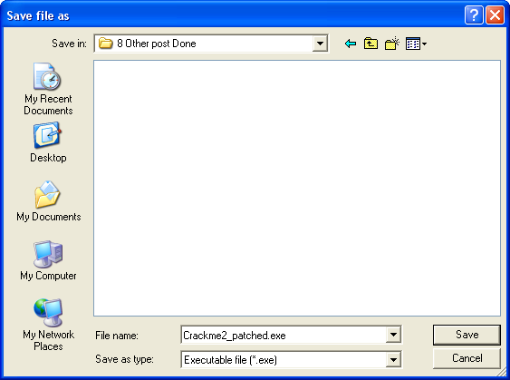

We now have a patched version of our crackme. Let’s try it out. Open this new file in Olly (the
patched one) . Click ctrl-G or hit the GOTO icon and enter our patched address:

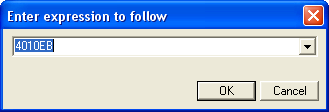

and now look at our patch:

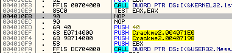

Yup, there’s the patch. Now run the app, enter the info and viola:

We now have a our first cracked and patched binary :0

### Homework

The homework in this tutorial is very straightforward (as long as you have been studying your
assembly language  ).

Here’s the question: “What could you change the instruction “TEST EAX, EAX” at address 4010E9 to in
order to keep the jump from showing our bad boy message?”

Keep in mind that whatever you change the TEST instruction to, it cannot be more than 2 bytes, as
that’s how long the TEST EAX, EAX instruction is, and if you put in a longer patch, it will
overwrite the JNZ instruction right after it…

-till next time

R4ndom

ps. If you need a hint, you can click [here](http://thelegendofrandom.com/blog/hint6)
