Tutorial #7: More Crackmes
==========================

Link: http://thelegendofrandom.com/blog/archives/223

### Introduction

Welcome to Part 7 of of R4ndom’s tutorials on Reverse Engineering. This time, we will be cracking
two crackmes; one to re-iterate last tutorial’s concepts, and one that we are going to have a
little fun with  In the download of this tutorial, you will find these two
crackmes as well as the program “Resource Hacker” that we will be using on the second crackme. You
can also download this [tool](http://thelegendofrandom.com/blog/tools) on the tools page.

You can download the files and PDF version of this tutorial on the
[tutorials](http://thelegendofrandom.com/blog/sample-page) page.

### Investigating the binary

Let’s jump right in. Load up canyou.exe (make sure the canyou.dll file is in the same place) into
Olly:

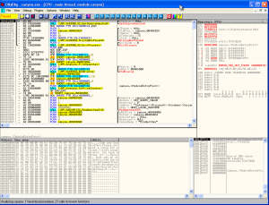

As I have said before, one of the most important things you can do before getting started is
running the app and studying it. It gives you a plethora of information; is there a time trial? Are
certain features disabled? Are there a certain amount of times it can be run? Is there a registry
screen that you can enter a registration code?

These are all really important things to know, and as you get better in reverse engineering, you
will gain more and more experience as to what you should be looking for (how long did it take to
validate the code? Is it forcing you to a web site?…)

When we run the app we get:

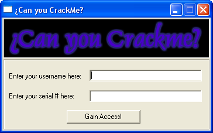

and after entering some data we get:

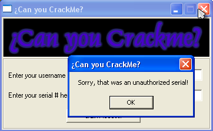

You should know the drill by now. Click back in Olly and let’s seewhat strings we can find:

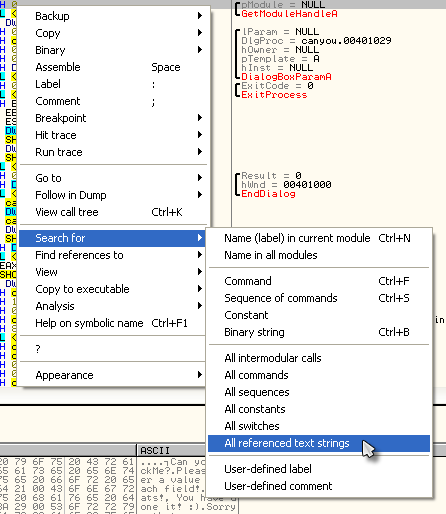

and we see what ASCII this crackme has to offer:

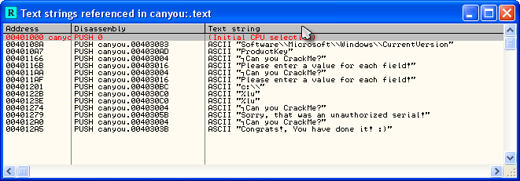

Well, we obviously see a couple of important ones here. The first thing we notice is that something
MUST be entered into each field:

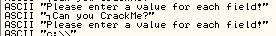

and then we see the really important stuff:

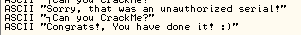

Lets double-click on one and see where we go:

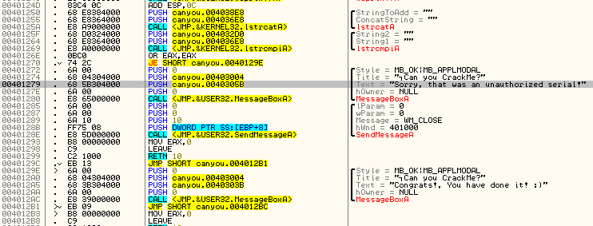

This should start looking familiar: we have a bad boy, followed by a good boy, with a very obvious
jump right before the bad boy, presumably jumping to the good boy. Also, I want you to notice that
before the jump is a call to the Windows API *lstrcmpi* . If we right-click on that and choose
“Help on symbolic name” we see:

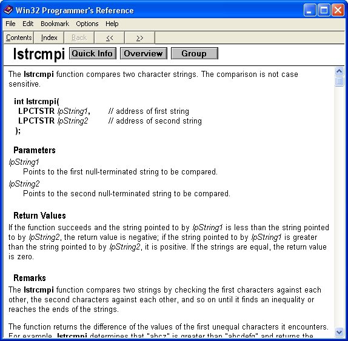

As you can see, lstrcmp compares two strings. This function is Very Important in reverse
engineering and you will see it over and over. It is used in many registration/password schemes to
compare the string that the user entered against a string that the app either has hard-coded in or
has created. If the string compare comes back zero, the user has entered the correct info, meaning
the strings are the same. If it comes back non-zero, the strings don’t match. In the case of this
crackme, our entered serial is probably checked against an internal or dynamically created string,
and if EAX returns a zero, they are the same, otherwise they are not. Right know, Olly doesn’t know
what these strings are going to be as we haven’t started the app and entered anything yet, but once
we get going, Olly will replace the String1 = ”” and String2 = ”” lines with real strings. If we
set a BP on the jump and then run the app, entering a serial (in this case “12121212121212121212″),
Olly will show us the strings that will be compared:

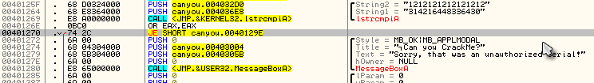

If you look at the lines above our jump instruction you can see that our password was compared with
the value “314216448336430″, whatever that is. On return, EAX will contain a zero if they were
identical and anything else if they weren’t. Obviously, in this case, they are not going to match.
The **OR EAX, EAX** is just a fancy way of finding out if EAX was zero or not, and if it is zero,
the **“JE SHORT canyou.0040129E”** jumps to the good boy. I wanted to point this string compare
routine out to you because in future tutorials, we will need to find out how this 15 digit number
was created, and searching for *lstrcmp* can lead us to it’s creation.

But in the mean time, let’s do what we know. Set a BP on the JE instruction at line 401270 and
re-start the app. Enter a username and serial and Olly will break on our BP:

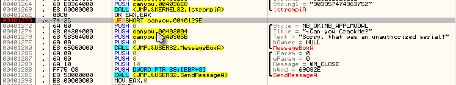

We notice by the grey arrow that Olly is not going to jump to the good boy and instead plans on
falling through to the bad boy so let’s help him with that:

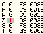

and now Olly has it right:

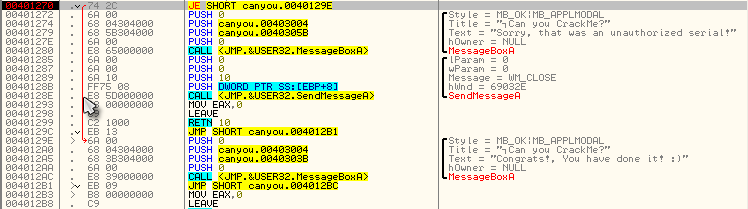

Let’s run the app to make sure:

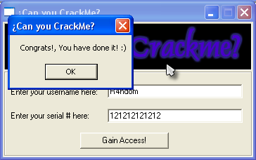

Now lets…

### Patch The App

This time we do not want to NOP out the jump as that would make the program show the bad boy every
time. Instead, we want to GUARANTEE that it jumps every time, that way it jumps to our good boy
message. So go to the the line our BP is on (you can open the “Breakpoint Window” and double-click
on the BP if you’re lost) and let’s change the instruction. Make sure you click on the JE
instruction and then hit the space bar:

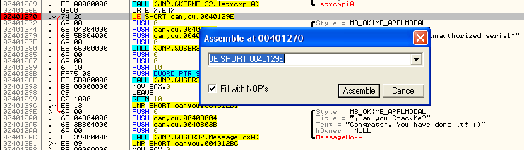

Again, notice that the highlighted instruction has been entered into our edit box. Now, let’s
change this JE (Jump on Equal) to a JMP (always jump, no matter what):

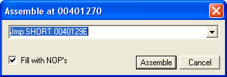

Click the Assemble button, and then the cancel button and you will see our change has been put in
the code:

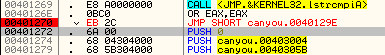

No, let’s run the app and make sure it works:

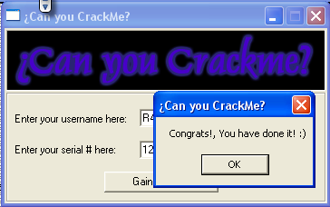

Now let’s save this patch to disk. Remember, if you re-start the app you will have to re-enable the
patch (Patch Window, highlight the patch and hit space bar), but since our app is still running, we
can just click over to Olly, right click the disassembly window and choose “Copy to executable” ->
“All modifications”:

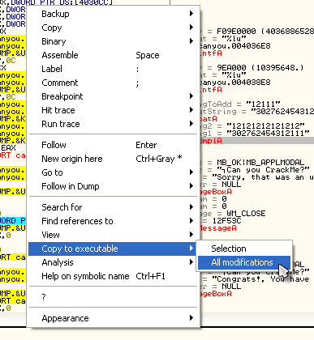

Choose “Save all” and our new memory process window will open (with our patch at the top of it):

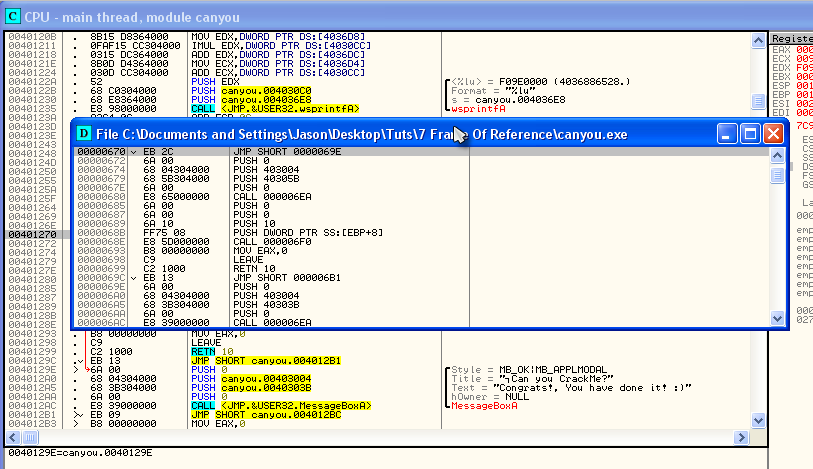

Now, let’s save it to disk…right click in this new window and click “Save File”. Save it as
canyou_patched (or anything you want), load this new patched file back in to Olly and run it. You
actually don’t need to load it into Olly anymore if you don’t want as the patch has been saved to
disk- you can just run it from wherever the crackme is. Just make sure you run the patched version
. Now, no matter what name and serial you put in, you will get the good
boy screen 

### Another Crackme

Let’s now load up the second program, Crackme8.exe and run it in Olly:

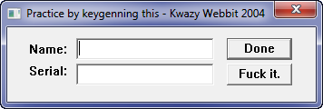

Well, that certainly makes a point :0 Ummmm. After I enter my name and serial, which button do I
press? Well, let me try one:

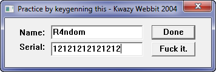

Now, Done usually means exit, so I’ll try the other one. And…………, it quits the app. Obviously I
should have clicked Done (?). Regardless, let’s take this opportunity to modify this program and
have some fun with it. Let’s change the buttons to a more meaningful “Check” and “Done”, or
anything else you prefer .

### Using Resource Hacker

If you haven’t already, go ahead and install Resource Hacker. When you first run it, it looks like
this:

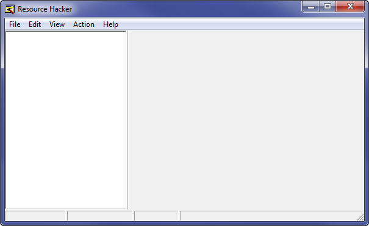

Go ahead and load the Crackme8 file into Resource Hacker and you should notice a folder called
Dialog with a plus sign next to it. Open up the plus and click the plus next to the next folder
(103) and you should see something like this:

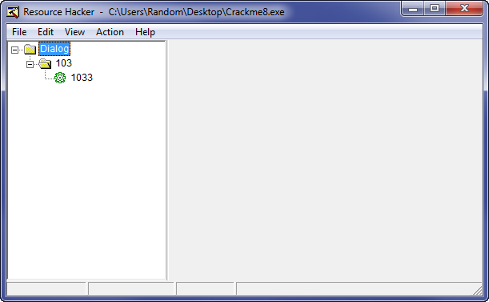

Now click on the 1033 and it will populate the right pane with data about this dialog, as well as
open a reference dialog showing what it looks like:

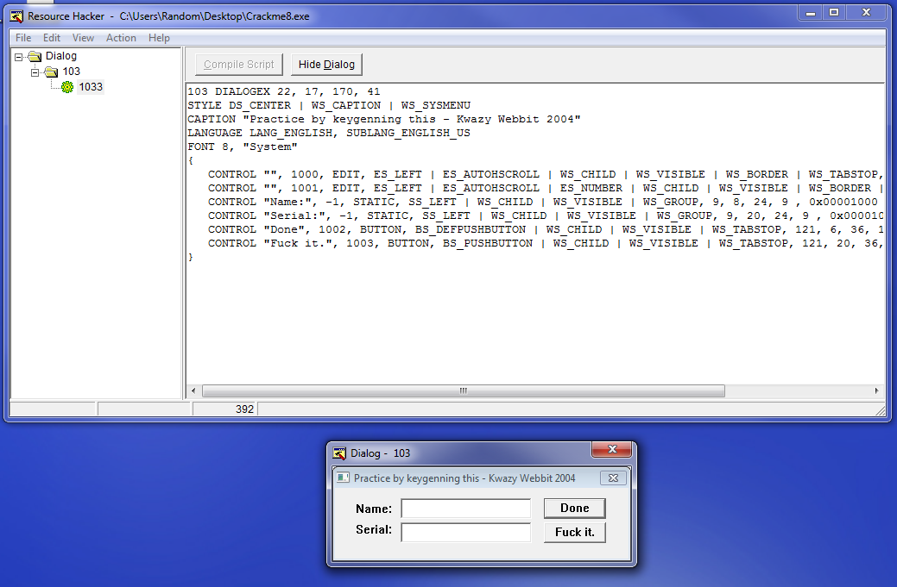

At the top of the right pane you can see some generic data about the window such as the font, the
caption, the styles etc:

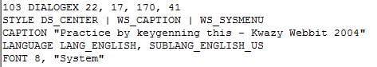

and underneath this you can see details about all of the elements in this dialog, including the
“Name” and “Serial” labels and the two buttons. Let’s change this dialog to our own liking, shall
we? First change the two button names to “Check” and “Exit”:

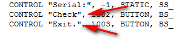

Now, let’s change the caption at the top:

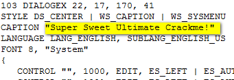

Now click the “Compile” button at the top and you will see our dialog update:

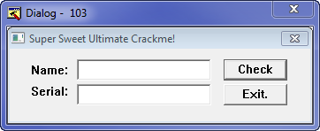

Well, that’s better. Let’s just save it (“File” -> “Save”) and load this new crackme into Olly (the
original crackme was saved by Resource Hacker as Crackme8_original), and run it:

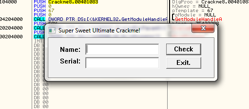

Ah, that’s better. Now we can officially start…

### Cracking The Program

You should know the drill by now. Let’s search for text strings:

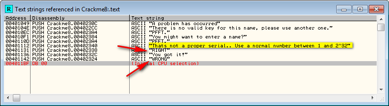

There are two things we learn; 1) the serial must be a number between 1 and a gazillion and 2) we
know where the good boy and bad boy messages are being generated. Lets go to the good boy message:

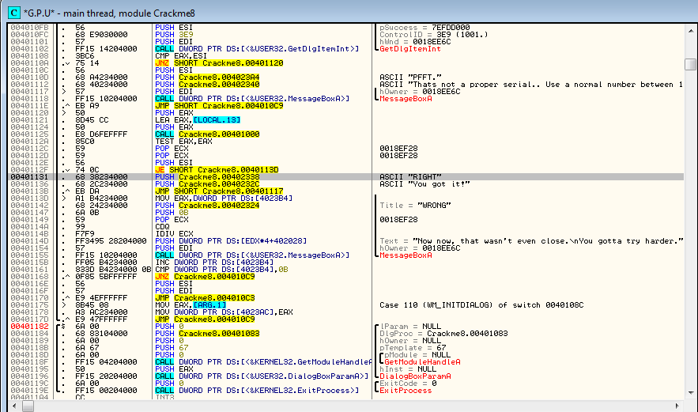

and we double-click into familiar territory. We see the good boy routine beginning at 401131, and
the bad boy starting at 40113D. We also see the jump (**JE SHORT Crackme8.0040113D** ) at address
401131 and the compare (**TEST EAX, EAX** ) at address 40112A. Let’s set our BP at address 40112F
and run the app. Enter a name and serial and click “Check”. Olly will then break at our breakpoint:

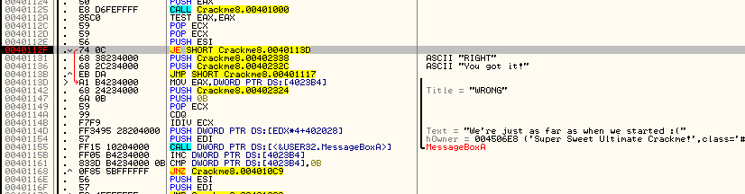

We can see that, unaltered, Olly is going to jump past our good boy and straight to the bad boy.
You know the routine…clear the zero flag and run the app:

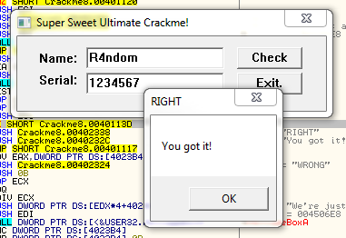

And success. Now let’s quickly create a patch: Re-start the app, go to the breakpoint (through the
breakpoint window), click once on the JE instruction and hit the space bar and NOP out the jump so
that we always fall through to the good boy:

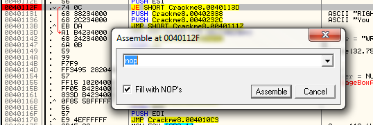

Hit “Assemble” then “Cancel. Right click and choose “Save to executable” -> “All modifications” and
choose “copy all”. Right click in the new window and select “Save file” and save it. You now have a
patched and resource-altered crackme that will take any serial number you put in and display the
good boy message 

### Food For Thought

I wanted to just mention that Resource Hacker is a fun and very useful little program. It allows
you to not only change many things in a file (strings, icons, labels, buttons, captions) but it
also let’s you change many things in Windows itself (the START button, context menus, the
computer’s ‘About’ dialog etc.) In fact, Resource Hacker is what I used to change all of the icons
in my version of Olly!

-Till next time

R4ndom
