Tutorial #8: Frame Of Reference
===============================

Link: http://thelegendofrandom.com/blog/archives/506

### Introduction

Now we’re gonna look at a crackme that’s just a little more challenging. It is called Crackme3.exe.
We will also learn some new tricks.

You can download the files and PDF version of this tutorial on the
[tutorials](http://thelegendofrandom.com/blog/sample-page) page.

### Investigating the binary

Go ahead and start up Olly and load in the crackme. It should load, analyze and pause on the first
line:

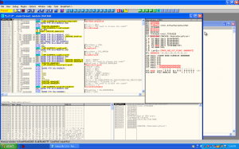

So let’s run this and see what we have:

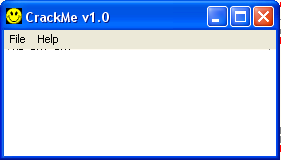

Well, not much to it. choose “Help”->”Register”:

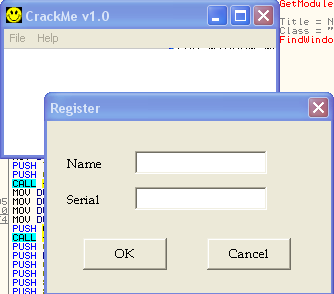

Now we’re getting somewhere. Oddly, it’s very similar to our FAKE program 
Try entering a username and serial to see how the app responds:

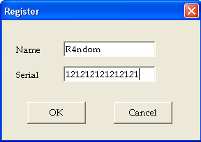

Hmmm. In this one you get a dialog giving you the bad news.

Sometimes, on a pretty small program I like to scroll down a couple pages just to see if there’s
anything interesting. I started scrolling down and about 6 pages down I came to some pretty
interesting stuff:

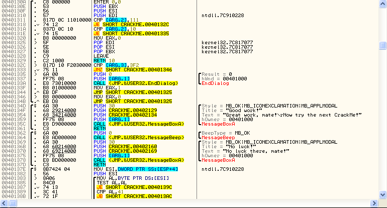

Look at the text right before the MessageBoxA function is being called. If you look just to the
left of the text above the MessageBoxA call, you can see a black line that delineates the function
parameters followed by the call:

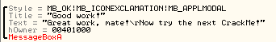

What Olly is showing you here is the arguments that are being prepared to be passed to the
function, along with the function being called. In this case, the arguments are 1) the style of the
window, 2) the title of the window (“Good work!”), 3) the text of the window (“Great work…”), and
4) the handle to the owner of this window. Finally, MessageBoxA is being called. You can right
click on the MessageBoxA word and select “Help on symbolic names” to find the arguments passed and
returned to this function.

Now take a look at this section compared to the section right below it:

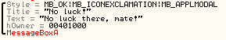

There is quite a difference between these two function calls; one looks really good, and the other
not so much. I think we can all agree that we would rather have the first one called. Let us now
remember

**R4ndom’s Essential Truths About Reversing Data #2:**

**2. Most protection schemes can be overcome by changing a simple jump instruction to jump to
‘good’ code instead of ‘bad’ code (or preventing a jump from jumping over ‘good’ code).**

If you look a few lines above these two functions you will see some jmp statements that will choose
which road you go down, the good one or the bad one. This is the case 99% of the time in 99% of
apps out there. The trick is finding this jump. (Of course there’s that other 1% where something
much harder has been implemented, but we’ll get to that.) In our case, there are some jumps at
401344 and 40134B. Now, to a trained reverse engineer, these jumps would quickly be passed over
(and if you want to know why, it is because they are not in the same function as our message boxes,
so they will not jump over our bad message or jump to our good message, but we will cover this
later) In the mean time, let’s investigate them:

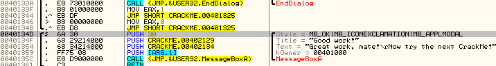

First of all, click on the JMP at 40134B.You will see a red line appear showing where this JMP will
jump to, and you can see that it goes the wrong way!!

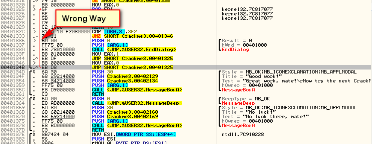

It does not jump to our good message, nor past our bad message, but up, earlier in the code. Let’s
try the other one at 401344. That one actually points at the same as the other one (still the wrong
way) so it seems our first guess was wrong.

By the way, as I said earlier, the reason a seasoned reverser would have passed right over these is
in the way Olly displays functions. If you look between the first column (the address) and the
second column (the opcodes) you will see some thick black lines. These lines were put in by Olly to
differentiate separate functions (though sometimes Olly cannot figure out where functions start and
stop, so you won’t have these lines):

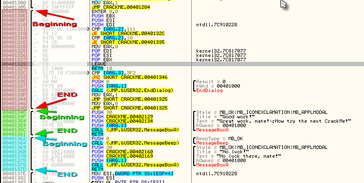

In this case, you can see that both JMP lines are in the function above our good and bad messages.
Since they don’t jump into a good or bad message, they are not really any help to us. This also
tells you another thing; The first message box (the good one) is not in the same function as the
bad message box. This tells us that these functions are called from somewhere, and that somewhere
before they are called, there is a decision being made as to which function to call, the good one
or the bad one. Let’s see how we can overcome this obstacle…

### Finding References

Right click on the first line of the good message function at address 40134D and select “Find
References To”->”Selected Command” (or press ctrl-R):

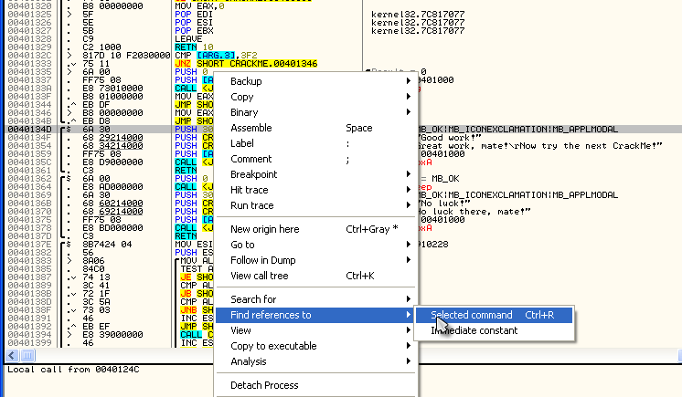

This will bring up the “References” window:

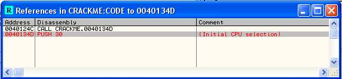

What this shows is all of the references (CALLs and JMPs) in the code that Olly can find that CALL
or JMP to *this* address. Now, double click on the first one in the list (the one that is not red)
and you will be taken to the line that calls this (good) message:

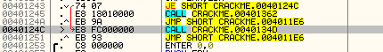

On line 40124C you can see a CALL CRACKME.0040134D. 40134D just happens to be the first line of the
good message dialog. Let’s set a breakpoint here:

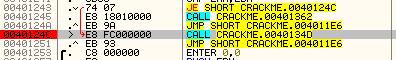

Now, lets do the same thing on the other function, the bad one. Go to line 401362, the first line
of the bad message function, right-click, choose “Find References To”->”Selection (or ctrl-R). This
will bring up the References window again. Now double click on the first item and we will be taken
to the address that called the bad message:

Interesting- it is 2 lines above our previous breakpoint! Let’s set a breakpoint here as well:

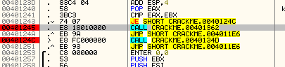

*Keep in mind that sometimes you will select a line and look for references, but there won’t be
any. There are 2 things that can cause this; 1) you have selected the wrong “Entry Point” into
this function, meaning that calls or jumps elsewhere in the application call this function, but
they call a different line, perhaps the line right before or after the one you have selected.
Choosing the right line to look for references on can take some time and skill, but keep at it. The
second reason Olly may not find any references is because there are no OBVIOUS places in the code
that point to this line. Remember, there is a lot of numbers being manipulated dynamically when a
program is run, and the address that a call or lump points to is no exception. So, if the call to
this address is created dynamically, there is no way Olly will know ahead of time that it will call
this line, so it will not list a reference to it. There are ways around this as well, but we will
not get into them for a while.*

Now, if we look around these two calls, you will see a couple jmp instructions. The first, a JE at
address 401243 is JE SHORT CRACKME.0040124C. Of course, you know what JE is because you have been
reading your assembly language book (see R.E.T.A.R.D. Rule #1), but just for the sake of argument,
let’s pretend you didn’t remember exactly what this particular mnemonic (instruction) meant. Here’s
where the MnemonicHelp plugin comes in. Right-click on the JE instruction and select the “? JE”
option in the context menu:

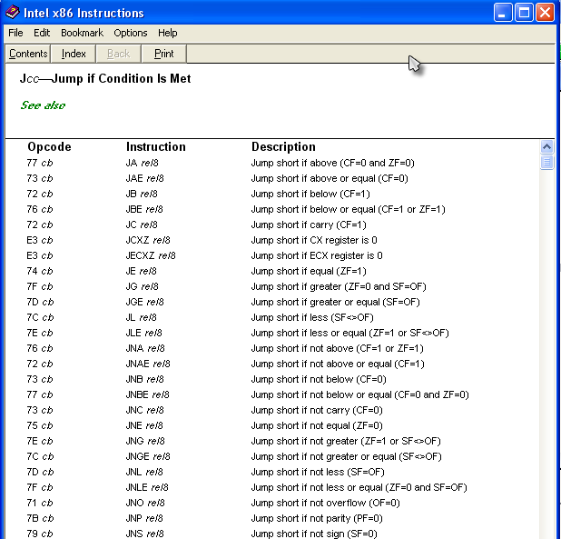

This window will be long as there are a significant amount of jmp instructions, but if we look down
to “JE” we see it’s “Jump if Equal (ZF = 1). This means jump if the Zero Flag is set to 1 (or the
two items being compared are equal). We went over flags in an earlier tutorial, so you should know
that in this case, if two objects that are compared are equal, JE will jump. We can also see that
this JE jumps past the call to the bad message, and the first instruction after the jump is a call
to the good message. If this JE does not jmp, we will call the bad message instead. So, we WANT to
make this jump so that we can call the good message instead. Let’s see this in action. Set another
breakpoint on the JE instruction and re-start (or run) the app. Click on “Help”->”Register” in the
crackme program, enter a username and a serial, and click OK.

Woah! Wait a second! We got the bad boy message and Olly never broke? That means Olly never reached
our breakpoint! What is going on here.

This is actually where being new at reverse engineering will come in handy
 I guarantee you every expert reverse engineer/cracker at this point is
thinking “What did I miss? A int 0xcc interrupt? IsDebuggerPresent? NTFlags? TLS Callback?” and
will go on a wild goose chase looking for some overly complicated solution. But since we are just
beginners, we only have a couple tools at our disposal, one of which is searching for string, so
let’s try that:

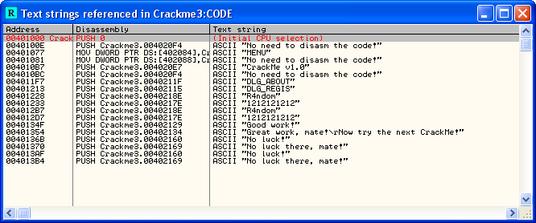

Now, you may see something rather interesting here…there are two “No luck!” bad boy messages and
only one good boy message. So that means that, somewhere else in the code is a check and if it does
not pass the bad boy will be displayed. This is a very popular technique in anti-reverse
engineering: make an obvious place for a good/bad message, but then add another check that’s not so
obvious. If you look at the code window where our good bay and bad boy are, you will notice that
the string “No luck!” is loaded at address 40136B, so we know that’s not the string we’re looking
for. So let’s double-click on the other one at address 4013AF:

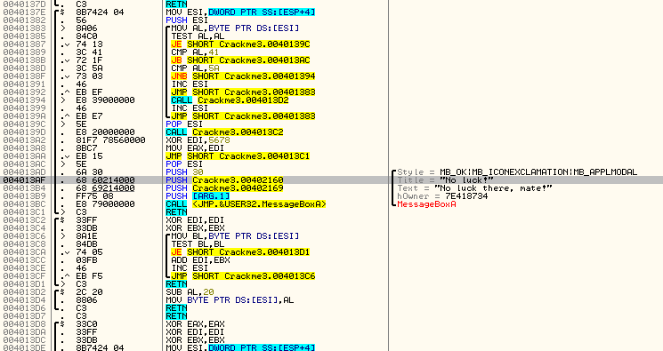

This bad boy message is in a completely different section of the programs memory! And we thought
this crackme was going to be so easy. Well, let’s take a deep breath and remember RETARD rule #2-
look for the compare/jump. Well, in this case there is a JMP at address 4013aa, and when you click
on it, Olly shows an arrow that goes right past the bad boy message. This looks promising…Let’s try
it. Put a BP on that jmp instruction, re-start the app and run it.

*You may get the error message we got in the last tutorial about the breakpoints being corrupted.
If this happens do the same thing as last time- open the BP window and re-enable all of the
breakpoints before you run the app:)*

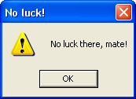

CRAP!!!! Well, that didn’t work, so I guess we’re gonna have to dig deeper. Let’s take a look at
this code and try and understand what exactly is going on here (this is where you’re assembly
reading is going to shine  ):

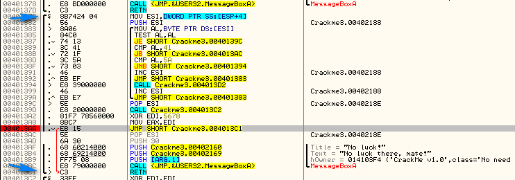

Well, one thing we know, because we learned it earlier in this tutorial, is where this function
begins and ends. In the picture you can see it by the blue arrows. So, starting from the beginning
of this function, there is a loop that first checks if AL is zero ( **TEXT AL, AL** ) , then cycles
through, comparing AL with a couple of different number (41, 5a), and in the middle of all of this,
is making some jumps depending on what AL is. First of all, let’s see which jump will actually call
our bad boy message (since there is a JMP instruction right before the bad boy, nothing can “fall
through” to it, so something must jump past that jump and run the bad boy. The most likely place
this jump would be to would be address 4013AC).

Click on the first instruction of the bad boy messageBoxA routine at address 4013AC, right click
the line and choose “Find References To” -> “Selected Address”. ( I know that once you clicked on
this line there was a red arrow that showed up, showing which instruction called it, but ho do we
know there are not other instructions in our crackme that call this bad boy message. Finding all
references helps us determine that there is probably only one. We then see the references window
again:

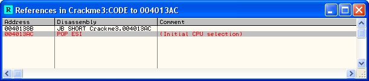

Now, double-click on the first one and let’s see which line is calling this bad boy:

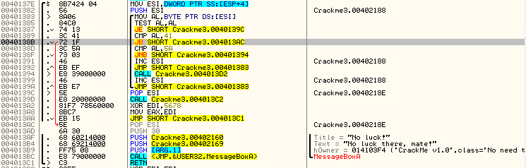

Ahh, so it is one inside the loop. Also notice that besides the line in red in the references
window (which we can ignore for now), there was only one reference to this address, so we can be
assured that this line at address 40138B is the only code calling this particular bad boy. So we
now know that the **JB SHORT 4013AC** at address 40138B is the culprit. Let’s try putting a BP on
it and changing it on the fly to see if we can bypass this bad boy. Place a breakpoint on address
40138B and re-run the app:

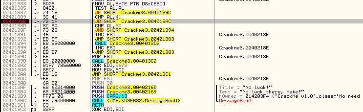

hmmm. Well since the arrow is grey, we know we’re not jumping to the bad boy in this iteration of
the loop. So let’s hit F9 again to cycle through the loop again:

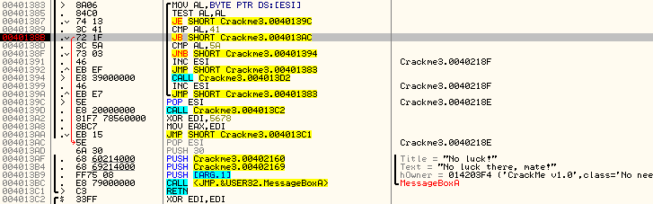

Aha. So the second time thru the loop it is going to call the bad boy. Well, let’s keep it from
doing it and see if we’re on the right track. You may notice that if you change the zero flag,
the jump is still taken. This is because the JB command is part of a slightly different jump
collection that uses the carry flag instead of the zero flag (don’t worry, this is all in your
assembly book  So double-click the carry flag (“C”)

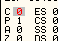

and the arrow should change to grey:

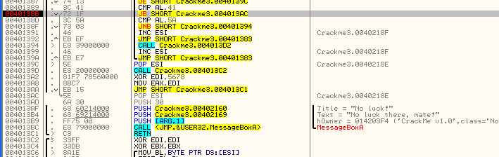

Now let’s run the loop again to see if the bad boy is called in the loop. I pressed F9 5 times and
none of the times was the bad boy called. In fact, after the fifth F9, I broke on our old BP where
we first thought the patch was going to be:

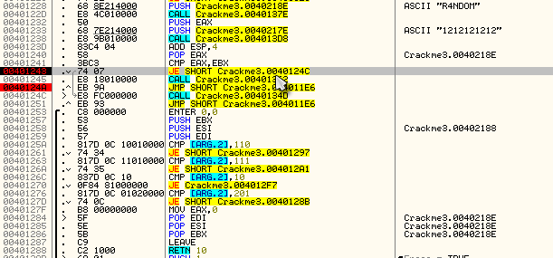

So this means that we have effectively passed the first check for the bad boy and are now in our
original check.Let’s patch this first check so we don’t have to worry about it anymore and can
focus on the main check. So return to our BP at address 40138B and let’s think about how we can
patch this to not jump to the bad boy. Remember, the jump is called on the second time through the
loop, and only if AL is BELOW 41 (the instructions are CMP AL, 31, JB SHORT 4013AC. So what if we
just NOP out this jump? Then it will never jump and we don’t have to worry about jumping to the bad
boy at all 

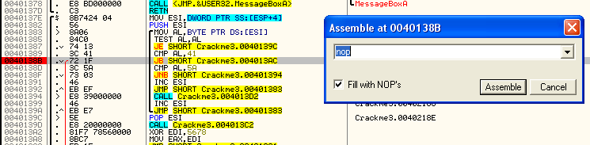

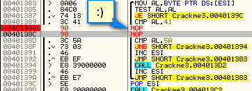

Let’s right-click and select “Copy to executable” -> “All modifications”. This will open the new
memory window. Now right-click in this window and choose “Save File” and save it as
crackme_patch1.exe.

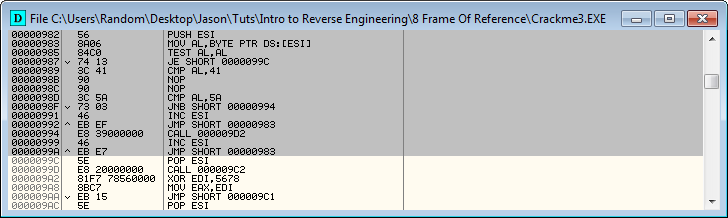

Now, before we re-load this new patched version, we need to realize that all of our patches,
comments and (especially) breakpooints will be removed because all of that info is stored in the
UDD file Crackme3.udd. We are now opening Crackme3_Patch1 which does not have a UDD file associated
with it. But there is some good news. Included with this download was the breakpoint manager
plugin. If you haven’t already, copy it into your plugin folder and then re-start Olly. If you had
already installed it at the beginning, you already have it loaded. ow open up the breakpoint
window, righ-click and choose “Breakpoint manager”->”Export Breakpoints”:

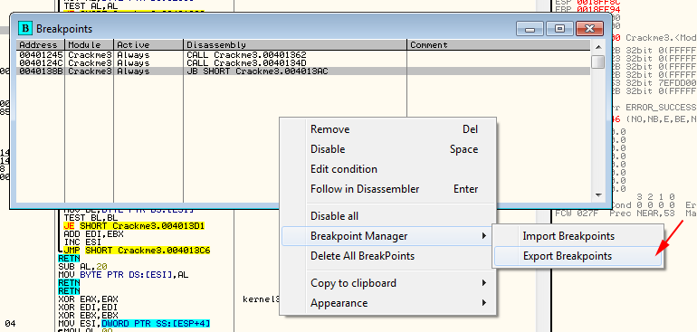

Save the file as we will import it into the new file. Now, reload the new (patched) file into olly.
It will probably pop up with a message about breakpoints being corrupted:

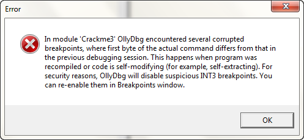

Just click OK. No open the breakpoints window in our new patched program and probably all (or most)
of the breakpoints will be gone. Now, right-click and choose “Breakpoint Manager” -> “Import
breakpoints”:

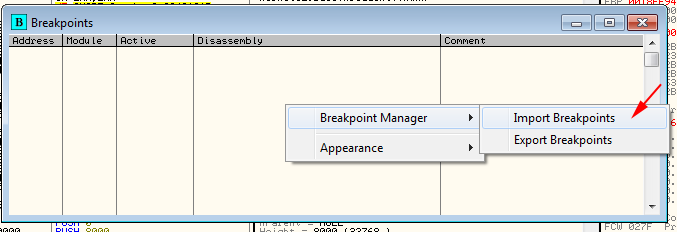

Now you will see our original breakpoints back again:

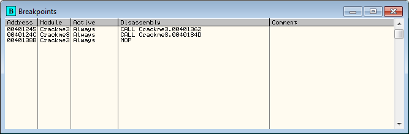

Now run the app and Olly breaks on our first BP at address 401243, the JE instruction (If yu had
not set a BP on this line, do o now, re-start the app and run it, you will then break here:

Now, as you remember, if you look at the grey arrow that goes from the current paused line down to
address 40124C, because it is grey, it is not going to be taken. You can also look between the
disassembly window and the dump window and it will tell you the jump is NOT taken:

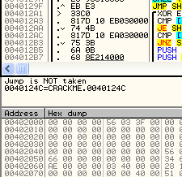

This means, without doing anything, the program will naturally NOT jump to the second call, and
will fall through to the first call. The first call jumps to our bad boy message, so we really
don’t want this to happen. Press F8 one time to step. As Olly told us, we did not jump and we are
now at the call to the bad message. Press F7 to step in to the call and we will land at the first
instruction of the bad message function: Now, if we press F9 to run Olly, we will see exactly what
we expect:

Let’s see if we can fix this  Restart the app, hit F9 to run it, select
“Help”->”Register” and enter a name and serial. Now, when you click OK Olly stops again at our
first breakpoint:

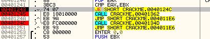

This time, let’s help Olly go in the right direction. Look over in the registers window and notice
the Z flag is red and …well…you know what to do:

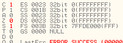

Notice, our arrow that was grey, showing that the jump was not going to be taken, has now turned
red, and the area between the diassembly and dump window has changed to “Jump will be taken”. What
we have done is told Olly to change the flag it uses to determine if two things were the same, so
that it thinks that they were. So now, we will jump over the call to the bad message and call the
good one!!!

Let’s try it. Press F8 to make the jump and then F7 to step into the call. We will now jump to the
beginning of the good message:

Now, press F8 a couple times, watching the stack window between each click. You will see the
arguments to the MessageBoxA call being pushed onto the stack, in this case good messages indeed.
As soon as you step over the actual function call at 40135C, the new dialog message will show up.
We have cracked our first program!!!

Now the problem is that since we changed the flag on the fly, when the app is run again it will not
change that flag again, so we will get the bad message. What we need to do is somehow save that
change so that every time the program is run, we can force it to make that jump. This is where
patching comes in. Do the same thing as we did earlier: Highlight all of the lines that have
changes in them, right-click and choose “Copy to executable”. Right click in the new window that
pops up and click “Save file”. Choose a name and this will now be your patched version.

You can now close that dump window and close Olly. Now go to the directory you saved the patched
file in and run it. Enter your info and voila:

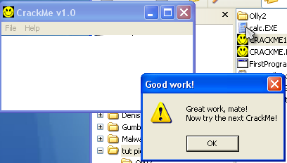

Good job. You have cracked a real crackme with some challenges in it.

-Till next time

R4ndom
