R4ndom’s Tutorial #9: No Strings Attached
=========================================

Link: http://thelegendofrandom.com/blog/archives/654

### Introduction

In this tutorial we will be adding a new trick to our arsenal; what do you do if there are no
usable string in the binary to search for? We will also be introducing a new R.E.T.A.R.D. rule
 In this tutorial (as well as the next) we will be studying a crackme
called Crackme6 by “TDC”, included in the download. Overall, it’s not a tough crackme, but we will
be doing some advanced analysis on it, preparing for future tutorials.

You can download the files and PDF version of this tutorial on the
[tutorials](http://thelegendofrandom.com/blog/sample-page) page.

So let’s get started…

Go ahead and load Crackme6 into Olly:

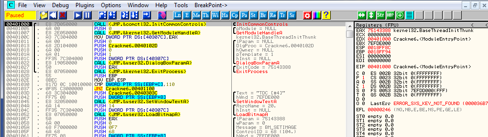

Now, we know the routine; let’s run the app and see what we got:

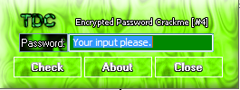

Hmmmm, seems simple enough. I entered a password of 1212121212 and here’s what I got back:

Pretty straight forward. So let’s go to our handy-dandy “search for Strings” and see what we got:

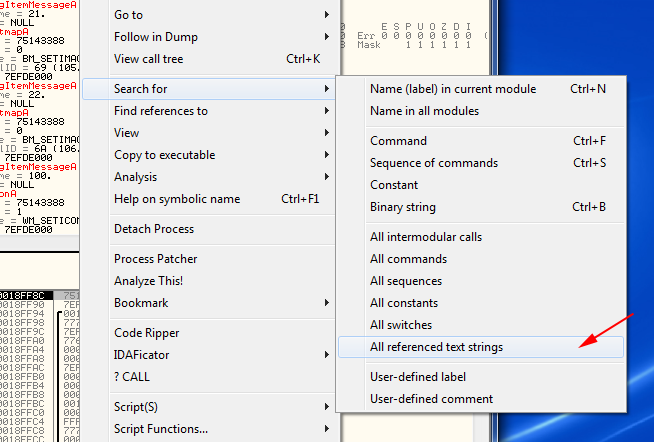

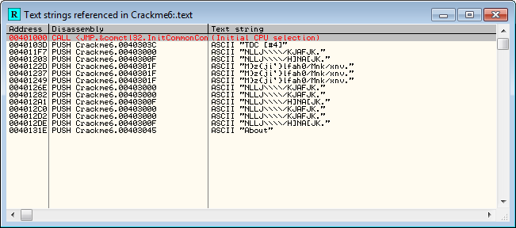

What the hell!!! Those aren’t helpful  What are we supposed to do with those
strings!?!? Obviously, this crackme has encrypted the strings (either that or the author speaks a
very strange language ;D ). Well, this is a good time to introduce

**R4ndom’s Essential Truths About Reversing Data #3:**

---

**#3. Do not rely on binary’s having usable text strings.**

---

Unfortunately, as soon as you start getting into real binaries (like commercial products) most will
be packed and/or protected in some way. One of the most obvious ways to hinder a reverse engineer
is to encrypt the strings. Frankly, when first investigating a new binary that I am interested in
reverse engineering, if I do a search for strings and any come up, I can assume that the binary
will probably not present too many challenges. So, you cannot rely on there being any (though it’s
great when there are 

### Intermodular Calls

In light of this, I will show you a new trick in the case of no strings; most Windows applications
use a standard set of APIs to perform specific actions. For example, MessageBoxA is called if a
simple message box is desired, or TerminateProcess is called when the app wishes to end. Since most
apps use these same APIs, we can use this to our benefit. For example, there are APIs for getting
text from a dialog input box (like a username and serial number). There are APIs for setting timers
(used in nag screens where you must wait 10 seconds before hitting ‘continue’). There are string
compare functions that are called to compare two strings (was the entered password the same as the
one stored in the program?). And there are APIs for reading and writing to the registry (to store
and retrieve your registration status).

Olly has a way of searching for all of these called APIs. Right click in the disassembly window and
choose “Search for” -> “All intermodular calls”:

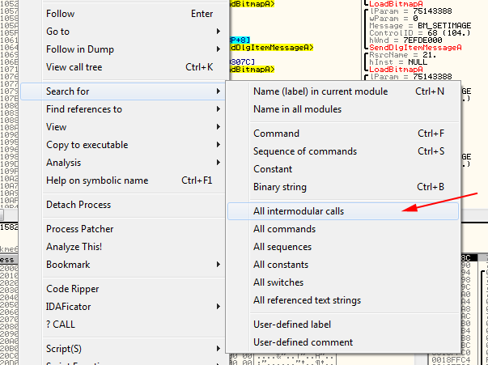

and Olly opens the Found intermodular calls window:

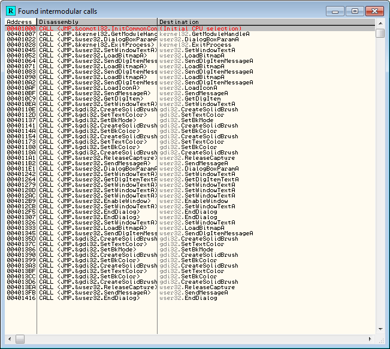

The first thing I usually do is click on the “Destination” heading to sort the list of functions in
alphabetical order (instead of by address):

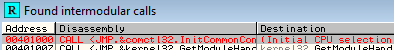

So now, if you look in the third column, you can see all of the API calls that this crackme makes:

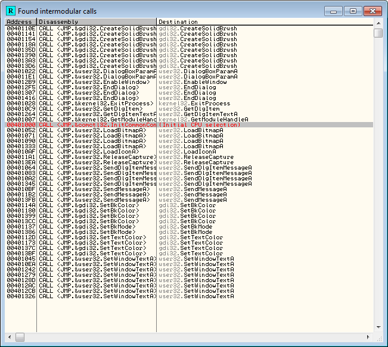

This is a small program, so there are not that many. Most programs will have hundreds. But in this
list you can tell a lot about a binary. You can tell it uses a dialog box as it’s main window. You
can tell it loads a custom bitmap. And you can tell that it changes some colors in the dialog box.

In a larger application, this window becomes even more invaluable, as it will tell you things such
as 1) Are registry APIs called to store and retrieve info from the registry? 2) Are there APIs
calling websites to verify that we are actually registered? 3) Are there reading and writing to
files APIs where perhaps a registration key will be stored? And when we get into packed binaries,
this screen will become even more important (but that’s later  )

All that being said, there are some specific APIs that reverse engineers are always looking out
for, APIs that are used in protection schemes a lot. These include:

- *DialogBoxParamA*
- *GetDlgItem*
- *GetDlgItemInt*
- *GetDlgTextA*
- *GetWindowTextA*
- *GetWindowWord*

- *LoadStringA*
- *lstrcmpA*

- *wsprintfA*

- *MessageBeep*
- *MessageBoxA*
- *MessageBoxExA*
- *SendMessageA*
- *SendDlgItemMessageA*

- *ReadFile*
- *WriteFile*
- *CreateFileA*

- *GetPrivateProfileIntA*
- *WritePrivateProfileStringA*
- *GetPrivateProfileStringA*

Unfortunately, this does not cover all of the API calls you may run into, but fortunately, most
apps use one of the following:

- **GetDlgItemTextA**
- **GetWindowTextA**
- **lstrcmpA**
- **GetPrivateProfileStringA**
- **GetPrivateProfileIntA**
- **RegQueryValueExA**
- **WritePrivateProfileStringA**
- **GetPrivateProfileIntA**

So if you focus on these 8 API calls, you will be able to handle the vast majority of instances.
And don’t forget, you always have Olly to help with “Get help on symbolic name”.

Now, when you look down the list in the calls that Olly has found in our crackme, there are two
that are in our short list:

**GetDlgItem**  and **GetDlgItemTextA** .

What these two API calls do is retrieve whatever text was entered into a dialog box (well, for our
tutorial, anyway  ). Well, in our crackme, this could only mean one thing,
our entered password. What we want to do is tell Olly to break anytime he comes across one of these
calls. The way to do that is to select the line that has the call you want, right click and select
“Set breakpoint on every call to ____”, Where ____ will be the name of the API (in this case
GetDlgItem):

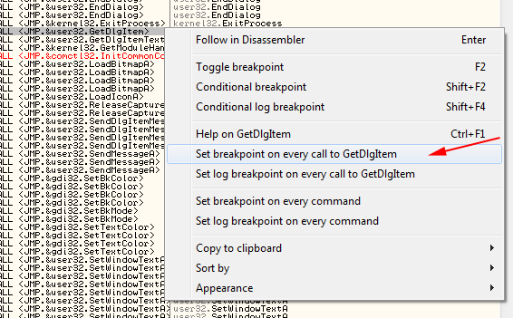

Now, we can see that Olly has placed a BP on this line.

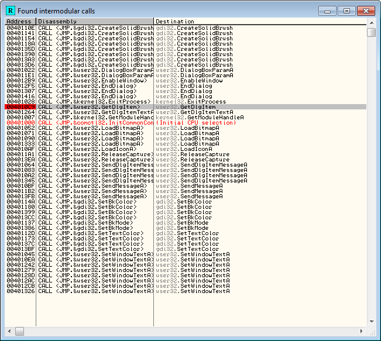

We also want to break on the other API call, GetDlgItemTextA, so click on that one, right-click and
do the same:

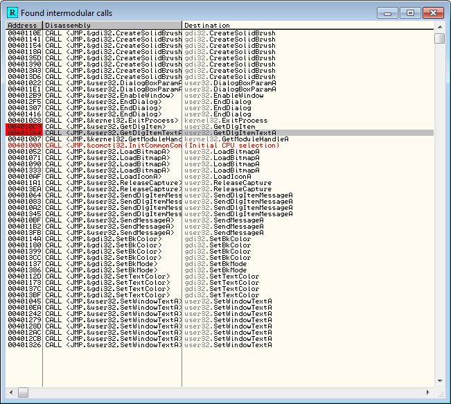

Now, anytime Olly comes across one of these two calls, he will break (before the call is made). So
let’s try it. Re-start the crackme and run it. Olly will break on a call to GetDlgItem:

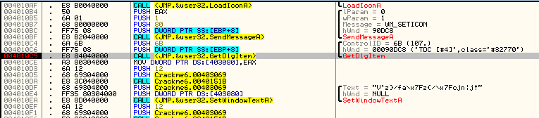

Now, since we have not entered anything yet, we’re not really interested in what GetDlgItem has
gotten in this case, so let’s keep going (F9):

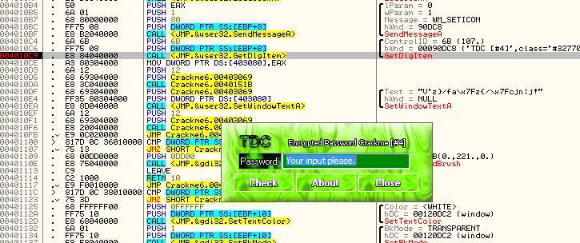

Now enter a password and click “check”:

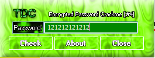

and Olly will break again, this time on GetDlgItemTextA:

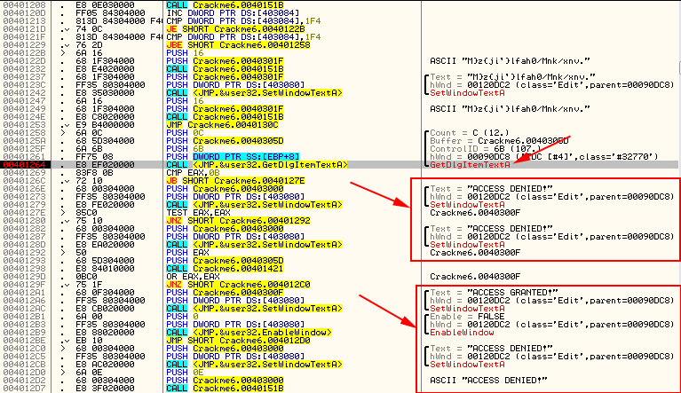

If you look around a little, you’ll see that we’re in the right place 
Funny, none of those strings were there when we initially searched for them

### Cracking the App

Let’s take a quick look around… We see a jump (JB) past the first “ACCESS DENIED”, so we’ll have to
pay attention to that:

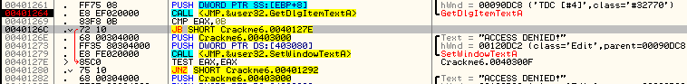

Then there’s a jump (JNZ) past the second bad boy, so we’ll add that to the list. Then we would
fall through to the good boy, so basically we want to make sure we jump both of those jumps:

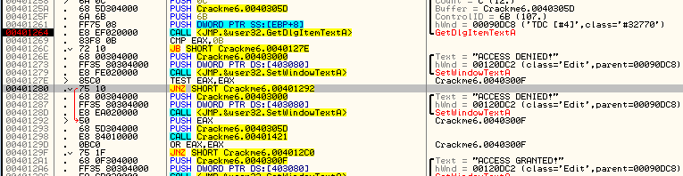

Let’s try it and see if we’re right. Run the app again and we should break at our GetDlgItemTextA
instruction (remember to bypass the firs break).

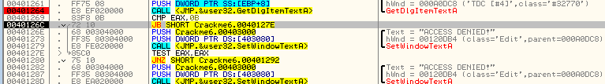

Since this is a JB jump, we need to flip the carry bit:

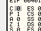

So that will force the jump. Now we’re going to do another TEST and stop at the jump at address
401280. Notice that our password has shown up in the comments column 

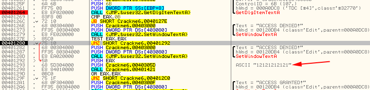

This jump we want to take as it jumps the second bad boy, so just keep stepping until we get to the
next JNZ instruction at 40129F:

OK, this is now going to jump past our good messages, so we want to stop that from happening. You
know what to do:

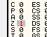

Now run the app (F9) and you will see we have successfully cracked the program.

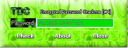

### Homework

For a challenge, try patching this crackme yourself, based on the flags we have changed. After
saving he patched program, you should be able to run it and enter any password (less than 11
digits) and it will say “Access Granted”. Keep in mind that there are several patches that can be
done to accomplish this, so if one doesn’t work, keep looking.

***Extra Credit:*** Patch the crackme so that your password can be any length.

-Till next time

R4ndom

ps. You can get a homework hint [here](http://thelegendofrandom.com/blog/hint9.html).

pps. I will post the solution in a couple days.
